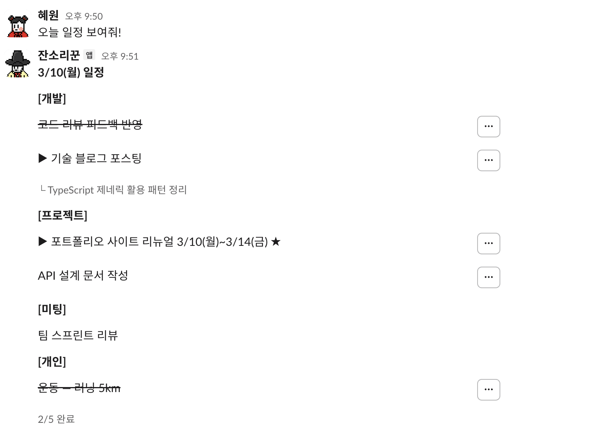
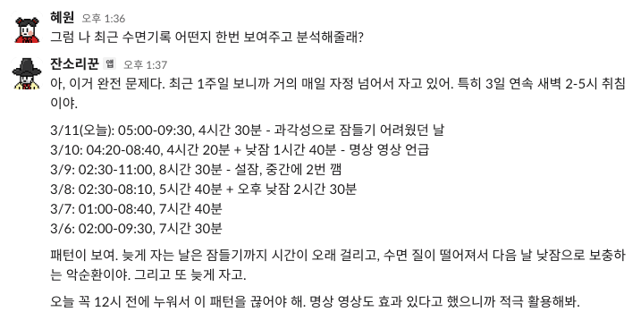
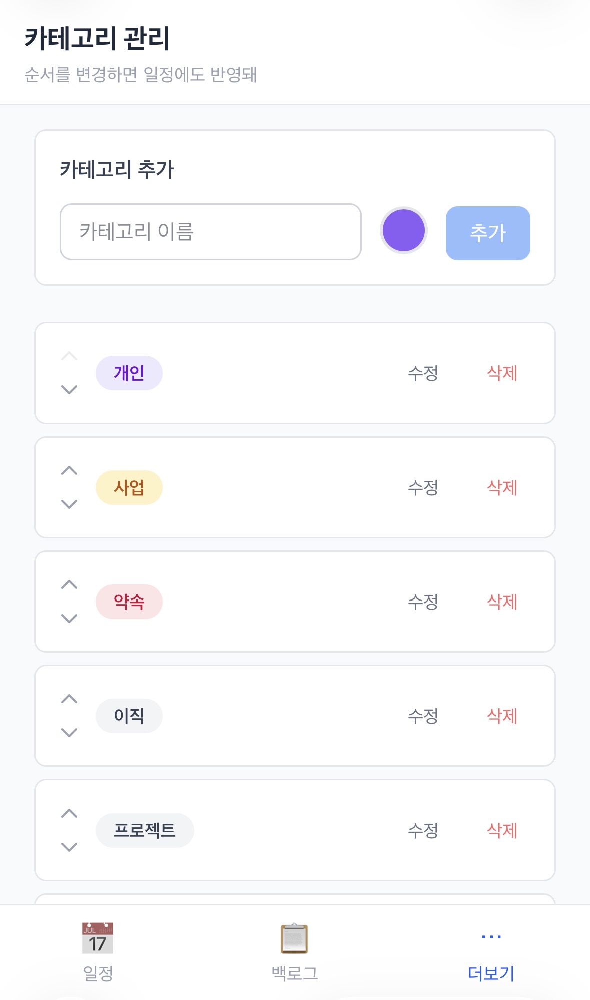
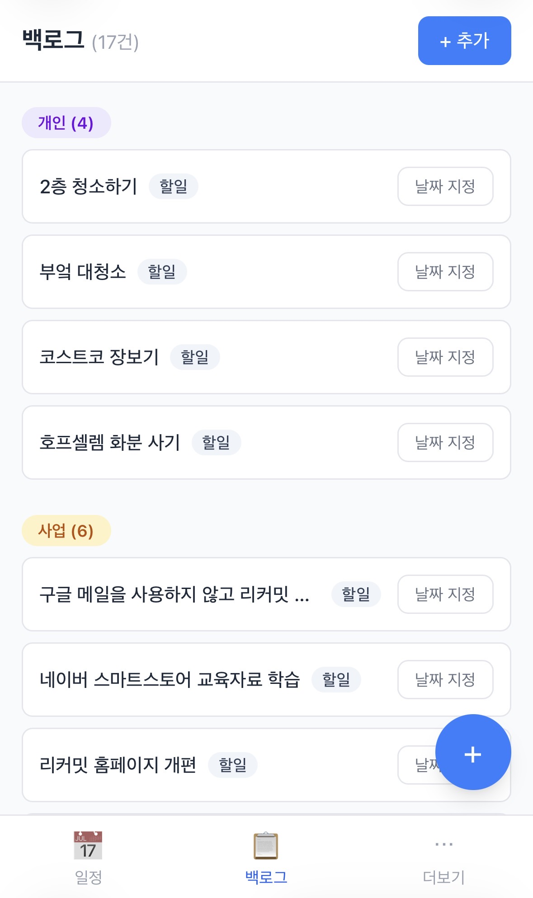
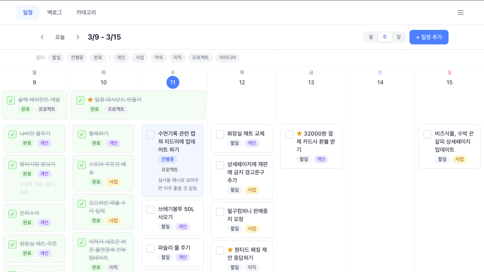
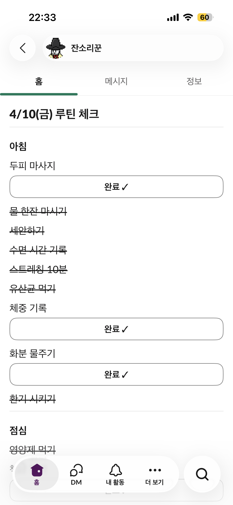
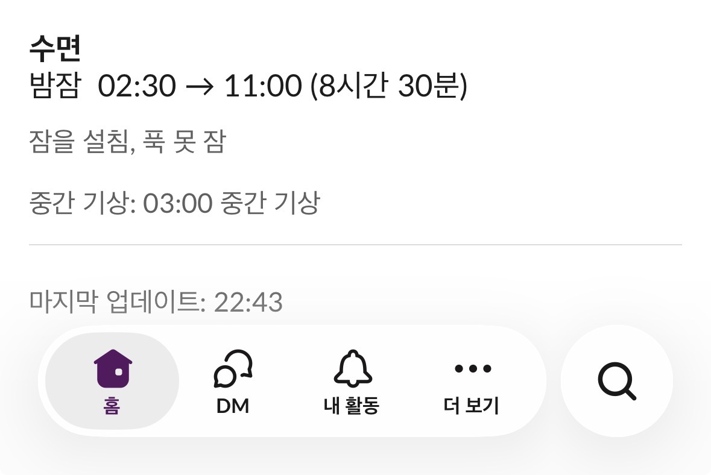

# Slack AI Agent — 개인 라이프 데이터 에이전트

> 자연어로 대화하면 AI가 알아서 기록하고, 분석하고, 잔소리까지 해주는 나만의 생활 관리 에이전트.


## 목차

- [왜 만들었나](#왜-만들었나)
- [아키텍처](#아키텍처)
- [주요 기능](#주요-기능)
- [기술 스택](#기술-스택)
- [설계 노트](#설계-노트)
- [AI 협업 시스템](#ai-협업-시스템--claude-code-전체-기능-활용)
- [메타인지 — Developer Profile](#메타인지--developer-profile)
- [개발 히스토리](#개발-히스토리)
- [프로젝트 구조](#프로젝트-구조)
- [실행 방법](#실행-방법)
- [관련 문서](#관련-문서)

---

<br>

## 왜 만들었나

사업을 운영하면서 할 일이 쏟아졌다. 머릿속에 떠오르는 일정을 카카오톡 나와의 채팅에 적어두고, 나중에 시간을 잡아 노션에 하나하나 정리하곤 했다. 하지만 그 정리 작업 자체가 또 하나의 일이 되었고, 기록이 누락되거나 애매해서 놓치는 일이 생겼다.

**"말만 하면 알아서 기록하고, 잔소리까지 해주는 나만의 AI 에이전트가 있으면 좋겠다."**

일정 관리에서 시작해 루틴, 수면, 생활 패턴 분석까지 — 삶의 모든 데이터를 한 곳에 쌓고, 자연어로 대화하면서 기록하고, 크로스 분석해서 패턴과 인사이트를 뽑아내는 시스템을 만들자. 그래서 Slack + AI + PostgreSQL 기반의 이 프로젝트가 시작되었다.

---

<br>

## 아키텍처

```
                        [Claude Sonnet API (Tool Use)]
                                   ↕
[대화]  [Slack] ←→ [Oracle VM: Node.js + Docker] ↔ SQL ↔ [Neon PostgreSQL]
                                                               ↕
                    [Gemini Flash]                    [Vercel: Next.js 웹 대시보드]
                         ↕                            (캘린더·백로그·카테고리)
[알림]  [Slack] ←── [Cron] ─── SQL 조회 ─────────→ [Neon PostgreSQL]
```

- **대화**: 사용자가 Slack에 자연어로 메시지를 보내면, Claude Sonnet이 의도를 파악하고 SQL 도구를 직접 호출해 데이터를 조회/변경한다. 별도의 API 레이어 없이 LLM이 SQL을 작성하고, 결과를 해석하고, 추가 조회가 필요하면 스스로 도구를 다시 호출하는 **Agent Loop 패턴**으로 동작한다. 도구를 쓸지, 몇 번 호출할지, 어떤 SQL을 작성할지 모두 LLM이 자율 판단한다.
- **알림**: 하루 4회 Cron이 Neon PostgreSQL에서 일정/루틴/수면 데이터를 직접 조회하고, 아침/밤 알림은 Gemini Flash로 자연어 메시지를 생성하여 Slack에 전송한다. 비용 최적화를 위해 크론 메시지 생성만 경량 모델로 분리했다.
- **웹 대시보드**: Next.js 16 기반 캘린더 UI로 Slack 에이전트가 쌓은 데이터를 시각화하고 직접 조작한다. 동일 Neon PostgreSQL을 공유하며, Vercel에서 자동 배포된다.

### v1 → v2 → v3: 아키텍처 전환

처음에는 Notion API + Gemini Flash 기반으로 시작했다. 하지만 운영하면서 근본적인 한계에 부딪혔다.

|              | v1                               | v2                                             |
| ------------ | -------------------------------- | ---------------------------------------------- |
| **데이터**   | Notion (DB별 분리, JOIN 불가)    | PostgreSQL (통합 DB, SQL 크로스 분석)          |
| **모델**     | Gemini Flash (속도형, 추론 약함) | Claude Sonnet (추론형)                         |
| **에이전트** | 채널별 분리 (schedule/routine)   | 단일 통합 에이전트 (LLM이 도메인 자율 판단)    |
| **도구**     | Notion MCP 6개 (범용)            | SQL 도구 3개 (query_db, modify_db, get_schema) |
| **프롬프트** | 150줄+ 규칙 (행동 강제)          | DB 스키마 + 최소 규칙 (모델 자율성 활용)       |

Notion은 테이블 간 JOIN이 안 되니 "루틴 달성률이 낮은 날의 일정 패턴"같은 크로스 분석이 불가능했다. Gemini Flash는 속도는 빠르지만 복잡한 SQL 생성과 맥락 이해에서 자주 틀렸다. 기능을 추가하며 임시방편으로 보수하는 대신, 코어(데이터층 + 모델)를 통째로 교체하는 결정을 내렸다.

v2에서 웹 대시보드를 추가하면서 Docker 서비스가 4개(app, db, web, caddy)로 늘어났고, ARM VM에서 빌드에 4분+가 소요되었다. v3에서는 인프라를 역할별로 분리했다.

|              | v2                                    | v3                                        |
| ------------ | ------------------------------------- | ----------------------------------------- |
| **DB**       | Docker PostgreSQL (self-hosted)       | Neon (managed PostgreSQL)                 |
| **웹**       | Docker + Caddy (HTTPS)                | Vercel (자동 배포, HTTPS 내장)            |
| **봇**       | Docker (VM)                           | Docker (VM) — 동일                        |
| **배포**     | 전체 docker compose (8\~9분)           | 봇: yarn deploy (2분) / 웹: GitHub push   |
| **서비스**   | 4개 (app, db, web, caddy)             | 1개 (app만)                               |

---

<br>

## 주요 기능

### 자연어 일정 관리

말만 하면 일정이 기록되고, 조회되고, 수정된다. 카테고리 자동 분류, 기간 일정, 상태 관리까지 LLM이 자율 판단.



### 데일리 루틴 체크리스트

자연어로 루틴을 등록하고 수정하면 매일 자동 생성되고, Slack Block Kit 버튼으로 체크한다. 달성률 분석, 시간대별(아침/점심/저녁/밤) 분류, 반복 주기(매일/격일/3일마다/주1회) 지원.


### 수면 기록 & 분석

아침 크론 알림이 오면 자연어로 취침/기상 시간을 기록한다. 7일 평균 수면시간 추적, 자정 이후 취침 패턴 감지, 낮잠 분리 기록.




### 크론 알림 시스템

하루 4회 자동 알림으로 하루를 구조화한다.

| 시간  | 내용                                    |
| ----- | --------------------------------------- |
| 09:00 | 오늘 일정 + 루틴 체크리스트 + 어제 리뷰 |
| 13:00 | 미완료 리마인더 + 점심 루틴             |
| 18:00 | 미완료 리마인더 + 저녁 루틴             |
| 22:00 | 하루 종합 리뷰 + 마무리 잔소리          |

### 커스텀 리마인더

자연어로 리마인더를 등록하면 지정된 시간에 자동 알림. 일회성(날짜 지정) / 반복(매일·평일·주말) 지원, 매분 체크로 정시 발동.


### 생활 맥락 인식 잔소리 시스템

에이전트가 매 대화에서 사용자의 현재 생활 상태를 파악하고, 자연스럽게 잔소리한다. SQL 사전 집계로 수면 부족, 루틴 미달성, 일정 과다 등을 실시간 감지하여 시스템 프롬프트에 주입. 추가 LLM 호출 없이 \~150토큰으로 맥락을 제공한다.


### 스마트 메모리

대화 중 사용자의 선호와 패턴을 자동 감지하여 기억한다. 카테고리 분류, 사용자 명시(user) vs 자동 감지(auto) 구분, soft-delete로 데이터 소실 방지.

### 웹 대시보드

Slack 대화만으로 부족했던 **시각적 일정 관리**를 위해 Next.js 16 기반 웹 대시보드를 구축했다. Slack 에이전트가 쌓은 데이터를 캘린더·백로그·카테고리 뷰로 시각화하고, 드래그 앤 드롭으로 직접 조작할 수 있다. Vercel에 자동 배포되어 모바일에서도 접근 가능하고, PWA를 지원해 홈 화면에 추가할 수 있다.

- **월간/주간/일간 캘린더** — 기간 일정 스패닝 바, 카테고리별 색상 분류, 상태 관리(todo → in-progress → done)
- **드래그 앤 드롭** — 일정 이동, 양방향 리사이즈로 기간 조정 (@dnd-kit)
- **백로그** — 날짜 미지정 일정을 카테고리별로 그룹 관리, 빠른 날짜 배정
- **카테고리 관리** — HSL 그라데이션 색상 피커, 드래그 정렬
- **반응형 UI** — 모바일/데스크탑 레이아웃 분리, safe area 대응

[모바일]

<p>
  
  
</p>
<p>
  
  
</p>

[데스크탑]

<p>
  
  
</p>

### App Home 대시보드

Slack App Home 탭에 오늘의 일정 + 루틴 + 수면 요약을 영구 표시. 웹 대시보드 바로가기 버튼으로 Slack ↔ 웹 간 빠른 전환을 지원한다.

<p>
  
  
</p>
<p>
  
  
</p>

---

<br>

## 기술 스택

| 영역       | 기술                                                              |
| ---------- | ----------------------------------------------------------------- |
| AI/LLM     | Claude Sonnet (Tool Use), Gemini Flash (크론 메시지)              |
| Backend    | Node.js + TypeScript (strict)                                     |
| Frontend   | Next.js 16 (App Router) + Tailwind CSS v4 + @dnd-kit              |
| Messaging  | Slack Bolt (Socket Mode)                                          |
| Database   | Neon (managed PostgreSQL)                                         |
| Auth       | iron-session (암호화 쿠키 세션)                                   |
| Scheduling | node-cron (timezone: Asia/Seoul)                                  |
| Bot Infra  | Docker + Oracle Cloud Free Tier ARM VM                            |
| Web Infra  | Vercel (자동 배포, HTTPS 내장)                                    |
| CI/CD      | GitHub Actions (CI + 배포 알림) + Vercel (웹 자동 배포) + yarn deploy (봇) |
| Security   | 다층 보안 체계 (규칙 + 체크리스트 + 스킬 + Hooks)                 |
| Test       | vitest                                                            |

---

<br>

## 설계 노트

### 프롬프트 엔지니어링

LLM이 SQL을 직접 작성하다 보면 반복되는 실수 패턴이 있었다. 이를 분석하고 프롬프트 규칙으로 구조화했다.

- **기간 일정 WHERE 패턴 강제**: `date <= '날짜' AND (end_date >= '날짜' OR end_date IS NULL)` 필수
- **요일 계산 SQL 제한**: LLM이 머릿속으로 요일을 추론하지 못하게 `EXTRACT(DOW FROM date)` 강제
- **3주 날짜 참조표**: 시스템 프롬프트에 어제/오늘/내일\~3주치 날짜-요일 매핑 제공
- **정렬 ORDER BY 템플릿 고정**: 일관된 일정 정렬 보장

### 의도 분류 시스템의 진화

3단계에 걸쳐 근본적으로 변화한 과정이 프로젝트의 핵심 교훈 중 하나다.

1. **LLM 분류** — 모든 메시지를 LLM에 "잡담? 액션?" 질문. 느리고 부정확.
2. **키워드 분류** — 95% 즉시 판단. 하지만 "완료하고 잘거야"(다짐)를 액션으로 오분류해 모든 일정을 완료 처리한 사건 발생. 새 표현마다 키워드를 추가하는 끝없는 보완 작업.
3. **분류 제거** — 분류 단계 자체를 삭제. LLM 에이전트에게 도구를 쓸지 말지 스스로 판단하게 위임. \~500줄 삭제.

> **교훈**: "분류"라는 별도 단계가 필요하다는 가정 자체가 틀렸다. LLM 에이전트는 이미 도구를 쓸지 말지 판단하는 능력이 있다.

### API 비용 최적화

Claude Sonnet 도입 후 비용 증가에 대응한 3-tier 전략:

- **하이브리드 모델**: 크론 메시지 생성은 Gemini Flash로 분리, 대화는 Claude Sonnet 유지
- **프롬프트 압축**: DB 스키마 축약, 커스텀 지시사항 상한선(20개)
- **프리컴퓨팅 설계**: 일/주 단위 요약 캐싱으로 도구 루프 3\~5회 → 1\~2회 감소 (도메인 확장 시 적용 예정)

### KST 타임존 정밀 처리

서버(UTC)에서 한국 날짜/요일이 하루 어긋나는 버그를 발견하고, noon KST 파싱 + UTC 메서드 조합으로 Docker/OS locale에 독립적인 정확성을 확보. `src/shared/kst.ts`로 모든 KST 유틸리티를 통합하여 3개 파일에 흩어진 중복 함수를 제거했다.

---

<br>

## AI 협업 시스템 — Claude Code 전체 기능 활용

이 프로젝트의 또 다른 목표는 **AI와 어떻게 규모 있게 협업할 수 있는가**를 실험하는 것이었다. 첫 번째 AI 프로젝트에서는 "일단 만들면서 정비"했다면, 이번에는 시작부터 CLAUDE.md, 컨벤션 문서, 코드 품질 자동화 시스템을 세우고 그 위에서 작업했다.

### Hooks — 자동 품질 게이트 (3개, 2-tier)

| Hook        | 시점         | 동작                                          |
| ----------- | ------------ | --------------------------------------------- |
| PostToolUse | 파일 수정 후 | prettier + eslint --fix 자동 실행             |
| PreToolUse  | 커밋 전      | yarn lint + tsc 타입 체크                     |
| PreToolUse  | 커밋 전      | 민감정보 유출 스캔 (scripts/check-secrets.sh) |

범용(모든 프로젝트) / 프로젝트 전용으로 2-tier 분리. CI/CD 이전 단계에서 코드 품질과 보안을 자동 확보한다.

### Custom Skills — 개발 워크플로우 자동화 (4개)

| 스킬             | 범위     | 용도                                                                                                             |
| ---------------- | -------- | ---------------------------------------------------------------------------------------------------------------- |
| `/init-project`  | 범용     | 프로젝트 첫 세팅 자동화 — 컨벤션, 브랜치 전략, 라벨 체계, CLAUDE.md 생성                                         |
| `/start-feature` | 프로젝트 | 이슈 생성 → 브랜치 → 설계(⛔ 보안 영향도 분석) → 구현 → 코드 리뷰 → PR까지 전체 워크플로우                       |
| `/review-code`   | 프로젝트 | ⛔ 보안 감사(최우선) + 코드 리뷰 + 컨벤션 점검 + 컨벤션 자동 진화 (7단계)                                        |
| `/review-me`     | 범용     | AI와 프롬프트로 협업하며 나타나는 개발 성향, 의사결정 패턴, 강점/개선점을 분석하여 `developer-profile.md`에 기록 |

스킬 간 파일 기반 연결 구조: `/init-project`가 생성한 컨벤션을 `/start-feature`와 `/review-code`가 참조한다.

### 다층 보안 체계 — Security-by-Design

Public 저장소에서 개인 라이프 데이터를 다루는 특성상, "코드가 보여도 안전한" 설계를 위한 4곳 다층 방어 체계를 구축했다.

| 위치             | 역할                                       | 트리거                 |
| ---------------- | ------------------------------------------ | ---------------------- |
| CLAUDE.md        | 최상위 보안 규칙 (CRITICAL)                | 모든 작업 시 자동 로드 |
| conventions.md   | 보안 체크리스트 (시크릿/API/인프라/의존성) | 코드 작성·리뷰 시 참조 |
| `/review-code`   | 2단계 보안 감사 (코드 리뷰 최우선)         | 리뷰 실행 시           |
| `/start-feature` | 설계 시 보안 영향도 분석 + 커밋 전 점검    | 기능 시작 시           |

보안 이슈는 무조건 🔴(필수 수정) — "나중에 고치자" 원천 차단. Hooks(민감정보 스캔) + 스킬(보안 감사) + 규칙(CLAUDE.md) 3중 방어로 운영한다.

### 개발 리포트 — AI 자율 모니터링 (Scheduled Task)

Claude Code의 Scheduled Task로 매일 자동 실행되는 개발 리포트 시스템.

| 작업                     | 스케줄     | 내용                                                                |
| ------------------------ | ---------- | ------------------------------------------------------------------- |
| nightly-dev-report       | 매일 22:00 | git 분석 + developer-profile.md 업데이트 + Slack 예약 전송 (09:25 작업 요약, 09:30 성향 분석) |

### MCP 서버 연동 (2개)

- **PostgreSQL MCP**: 개발 중 Claude Code에서 운영 DB를 직접 조회/분석. 스키마 변경 영향도 확인, 데이터 정합성 검증 등에 활용.
- **Slack MCP**: Claude Code가 Slack 채널의 실제 대화 내용을 읽고 분석할 수 있도록 연동. 에이전트 응답 품질 점검, 사용자 대화 패턴 분석, 크론 알림 동작 확인 등 운영 모니터링에 활용.

---

<br>

## 메타인지 — Developer Profile

이 프로젝트에서는 `docs/developer-profile.md`를 만들어 AI가 나의 개발 성향을 분석하고 기록하도록 했다. 코드를 짜는 것뿐 아니라, **내 작업 방식을 관찰하고 개선하고 싶었다.**

AI가 관찰한 주요 패턴:

- **실용적 미니멀리스트**: 과도한 설계를 경계하되 확장 가능한 구조를 놓치지 않음. "1단계만 먼저 적용하자"는 접근.
- **비교 기반 학습**: 유사 프로젝트(오픈클로 등)를 연구하고, 원리를 이해한 뒤 자기 규모에 맞게 축소 적용.
- **엣지 케이스 선제 인식**: 구현 전에 실패 시나리오를 먼저 질문. 이 습관이 soft-delete + source 이중 구조 같은 핵심 설계를 이끌어냄.
- **위임과 검증의 균형**: 탐색은 AI에 적극 위임, 설계 결정은 함께 논의, 최종 판단은 직접.

---

<br>

## 개발 히스토리

v1 설계 → 운영 → 한계 인식 → v2 전환 → 웹 대시보드 → v3 인프라 분리까지 진행했다.

| 날짜        | 내용                                                                        |
| ----------- | --------------------------------------------------------------------------- |
| 03-05       | TypeScript + ESM, Slack Bolt, LLM 추상화, MCP 클라이언트                    |
| 03-06       | 일정 에이전트, 크론 알림, 루틴 에이전트, Docker 배포                        |
| 03-07       | SDK 직접 조회(7\~11초→\~1초), 의도 분류 진화, 대화 히스토리                   |
| 03-08       | **v2 전환** — PostgreSQL, KST 수정, App Home, 스마트 메모리                 |
| 03-09       | Hooks/Skills, 비용 최적화, 생활 맥락 잔소리, 개발 크론                      |
| 03-10\~11   | Next.js 캘린더, DnD, 백로그, 카테고리, PWA, 다층 보안 체계, HTTPS 배포      |
| 03-12       | UX 개선, **v3 전환**(Vercel+Neon, Docker 4→1), CI/CD 배포 알림, 캐싱, 테스트 |

> 상세 기록: [docs/project-history.md](docs/project-history.md)

---

<br>

## 프로젝트 구조

```
src/                              # Slack 에이전트 (Oracle VM + Docker)
├── app.ts                        # 서버 진입점
├── router.ts                     # 채널별 에이전트 라우팅
├── agents/
│   └── life/                     # 통합 라이프 에이전트
│       ├── index.ts              # 에이전트 생성 (SQL 도구 기반)
│       ├── prompt.ts             # 시스템 프롬프트 (DB 스키마 + 캐릭터)
│       ├── actions.ts            # 인터랙티브 버튼 핸들러
│       └── blocks.ts             # Slack Block Kit 메시지 빌더
├── cron/
│   └── life-cron.ts              # 통합 크론 알림 (아침/점심/저녁/밤)
└── shared/
    ├── config.ts                 # 환경변수 검증 + 설정
    ├── llm.ts                    # LLM 추상화 (Anthropic/Gemini/Groq)
    ├── agent-loop.ts             # 에이전트 루프 (LLM ↔ 도구 반복)
    ├── db.ts                     # Neon PostgreSQL 연결 + 쿼리
    ├── sql-tools.ts              # SQL 도구 정의 (query_db, modify_db, get_schema)
    ├── life-context.ts           # 생활 맥락 빌더 (잔소리 시스템)
    ├── life-queries.ts           # 크론용 SQL 조회 헬퍼
    ├── chat-history.ts           # 대화 히스토리 (10쌍 슬라이딩 윈도우)
    ├── kst.ts                    # KST 타임존 유틸리티
    ├── personality.ts            # 캐릭터 프롬프트 정의
    └── slack.ts                  # Slack API 유틸리티

web/                              # 웹 대시보드 (Vercel 자동 배포)
├── src/app/
│   ├── schedules/                # 캘린더 (월간/주간/일간)
│   ├── backlog/                  # 백로그 관리
│   ├── categories/               # 카테고리 관리
│   ├── login/                    # 인증
│   └── api/                      # API Routes (Neon DB 직접 연결)
└── src/components/               # 공용 UI 컴포넌트
```

---

<br>

## 실행 방법

```bash
# Slack 봇 (백엔드)
yarn install
cp .env.example .env        # Slack, Anthropic, Neon DB 등 API 키 설정
yarn dev                    # 개발 모드
yarn build && yarn start    # 빌드 & 실행
yarn deploy                 # Oracle VM 배포

# 웹 대시보드
cd web
yarn install
cp .env.example .env.local  # Neon DB URL, 대시보드 비밀번호 설정
yarn dev                    # localhost:3000
# 프로덕션은 Vercel 자동 배포 (GitHub push → 빌드 → 배포)
```

---

<br>

## 관련 문서

| 문서                                                   | 내용                                |
| ------------------------------------------------------ | ----------------------------------- |
| [docs/project-history.md](docs/project-history.md)     | 설계 변화와 의사결정 과정 상세 기록 |
| [docs/conventions.md](docs/conventions.md)             | 코드 컨벤션 & 보안 체크리스트       |
| [docs/developer-profile.md](docs/developer-profile.md) | AI가 분석한 개발자 성향 프로필      |
