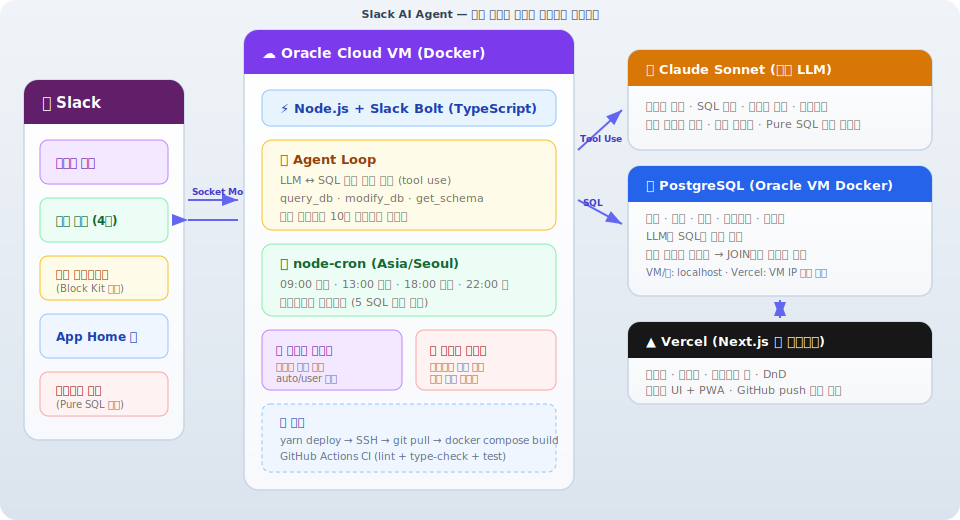
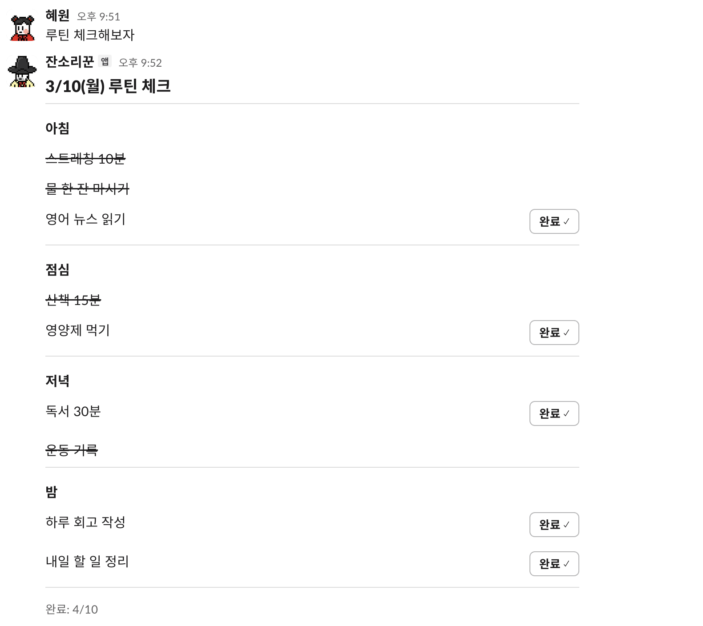
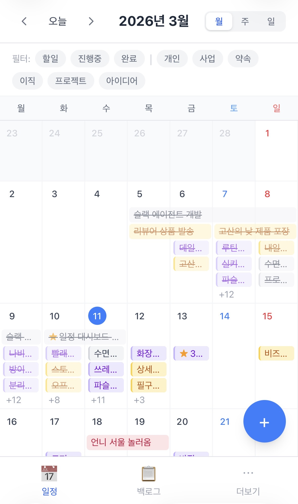
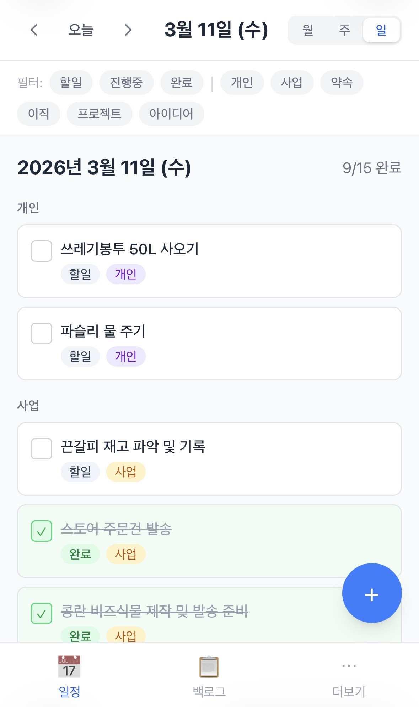
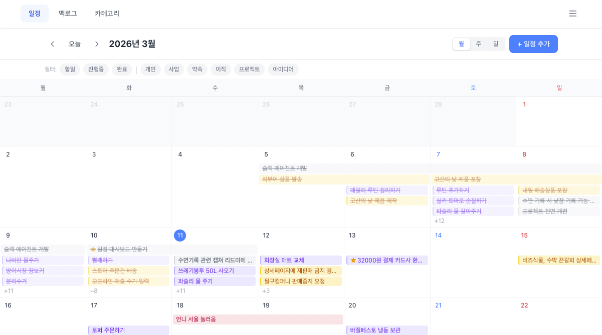
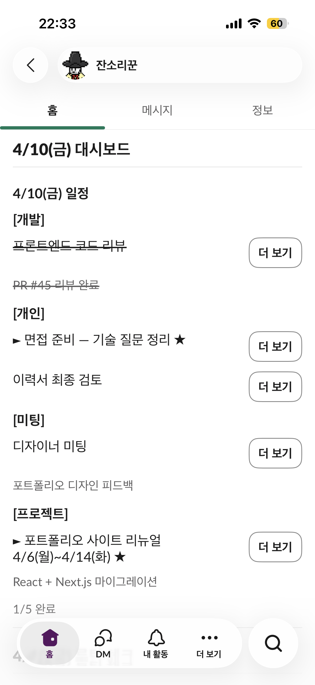
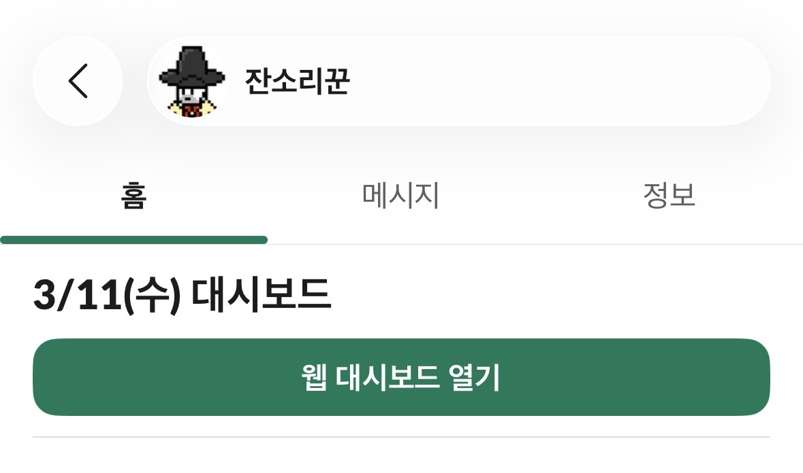

# Slack AI Agent — 개인 라이프 데이터 에이전트

> **자연어로 말만 하면 DB에 쌓이고, AI가 크로스 분석해 인사이트를 먼저 건네는 개인용 에이전트.**
> 내가 매일 쓰려고 만들었고, 5주째 매일 쓰고 있다.


<p align="center">
  <b>5주 실사용</b> · <b>320 tests</b> · <b>100+ PR</b> · <b>Public 저장소 + 개인 데이터 보안</b> · <b>1인 풀스택</b>
</p>

---

## 이 프로젝트의 핵심

- **Dogfooding 기반 설계** — 내가 매일 쓰는 실제 도구. "쓰다 보니 불편한 지점"이 곧 이슈가 되고 다음 PR이 된다. 5주 연속 일일 사용.
- **운영 중인 LLM 에이전트** — LLM이 SQL을 직접 쓰는 구조에서 발생하는 비용·정확도·안전 문제를 운영하며 하나씩 해결.
- **Public 저장소 × 민감 데이터 다층 보안** — 코드가 전부 공개된 상태에서 개인 일정·수면·루틴 데이터를 지키는 구조적 방어 설계.
- **AI 개발 파이프라인 자체를 운영** — Claude Code의 Hooks·Skills·MCP·Scheduled Tasks를 조합해 설계→구현→리뷰→PR을 자동화. 설계(Opus) / 구현(Sonnet) 모델 분리로 토큰 비용 최적화.

---

## 어떻게 동작하나

<p align="center">
  
</p>

핵심은 **LLM이 DB 전체에 자유롭게 접근하는 구조**다. Claude Sonnet이 SQL을 직접 작성·실행·반복하며(Agent Loop) 도구 호출 여부와 횟수를 자율 판단한다. 테이블만 추가하면 별도 코드 없이 크로스 분석이 가능하다.

Vercel(웹)은 DB에 직접 연결하지 않고, **HTTPS API 프록시**를 경유해 데이터를 조회한다. DB 포트는 외부에 노출되지 않으며, 전 구간 TLS로 암호화된다.

---

## 차별점

### 1. 실사용 드리븐 설계 — 내가 매일 쓰면서 만든다

- 체크리스트가 Slack 스크롤에 밀려 안 보임 → **App Home** 도입
- LLM 응답이 7\~11초 걸림 → **fast path**(정규식 → 직접 SQL → Block Kit)로 \~1초
- LLM 호출 비용이 아까움 → **웹 대시보드** 분리해 단순 조작은 LLM 없이 처리
- 사주 해석 오류가 반복됨 → **만세력 계산 유틸리티**를 직접 코드로 구현해 LLM은 해석만 담당

문제를 추상적으로 상상하지 않고, 실사용 중 마주친 마찰을 추적해 해결한다.

### 2. LLM × SQL 자율 에이전트 + 비용·안전 제어

- **2-tier 비용 구조** — Claude Sonnet(대화/크론/주간 리포트) + Pure SQL(프로액티브 인사이트/넛지). 패턴 감지가 명확한 영역은 LLM 호출 없이 SQL로 처리.
- **프롬프트 엔지니어링** — LLM 반복 실수를 관찰·분류해 규칙으로 차단. 의도 분류 시스템은 3단계 진화 후 **삭제**("분류 단계가 필요하다"는 가정 자체가 틀렸다는 결론).
- **아키텍처 3회 전환** — Notion→PostgreSQL, 단일 Docker→멀티 서비스→Vercel 분리. 임시방편 대신 코어 교체로 대응. [의사결정 과정](docs/project-history.md).

### 3. Public 저장소 × 개인 데이터 다층 보안

코드가 전부 공개된 상태에서 개인 데이터를 지키려면 "코드가 보여도 안전한" 구조가 필요하다.

| 계층 | 방어 |
|------|------|
| 네트워크 | DB·API 포트 루프백 바인딩, 외부 트래픽은 Caddy TLS 종료 강제, HTTPS API 프록시 경유 |
| 인증 | Bearer API Key(타이밍 세이프 비교), iron-session, 요청 크기 1MB 제한 |
| SQL 실행 | 테넌트 격리 검증, DDL/위험 함수 차단, WHERE 필수 + 벌크 50행 제한, `statement_timeout` 파라미터화 |
| LLM | 프롬프트 인젝션 패턴 감지, SQL 감사 로그 |
| 요청 제어 | 슬라이딩 윈도우 Rate Limiter(5req/min), 10KB 메시지 제한, 봇 루프 필터 |
| 개발 프로세스 | 커밋 전 시크릿 스캔 Hook, PR 리뷰 스킬에 보안 감사 체크리스트 내장 |

### 4. AI 개발 파이프라인 자체를 프로덕트화

```
/design (Opus)  →  .claude/plans/  →  /compact  →  /build (Sonnet)
  설계·인터뷰         계획서 핸드오프     컨텍스트 정리    구현·리뷰·PR
```

- **Hooks (3)**: prettier/eslint 자동 실행, tsc+lint pre-commit, 시크릿 스캔
- **Custom Skills (3)**: `/init-project`, `/design`(Opus), `/build`(Sonnet) — 설계/구현 모델 분리로 토큰 비용 최적화, 계획서 파일로 핸드오프
- **MCP**: PostgreSQL(운영 DB 조회), Slack(에이전트 응답 품질 점검)
- **Scheduled Tasks**: 매일 22:00 git 분석 → `developer-profile.md` 업데이트 → Slack 예약 전송

AI를 "코딩 보조"가 아니라 **협업 개발자**로 취급하고, 작업 단위는 GitHub Issues·PR로 리뷰·검증한다.

---

## 주요 기능

### Slack 에이전트 — 자연어로 모든 생활 데이터 관리

일정·루틴·수면·지출·일기를 자연어 대화만으로 기록·조회·수정. 하루 2회 크론 알림 + 프로액티브 인사이트(넛지) + 생활 맥락 기반 잔소리. 스마트 메모리로 사용자 선호를 자동 학습.

<p>
  
  
</p>

### 프로액티브 인사이트 — 물어보지 않아도 패턴을 감지

5가지 SQL 패턴 감지(streak · sleepTrend · slotGap · weekComparison · overdueAlert) → 우선순위 선택 → 아침/밤 알림에 자동 삽입. **LLM 호출 없이 Pure SQL**로 동작. 주간 리포트와 자연어 분석은 Claude Sonnet이 담당.

### 웹 대시보드 — LLM 비용 절감 + UX 편의성을 하나의 설계로 해결

단순 조작(이동·체크·수정)은 LLM을 거치지 않고 직접 처리. 캘린더·백로그·카테고리·루틴 히트맵을 시각화하고, 드래그 앤 드롭(@dnd-kit)으로 일정 이동·리사이즈, 반응형 UI + PWA.

<p>
  
  
  
</p>

### App Home — Slack 내 대시보드

오늘의 일정·루틴·수면 요약을 Slack App Home 탭에 영구 표시. Slack 스크롤에 밀리는 문제 해결.

<p>
  
  
</p>

---

## 기술 스택

| 영역 | 선택 |
|------|------|
| AI/LLM | Claude Sonnet (Tool Use) — 대화·크론·주간 리포트 |
| AI 개발 | Claude Code — Hooks · Custom Skills · MCP · Scheduled Tasks |
| Backend | Node.js + TypeScript (strict) |
| Frontend | Next.js 16 (App Router) + Tailwind v4 + @dnd-kit |
| Messaging | Slack Bolt (Socket Mode) |
| Database | PostgreSQL 17 (Docker, TLS on) |
| Auth | iron-session (암호화 쿠키 세션) |
| Infra | Docker Compose + 클라우드 VM · Vercel · Caddy(호스트 서비스, 자동 TLS) |
| CI/CD | GitHub Actions → GHCR 이미지 빌드·자동 정리 → VM pull + 재기동 |
| Test | vitest — **320 tests / 17 files** |

---

## 개발 히스토리

> **2026-03-05 시작. 5주째 매일 사용 중.** (2026-04-10 기준)

| 주차 | 핵심 변화 |
|------|-----------|
| W1 (03-05\~11) | Slack Bolt · LLM 추상화 · 일정/루틴 에이전트 · 속도 최적화(7\~11초→\~1초) · **v2 전환**(Notion→PostgreSQL) · App Home · 스마트 메모리 · Hooks/Skills · HTTPS 배포 |
| W2 (03-12\~15) | **v3 전환**(Vercel+VM 분리) · 320 테스트 · CI/CD Slack 알림 · 웹 대시보드 UX(DnD·PWA·반응형) · 카테고리 유형 시스템 · **명리학/일기 도메인** · 만세력 계산 유틸리티 |
| W3 (03-22) | 하위 카테고리(subcategory) + 일정 폼 UX |
| W4 (04-03\~07) | 루틴 관리 대시보드(히트맵) · **Neon→VM PostgreSQL 마이그레이션** · 디자인 시스템(공통 컴포넌트 7개) · 결제수단/할부 입력 |
| W5 (04-09\~10) | **보안 아키텍처 전면 강화** — DB Proxy API · Rate Limiting · SQL 감사 로그 · 전 구간 TLS · 포트 루프백 바인딩 <br> **배포 파이프라인 최적화** — GHCR 이미지 빌드(warm cache \~81초 고정, 편차 13배→2배) · 이미지 자동 정리 |

**누적**: 430+ 커밋 · 100+ PR · 95+ 이슈 · [상세 기록](docs/project-history.md)

---

## 프로젝트 구조

```
src/                       # Slack 에이전트 (VM + Docker)
├── app.ts                 # 서버 진입점
├── router.ts              # 채널별 라우팅 + Rate Limiting
├── db-proxy.ts            # DB Proxy API (Vercel → HTTPS → DB)
├── agents/life/           # 통합 라이프 에이전트 (SQL 도구 기반)
├── cron/                  # 크론 알림 + 주간 리포트
└── shared/                # LLM, agent-loop, sql-tools, insights, ...

web/                       # 웹 대시보드 (Vercel 자동 배포)
└── src/app/               # schedules · backlog · categories · routines · ...
```

---

## 실행 방법

```bash
# Slack 봇 (백엔드)
yarn install
cp .env.example .env        # Slack, Anthropic, DB 등 API 키 설정
yarn dev                    # 개발 모드
yarn build && yarn start    # 빌드 & 실행
yarn deploy                 # 운영 VM 배포 (SSH → deploy.sh)

# 웹 대시보드
cd web && yarn install
cp .env.example .env.local  # DB Proxy URL, 세션 시크릿 등
yarn dev                    # localhost:3000
# 프로덕션은 Vercel 자동 배포 (GitHub push → 빌드 → 배포)
```

---

## 관련 문서

| 문서 | 내용 |
|------|------|
| [docs/project-history.md](docs/project-history.md) | 설계 변화와 의사결정 과정 상세 기록 |
| [docs/conventions.md](docs/conventions.md) | 코드 컨벤션 & 보안 체크리스트 |
| [docs/pipeline-optimization.md](docs/pipeline-optimization.md) | 배포 파이프라인 최적화 (GHCR 이미지 빌드) |
| [docs/developer-profile.md](docs/developer-profile.md) | AI가 분석한 개발자 성향 프로필 (gitignored) |
