# 라이프 데이터 LLM 에이전트 — 잔소리도 하고, 잔소리 근거도 통계로 검증한다

> 자연어로 일정·루틴·수면·지출·일기를 기록하면, Claude가 SQL로 DB를 관리하고 크로스 분석해 "일찍 자야 일정 다 해내" 같은 잔소리를 먼저 건넨다.
> **LLM이 자율로 발견한 가설은 매주 통계 검정(Fisher's exact + BH-FDR)을 거쳐 채택·기각이 자동 결정된다** — 자기 출력의 신뢰도를 시스템이 직접 측정한다.
> 기획·보안·운영까지 1인, 2026-03-05 시작 후 매일 사용 중.

<p align="center">
  
</p>

<p align="center">
  
  
  
  
  
</p>

---

## 이 프로젝트의 핵심

### 1. 프로액티브 인사이트 + 생활 맥락 잔소리

LLM이 그날의 라이프 데이터(일정·루틴·수면·일기) + 명리학 해석을 크로스 분석해 잔소리를 먼저 건넨다. **패턴 감지는 직접 짠 SQL이, 잔소리 합성은 LLM이** — 역할을 명확히 나눠 비용·속도·품질을 동시에 잡았다.

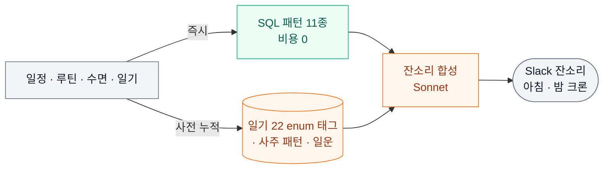
```mermaid
graph LR
    D[일정 · 루틴 · 수면 · 일기] -->|즉시| P[SQL 패턴 11종<br/>비용 0]
    D -->|사전 누적| L[(일기 22 enum 태그<br/>· 사주 패턴 · 일운)]
    P --> SY[잔소리 합성<br/>Sonnet]
    L --> SY
    SY --> O([Slack 잔소리<br/>아침 · 밤 크론])

    classDef io fill:#f3f4f6,stroke:#6b7280,color:#111827
    classDef fast fill:#ecfdf5,stroke:#10b981,color:#065f46
    classDef loop fill:#fff7ed,stroke:#f97316,color:#9a3412
    class D,O io
    class P fast
    class L,SY loop
```

**SQL이 잡는 패턴** (LLM 미경유, 비용 0)

- **11가지 감지 패턴** — `streak`(연속 기록), `sleepTrend`(수면 추세), `slotGap`(시간대별 루틴 격차), `weekComparison`(전주 대비), `overdueAlert`(기한 초과), `categorySkew`(카테고리 편향), `drift`(점진적 이탈), `recovery`(회복 신호), `lapseAlert`(단절 경보), `weeklyRegression`(주간 회귀), `spottyPattern`(산발 패턴). CTE·window function으로 직접 감지
- **수면·루틴·일정 영향 분석** — `sleepTrend` 패턴이 수면 부족 → 루틴/일정 하락 상관을 자동 감지

**LLM이 합성하는 영역 — 출력은 다 화이트리스트·DB 제약으로 검증**

- **일기 메타 태그 추출 (22 enum 화이트리스트)** — Opus가 일기 텍스트에서 `irritation`·`mood_down`·`task_completion` 같은 22개 enum 태그를 골라낸다. 시스템 프롬프트가 "이 22개 외엔 절대 출력 금지"로 강제 + 응답 파싱 후 `TAG_SET` 화이트리스트로 한 번 더 필터. **자유 텍스트로 새 태그가 들어올 수 없는 구조** → 카탈로그·가설 검증의 입력 일관성 보장
- **주간 사주 회고** — 매주 월요일 아침 Opus가 지난 7일 메트릭 + 신뢰도 단계별 영향력(verified/accumulating/recent)을 받아 사주 관점 회고를 Block Kit 카드로 발송. 멱등성(idempotency) DB 제약(`UNIQUE(user_id, week_start) ON CONFLICT DO NOTHING RETURNING`)으로 크론 재실행·재시도에도 정확히 1회 영속화
- **잔소리 합성** — SQL이 모은 패턴 + 일기 + 사주 패턴을 받아 그날 톤·맥락에 맞는 잔소리로 합성

**하루 두 번 작동** — 밤은 그날 데이터를 엮은 잔소리, 아침은 어제 루틴 달성도 + 오늘 일정 안내.

<p align="center">
  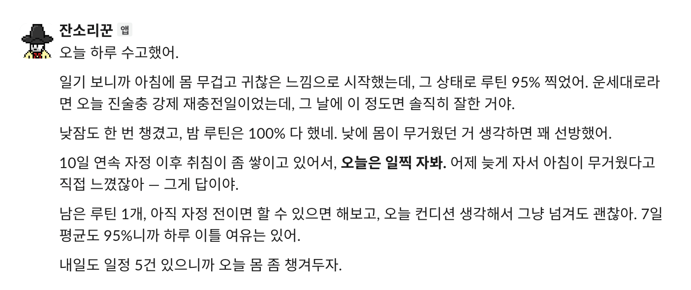
</p>

### 2. LLM 자율성 + 출력 신뢰도 자동 검증

LLM이 SQL을 자율로 쓰고 가설까지 자율 생성하는 구조는 강력하지만, "**LLM이 만든 게 진짜 맞나?**"를 사람이 매번 검증할 수는 없다. 이 시스템은 세 층의 자동화로 LLM 출력을 통제·검증한다.

#### (a) 실행 안전 가드레일 — LLM이 짠 SQL이 위험하지 않은가

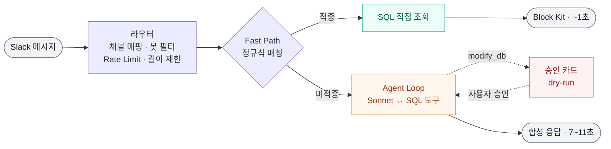
```mermaid
graph LR
    U([Slack 메시지]) --> R[라우터<br/>채널 매핑 · 봇 필터<br/>Rate Limit · 길이 제한]
    R --> F{Fast Path<br/>정규식 매칭}
    F -->|적중| FP[SQL 직접 조회]
    F -->|미적중| AL[Agent Loop<br/>Sonnet ↔ SQL 도구]
    AL -. modify_db .-> A[승인 카드<br/>dry-run]
    A -. 사용자 승인 .-> AL
    FP --> O1([Block Kit · ~1초])
    AL --> O2([합성 응답 · 7~11초])

    classDef io fill:#f3f4f6,stroke:#6b7280,color:#111827
    classDef fast fill:#ecfdf5,stroke:#10b981,color:#065f46
    classDef loop fill:#fff7ed,stroke:#f97316,color:#9a3412
    classDef guard fill:#fef2f2,stroke:#ef4444,color:#991b1b
    class U,O1,O2 io
    class FP fast
    class AL loop
    class A guard
```

- **라우터 1차 필터** — 채널별 에이전트 매핑(`#life`/`#insight`/`#money`), 봇 메시지·subtype 필터(에코·루프 차단), 사용자별 슬라이딩 윈도우 Rate Limit(1분 5회), 메시지 길이 10KB 제한
- **DB Proxy + SQL 화이트리스트** — DDL(테이블 생성·삭제·구조 변경) 차단, 위험 함수 차단, WHERE 필수, 벌크 처리 행 수 제한
- **modify_db 승인 플로우** — 변경 쿼리는 Slack 카드로 dry-run 결과를 보여주고 사용자 승인 후 실행
- **LLM 자율 슬롯 4중 안전장치** — LLM이 자유롭게 발견 쿼리를 짤 수 있는 슬롯엔 (1) SELECT-only 강제 (2) `get_schema` 사전 호출 의무 (3) `result_type` 화이트리스트 (4) `verify_after_days` 1\~28 clamp으로 폭주 방지. 슬롯 설계 전반 + 4중 안전장치 상세는 [ADR 0016](docs/adr/0016-llm-autonomous-slot-outcome-verification.md) Section 3

<p align="center">
  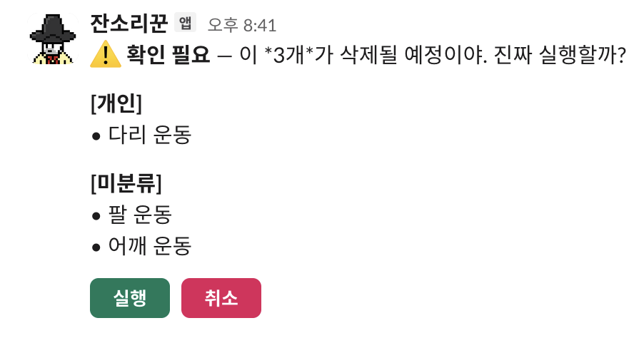
  &nbsp;&nbsp;
  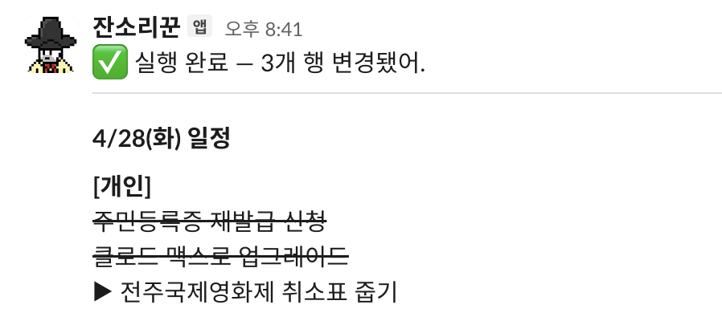
</p>

#### (b) 출력 신뢰도 자동 검증 — LLM이 만든 가설이 정말 맞나

두 시스템이 병렬로 돌고, 결과는 view 하나로 묶인다.

- **카탈로그 누적 매칭** — 매일 사주 시드 점수 + 일기 22 enum 태그를 페어로 카운트. `saju_seed_outcome_catalog`가 hit/miss 카운터로 단순 누적 (통계 검정 없음, 빠른 시그널 트래킹)
- **가설 검증 파이프라인** — 충분히 누적된 페어 + Opus 자율 발견을 `saju_hypotheses`에 등록. status는 `active`/`confirmed`/`rejected`/`archived` 4종. 매주 월요일 cron이 통계로 자동 전이
- **신뢰도 라벨링 view** — `saju_influence_summary` view가 두 시스템 결과를 confidence_tier로 묶어 실시간 응답에 노출 ([ADR 0020](docs/adr/0020-fortune-system-responsibility-split-via-view.md))

```mermaid
graph TB
    D[일기 22 enum 태그<br/>+ 일운 시드 점수] --> CAT[(카탈로그 카운터<br/>seed × tag · hit/miss)]
    CAT -->|충분히 누적된 페어 승격<br/>+ Opus 자율 발견| H[(가설 saju_hypotheses<br/>status = active)]
    H -->|매주 월요일 cron| ST[Fisher's exact + BH-FDR<br/>+ 4주 추세]
    ST --> V{자동 전이 평가}
    V -->|q < 0.05<br/>AND rate_ratio ≥ 1.3<br/>AND 누적 trigger ≥ 30일| CF[status = confirmed]
    V -->|최근 4주 rate_ratio<br/>0.95 ~ 1.05 평탄| RJ[status = rejected]
    V -->|조건 미달| H

    CF -. verified tier .-> VIEW[saju_influence_summary VIEW<br/>신뢰도 라벨링]
    CAT -. accumulating tier<br/>hit_rate ≥ 0.55, n ≥ 5 .-> VIEW
    REC[(최근 7일 trigger 발현)] -. recent tier .-> VIEW
    VIEW --> O([실시간 LLM 응답에<br/>tier별 노출])

    classDef io fill:#f3f4f6,stroke:#6b7280,color:#111827
    classDef stat fill:#dbeafe,stroke:#2563eb,color:#1e3a8a
    classDef store fill:#ecfdf5,stroke:#10b981,color:#065f46
    classDef view fill:#fef3c7,stroke:#d97706,color:#92400e
    class D,O,REC io
    class V,CF,RJ,ST stat
    class CAT,H store
    class VIEW view
```

**자동 전이 조건 — 코드가 가설을 결정한다 (사람 개입 0)**

- `active → confirmed`: BH 보정 후 **q < 0.05** AND **rate_ratio ≥ 1.3** (effect size 컷 — 통계적 유의해도 효과 미미하면 채택 안 함) AND **누적 trigger 발현일 ≥ 30**
- `active → rejected`: 최근 4주 rate_ratio가 **0.95 ~ 1.05에서 평탄** = 효과 없음
- 조건 미달이면 `active` 유지하고 다음 주 재평가

**왜 두 시스템으로 나눴나** — catalog는 "이 페어가 자주 같이 나옴"의 빠른 트래킹(통계 검정 없이 카운터만). 검증된 신호로 격상하려면 가설 파이프라인을 거쳐 통계 검정을 받아야 함. 두 단계를 view로 묶어 신뢰도 단계별로 라벨링.

**왜 outcome 기반 검증인가** — LLM이 텍스트로 그럴듯한 가설을 만드는 건 쉽지만, **사용자 실제 데이터에 맞는지는 별개**. 이 시스템은 LLM 텍스트 의존을 최소화하고(일기 태그도 22 enum 화이트리스트로 강제), 가설의 채택·기각을 **실제 outcome 통계로만** 결정한다. 결정론(SQL 패턴·카탈로그 카운터)과 자율(LLM 가설)의 책임을 분리하고, 자율 출력엔 검증 기간을 의무화 — 신뢰 비용을 시스템에 외주화한다 ([ADR 0019](docs/adr/0019-saju-hypothesis-verification-pipeline.md)).

**멱등성(idempotency) DB 제약** — 주간 회고 생성·일기 메타 적재 등은 `UNIQUE + ON CONFLICT DO NOTHING RETURNING`으로 강제. 크론 재실행·LLM 재시도가 일어나도 정확히 1회 영속화. LLM은 매번 다른 답을 줄 수 있으므로 신뢰 비용을 DB 제약으로 흡수.

#### (c) 비용·품질·속도 제어 — 출력은 어떻게 빨라지나

- **Sonnet/Opus 분리** — 실시간 대화는 Sonnet, 비동기 깊은 분석(주간 사주 회고·일기 메타 추출·가설 발견)은 Opus + Scheduled Task로 분리해 결과를 DB에 영속화. 실시간 응답은 DB 조회로 풍부한 맥락을 프롬프트에 주입
- **프롬프트 캐싱** — Anthropic `cache_control: ephemeral`로 시스템 프롬프트·도구 정의 캐시 → 토큰 비용 최대 90% 절감
- **Fast path 바이패스** — 정규식 매칭 가능한 단순 조회는 LLM 우회 → \~1초 응답 (LLM 경유 시 7\~11초)

### 3. Public 저장소 개인 데이터 다층 보안

코드가 전부 공개된 상태에서 개인 데이터를 지키려면 **코드가 보여도 안전한** 구조가 필요하다.

| 계층          | 방어                                                                                              |
| ------------- | ------------------------------------------------------------------------------------------------- |
| 네트워크      | DB·API 포트 루프백 바인딩, 외부 트래픽은 Caddy TLS 종료 강제, HTTPS API 프록시 경유               |
| 인증          | Bearer API Key(타이밍 세이프 비교), iron-session, 요청 크기 1MB 제한                              |
| SQL 실행      | 테넌트 격리 검증, DDL/위험 함수 차단, WHERE 필수 + 벌크 행 수 제한, `statement_timeout` 파라미터화 |
| LLM           | 프롬프트 인젝션 패턴 감지, SQL 감사 로그, 자율 슬롯 4중 안전장치                                  |
| 요청 제어     | 슬라이딩 윈도우 Rate Limiter, 메시지 크기 제한, 봇 루프 필터                                      |
| 개발 프로세스 | 커밋 전 시크릿 스캔 Hook, PR 리뷰 스킬에 보안 감사 체크리스트 내장                                |

### 4. A to Z 1인 제작 + AI 협업 파이프라인

기획·설계·구현·보안·배포·운영까지 혼자. Claude Code의 기능을 조합해 **AI를 코딩 보조가 아니라 협업 개발자**로 다루는 흐름을 세웠다.

```
/design  →  .claude/plans/  →  /compact  →  /build
  설계·인터뷰    계획서 핸드오프    컨텍스트 정리    구현·리뷰·PR
```

- **Hooks**: 자동 포맷·린트·타입체크·시크릿 스캔
- **Custom Skills**: `/init-project`, `/design`, `/build` — 계획서 파일로 세션 간 핸드오프
- **MCP**: Slack(에이전트 응답 품질 점검)
- **Scheduled Tasks (비동기 깊은 분석 전용)**: 주간 사주 회고(Opus, 신뢰도 단계별 영향력 통합), 일기 메타 추출(Opus), 주간 일운 사전 분석, 밤 응원 메시지

**설계 사고 5문서 아키텍처** — 인터뷰 분기점·포기·회고가 코드만 남고 휘발되는 문제를 해결하기 위해 사고를 5문서로 분산. 각 문서마다 owner(`/design` / `/build`)가 명시되어 단계별로 자동 갱신된다.

| 문서                  | 역할                                | owner             |
| --------------------- | ----------------------------------- | ----------------- |
| `plans/`              | 구현 직전 메모 (휘발)               | `/design`         |
| `design-notebook/`    | 마스터 단위 서사·분기점·회고 누적   | `/design`+`/build`|
| `adr/`                | 되돌리기 어려운 결정 (Michael Nygard, 불변) | `/design`   |
| `features.md`         | 현재 기능 카탈로그                  | `/build`          |
| `domains/<domain>.md` | 도메인별 스키마·API·로직 상세       | `/design`+`/build`|

**비공개 어필 누적본** — phase 마감마다 비자명한 작업 패턴(헌장 cross-check, view 매개 통합, idempotency DB 제약 같은 것)을 `_personal/portfolio-candidates.md`에 누적. 추천 시점에 Claude가 평가 기준(일반화 가치·비자명성·원천 안정성·단발 vs 누적)으로 후보를 제안하고 사용자가 선택. README·이력서 갱신 시 이 누적본을 단일 소스로 사용.

**자체 업타임 모니터링**: GitHub Actions cron으로 봇·웹 5분 간격 폴링 + Slack DOWN/RECOVERY 알림.

작업 단위는 GitHub Issues·PR로 리뷰·검증한다. 작업 방식 자체는 별도 메타 repo([build-with-ai](https://github.com/hyewon3938/build-with-ai))에 누적.

---

## 주요 기능

> 일정·루틴·수면·리마인더는 #life 채널에서, 일기·사주는 #insight 채널에서 자연어로 처리한다. 지출·예산은 웹 대시보드 전용.

### 1. 일정·루틴 — 하루 2회 크론 알림으로 일상 흐름 관리

일정과 루틴을 자연어 대화로 기록·조회·수정. 하루 2회 크론 알림이 진행 현황 리뷰와 프로액티브 잔소리를 함께 전달한다.

- **아침 알림** — 어제 루틴 최종 달성도 + 오늘 일정 + 낮 루틴 체크리스트
- **밤 알림** — 오늘 일정 소화 현황 + 루틴 진행률 + 그날 데이터 기반 잔소리

### 2. 수면 — 자연어 입력 + 패턴 분석

**수면 워크플로우** — 아침에 봇이 기록 알림 → 슬랙에 자연어 입력(취침/기상/중간기상/메모) → 자동 파싱·저장 → 웹 대시보드에서 시각화 + 규칙성 점수 → 수면 부족한 날 루틴/일정 하락 상관 분석 → 잔소리 근거로 재활용

<p align="center">
  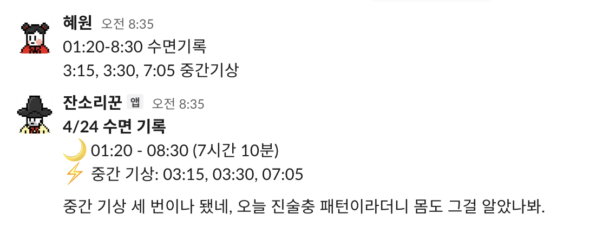
</p>

### 3. 리마인더 — 자연어로 만드는 알림

"이제부터 매일 11시에 약 먹기 리마인더 해줘", "매주 일요일 저녁에 한 주 회고 알림" 같은 자연어를 봇이 cron 표현식으로 변환·저장하고, 등록된 시간이 되면 봇이 자기 자신을 호출해 알림을 보낸다. 자연어로 조회·수정·삭제까지 가능.

- **LLM 자율 cron 추론** — 자연어 시간 표현 → cron 형식 변환을 LLM에 위임
- **에이전트가 자기 자신을 스케줄링** — 등록된 리마인더는 봇이 미래 시점의 자기 자신을 호출하는 구조로 동작
- **자연어 CRUD** — "그 리마인더 화요일로 바꿔줘", "약 먹기 리마인더 삭제" 같은 수정·삭제도 자연어로

<p align="center">
  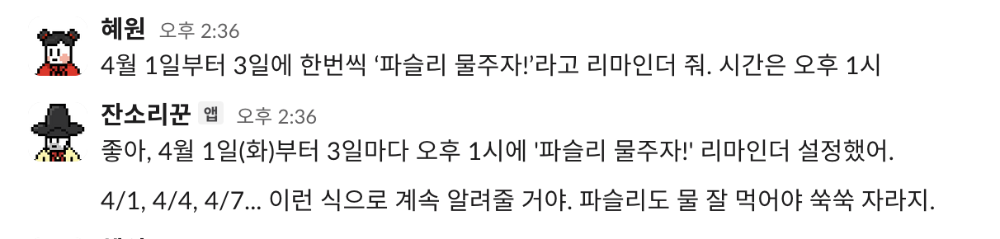
</p>

### 4. 일기·사주 — 일기 누적 + 명리학 해석 강화 루프

`#insight` 채널은 일기와 명리학 해석이 함께 모이는 곳. 일기 패턴 위에 **명리학(사주) 해석 프레임**을 결합 — 라이프 데이터에 사주 기반 패턴 분석을 더한 실험.

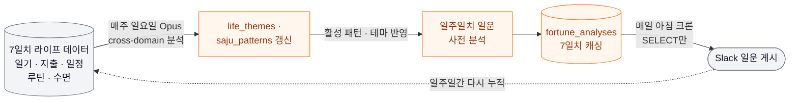
```mermaid
graph LR
    D[(7일치 라이프 데이터<br/>일기 · 지출 · 일정<br/>루틴 · 수면)]
    D -->|매주 일요일 Opus<br/>cross-domain 분석| W1[life_themes ·<br/>saju_patterns 갱신]
    W1 -->|활성 패턴 · 테마 반영| W2[일주일치 일운<br/>사전 분석]
    W2 --> FA[(fortune_analyses<br/>7일치 캐싱)]
    FA -->|매일 아침 크론<br/>SELECT만| O([Slack 일운 게시])
    O -. 일주일간 다시 누적 .-> D

    classDef io fill:#f3f4f6,stroke:#6b7280,color:#111827
    classDef loop fill:#fff7ed,stroke:#f97316,color:#9a3412
    class D,O io
    class W1,W2,FA loop
```

**(1) 매일 일운 자동 게시** — 매일 아침 봇이 사전 분석된 그날의 일운(천간·지지·십성)을 #insight에 게시. 활성 사주 패턴 + 라이프 테마 해석이 자동 반영.

**(2) 순간순간 일기 작성** — 체감·감정·메모를 짧은 텍스트로 슬랙에 자유롭게 입력. 같은 날의 메시지는 자동으로 묶여 `diary_entries`에 누적.

**(3) 주간 분석 (두 routine 순차)** — 매주 일요일 Opus가 두 단계로 작동. 먼저 누적된 일기·지출·일정·루틴·수면 + 일운을 28일 윈도우로 cross-domain 분석해 `saju_patterns`·`life_themes`를 갱신, 이어서 다음 일주일치 일운을 사전 분석해 `fortune_analyses`에 저장. 활성 패턴은 다음 주 일운부터 자동 반영 → 해석이 매주 강화되는 루프.

**(4) 가설-검증 정량 파이프라인** — Opus가 자율로 발견한 사주 trigger ↔ 라이프 outcome 가설을 매주 Fisher's exact + BH-FDR로 검정. `confirmed`로 자동 전이된 가설만 잔소리·회고에 노출 ([2 (b)](#b-출력-신뢰도-자동-검증--llm이-만든-가설이-정말-맞나) 참조).

**(5) 잔소리에 재활용** — 같은 날의 일기는 1번 차별점의 밤 잔소리 LLM에도 주입. 본인 진술과 데이터 패턴을 함께 짚는 잔소리가 가능.

- **만세력 계산 유틸** — LLM 할루시네이션 방지를 위해 직접 코드로 구현 ([docs/domains/insight.md](docs/domains/insight.md))
- **운세 fast path** — `일운`/`월운` 등은 정규식 매칭 → DB 직접 조회로 LLM 우회
- **60갑자 카탈로그 정규화** — 천간·지지·갑자 마스터를 SQL 테이블로 분리하고 일일 매칭은 카탈로그 lookup으로 처리 ([ADR 0017](docs/adr/0017-saju-ganji-master-normalization.md))

### 5. 지출·예산 — 개인 예산 엔진

목표 기간을 설정하면 월·일 단위 예산이 자동 분배되고, 일일 소비 패턴을 추적해 초과·절약 여부를 기록. 결제수단·할부·고정비까지 포함한 다층 지출 구조.

- **일일 집계** — 매일 소비액과 예산 대비 차이 기록
- **할부 분산** — 결제 시점이 아닌 실제 지출 시점 기준으로 월별 배분 + 자산 차감 범위 토글
- **고정비/결제수단 관리** — 반복 지출과 카드별 청구 주기 추적
- **결제주기 종료 자동 정산** — 결제주기 종료 cron이 카드 자산을 자동 차감, 할부 미래 회차도 즉시 반영
- **카테고리별 횟수 제한 트래커** — "이번 결제주기에 외식 N회 이하" 같은 카테고리별 횟수 목표를 설정하고 진행을 시각적으로 확인

<p align="center">
  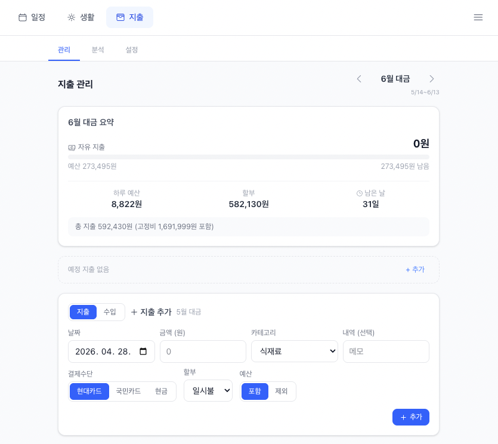
    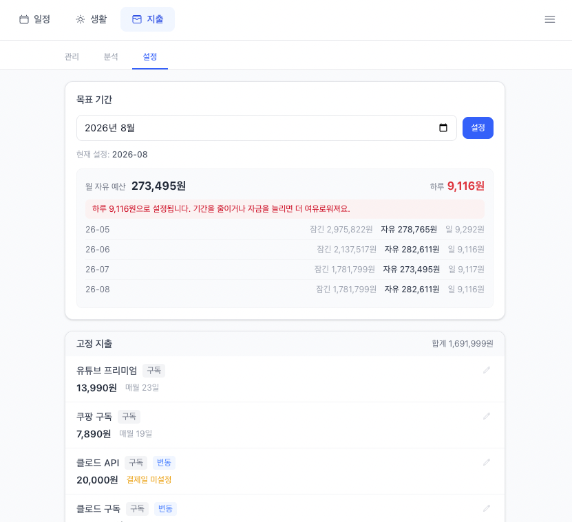

</p>

### 6. 웹 대시보드 + Slack App Home — 통합 인터페이스

위 모든 도메인의 데이터를 웹 대시보드와 Slack App Home에서 확인·수정한다. 세 가지 목적이 결합된 인터페이스.

1. **자연어 입력이 어려운 영역의 진입점** — 지출처럼 분류·금액이 복잡한 도메인, 또는 단순 조작(이동·체크·수정)은 LLM을 거치지 않고 직접 처리. **비용 절감 + 즉시 응답**.
2. **데이터 시각화로 패턴 발견** — 캘린더·백로그·카테고리는 드래그 앤 드롭으로 이동·리사이즈, 루틴 달성률은 히트맵, 수면 규칙성은 차트로. 라이프 데이터의 흐름을 시각적으로 한눈에.
3. **Slack App Home 빠른 확인** — 오늘의 일정·루틴·수면 요약을 영구 표시. 채팅 없이 가벼운 조회·수정 가능.

반응형 + PWA로 모바일에서도 동일하게 작동.

<p align="center">
  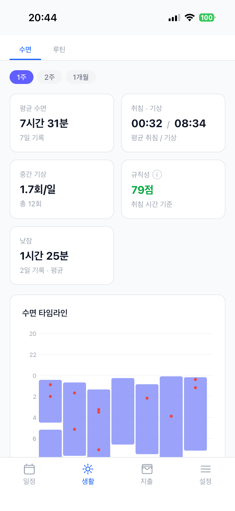
  &nbsp;&nbsp;
  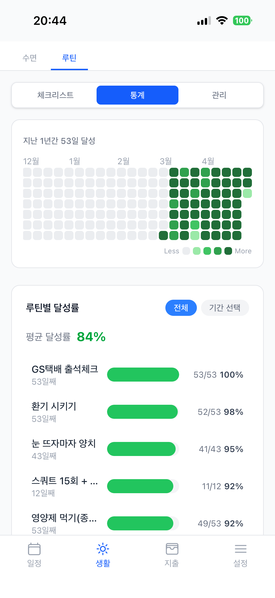
</p>

<p align="center">
  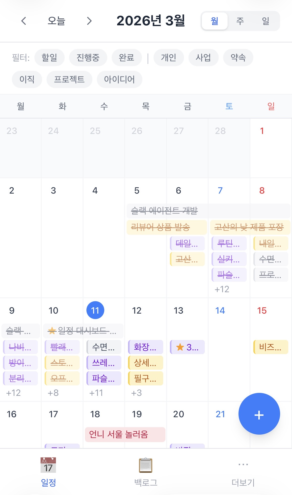
  &nbsp;
  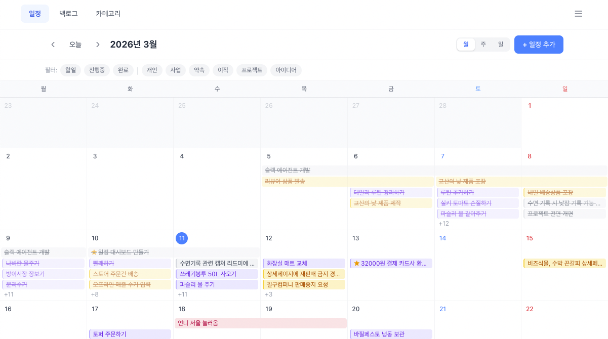
  &nbsp;
  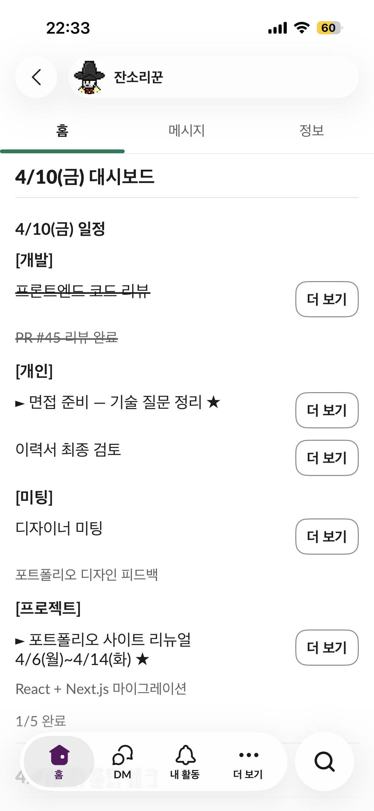
</p>

---

## 동작 방식

<p align="center">
  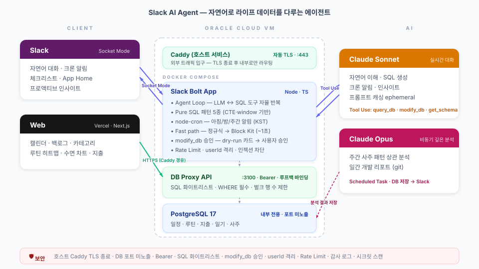
</p>

자연어 메시지가 들어오면 **채널 라우터 → Rate Limiter → Fast path 또는 Agent Loop → 응답** 순으로 흐른다. Fast path(정규식 매칭) 적중 시 SQL 직접 조회로 \~1초 응답, 미적중 시 Sonnet이 SQL 도구를 자율 반복 호출해 결과를 합성. modify_db는 dry-run 결과를 사용자 승인 카드로 띄운 뒤 실행한다.

**인프라 분리 (v3)**

- **봇·DB**: Oracle Cloud VM, Docker Compose로 app + PostgreSQL 17 컨테이너 운영
- **TLS**: 호스트 레이어 Caddy가 자동 인증서로 :443 종료 (Docker 바깥)
- **DB Proxy**: 127.0.0.1:3100 루프백 바인딩 → 외부에서는 Caddy HTTPS 경유로만 접근, DB 포트 자체는 미노출
- **웹**: Vercel(Next.js)은 DB 직결 없이 DB Proxy API를 HTTPS로 호출 — Bearer + iron-session 인증

**비동기 분석 파이프라인**

- **node-cron** (Asia/Seoul): 아침/밤 알림 + 일요일 주간 리포트 + 월요일 가설 검증·주간 사주 회고 — Sonnet/Opus로 합성
- **Scheduled Task**: 매주 일요일 사주 패턴·테마 갱신 + 일주일치 일운 사전 분석 + LLM 자율 가설 발견 — Opus가 분석 후 DB에 결과 영속화 → 매일 크론·실시간 응답 시점엔 SELECT만으로 비용·지연 분리

**배포·관측**

- **CI/CD**: main push → GitHub Actions CI → GHCR 이미지 빌드 → VM SSH로 `docker compose pull + --force-recreate`
- **자체 업타임 모니터링**: GitHub Actions cron 5분 간격 폴링 → Slack DOWN/RECOVERY 알림

---

## 프로젝트 구조

```
src/                       # Slack 에이전트 (VM + Docker)
├── app.ts                 # 서버 진입점
├── router.ts              # 채널별 라우팅 + Rate Limiting
├── db-proxy.ts            # DB Proxy API (Vercel → HTTPS → DB)
├── agents/life/           # 통합 라이프 에이전트 (일정·루틴·수면·리마인더)
├── agents/insight/        # 사주·일기 에이전트 + 가설 발견·카드 빌더
├── cron/                  # 크론 알림 + 주간 리포트 + 가설 검증
└── shared/                # LLM, agent-loop, sql-tools, saju-hypothesis, ...

web/                       # 웹 대시보드 (Vercel 자동 배포)
└── src/app/               # schedules · backlog · categories · routines · budget · ...
```

---

## 기술 스택

| 영역      | 선택                                                                              |
| --------- | --------------------------------------------------------------------------------- |
| AI/LLM    | Claude (Opus: 비동기 깊은 분석·가설 발견 / Sonnet: 실시간 대화·크론·잔소리 합성) + Tool Use |
| AI 개발   | Claude Code — Hooks · Custom Skills · MCP · Scheduled Tasks                       |
| Backend   | Node.js + TypeScript (strict)                                                     |
| Frontend  | Next.js 16 (App Router) + Tailwind v4 + @dnd-kit                                  |
| Messaging | Slack Bolt (Socket Mode)                                                          |
| Database  | PostgreSQL 17 (Docker, TLS on)                                                    |
| Stats     | Fisher's exact test + Benjamini-Hochberg FDR (가설 lifecycle 자동 관리)            |
| Auth      | iron-session (암호화 쿠키 세션)                                                   |
| Infra     | Docker Compose + 클라우드 VM · Vercel · Caddy(자동 TLS)                           |
| CI/CD     | GitHub Actions → GHCR 이미지 빌드·자동 정리 → VM pull + 재기동                    |
| Test      | vitest — 단위·통합·SQL 안전·프롬프트 검증                                         |

---

## 개발 히스토리

**2026-03-05 시작, 매일 사용·운영 중.** 초반은 도메인 확장과 인프라 분리, 5월 이후는 LLM 자율성·출력 신뢰도 검증 파이프라인이 중심.

| 주차                  | 핵심 변화                                                                                                                                                              |
| --------------------- | ---------------------------------------------------------------------------------------------------------------------------------------------------------------------- |
| W1 (03-05\~11)        | Slack Bolt · LLM 추상화 · 일정/루틴 에이전트 · 속도 최적화(7\~11초→\~1초) · **v2 전환**(Notion→PostgreSQL) · App Home · Hooks/Skills · HTTPS 배포                      |
| W2 (03-12\~15)        | **v3 전환**(Vercel+VM 분리) · CI/CD Slack 알림 · 웹 대시보드 UX(DnD·PWA·반응형) · **명리학/일기 도메인** · 만세력 계산 유틸                                            |
| W3\~W4 (03-22\~04-07) | **일정 카테고리에 하위 분류 단계 추가** · 루틴 대시보드(히트맵) · **Neon→VM PostgreSQL 마이그레이션** · 디자인 시스템 · **지출·예산 엔진 도입**(자동 분배·결제수단·할부) |
| W5 (04-09\~10)        | **보안 아키텍처 전면 강화** · **배포 파이프라인 최적화** (warm cache \~81초, 편차 13배→2배)                                                                            |
| W6 (04-13\~15)        | **API 비용 최적화** · **지출·예산 v2 엔진 재설계** (목표 기간·금액 → 월/일 예산 자동 분배 + 동적 재조정, 4-Phase TDD)                                                  |
| W7 (04-21\~23)        | **자체 업타임 모니터링** · **ADR 체계 도입** · **LLM 하네스 강화**(modify_db 대량 변경 승인 플로우)                                                                    |
| W8 (05-04\~10)        | **예산 정의 통일** (자유지출·일 예산 산정·일별 로그 baseline·cron 시각 재정렬) · **사주 패턴 cross-domain 통합** · **운세 분석 개인화** (라이프 테마 두 트랙 + 의사결정 가이드) |
| W9 (05-11\~17)        | **프로액티브 인사이트 v2 마스터 진입** — Phase 1 (인사이트 엔진 통합·임계치 외부화) · **Phase 2** (LLM 자율 발견 슬롯 + Outcome 검증, ADR 0016) · **Phase 3** (60갑자 정규화 + 일일 매칭, ADR 0017) · 일정 카테고리 FK 전환 · 결제주기 종료 자산 자동 차감 |
| W10 (05-20\~24)       | **할부 자산 차감 범위 토글** · **인사이트 Phase 4 — 가설-검증 정량 파이프라인** (Fisher's exact + BH-FDR + lifecycle 자동 관리, ADR 0019)                              |
| W11 (05-25\~26)       | **사주 풀이 책임 분리 + view 매개 마스터 통합** (`saju_influence_summary` 신뢰도 라벨링 + idempotency DB 제약, ADR 0020·0021) · 5문서 아키텍처 + portfolio-candidates 워크플로우 정착 |

상세 → [docs/project-history.md](docs/project-history.md)

---

## 빠른 실행

```bash
# Slack 봇
yarn install
cp .env.example .env
yarn dev

# 웹 대시보드
cd web && yarn install
cp .env.example .env.local
yarn dev
```

운영 배포는 GitHub Actions가 담당 (main push → 자동 배포).

---

## 관련 문서

문서 운영 — 마일스톤은 `project-history.md`, 마스터 단위 설계 서사는 `design-notebook/`, 되돌리기 어려운 판단은 `adr/`, 현재 기능 카탈로그는 `features.md`, 도메인별 스키마·로직은 `domains/`, 일상 작업·성향 분석 등 비공개 정보는 `_personal/`(gitignored)로 분리.

| 문서                                                           | 내용                                                                                                                         |
| -------------------------------------------------------------- | ---------------------------------------------------------------------------------------------------------------------------- |
| [docs/design-notebook/](docs/design-notebook/)                 | 마스터 단위 설계 서사 — Phase 별 분기점·포기·회고 누적                                                                       |
| [docs/adr/](docs/adr/)                                         | Architecture Decision Records — 되돌리기 어려운 설계 판단의 배경·대안·트레이드오프                                           |
| [docs/features.md](docs/features.md)                           | 현재 기능 카탈로그 — 도메인별로 작동 중인 기능 한눈에                                                                        |
| [docs/project-history.md](docs/project-history.md)             | 마일스톤 timeline — 기능 출시·아키텍처 전환·인프라 변화 (2026-04-07 이전: [archive-v1-v2.md](docs/history/archive-v1-v2.md)) |
| [docs/domains/](docs/domains/)                                 | 도메인별 명세 — 일정·루틴·사주·예산 각 도메인의 DB 스키마·API·로직                                                           |
| [docs/conventions.md](docs/conventions.md)                     | 코드 컨벤션 & 보안 체크리스트                                                                                                |
| [docs/optimization/](docs/optimization/)                       | 최적화 기록 — LLM 비용, 응답 속도, 배포 파이프라인                                                                           |
| [docs/ops/db-backup.md](docs/ops/db-backup.md)                 | DB 백업/복원 운영 가이드                                                                                                     |
| [docs/ops/health-monitoring.md](docs/ops/health-monitoring.md) | 업타임 모니터링 운영 가이드                                                                                                  |

---

## 작업 방식 / AI 협업

이 프로젝트를 만들면서 다듬어 온 작업 방식 — Claude와 일하는 흐름, 문서 운영 체계, 의사결정 기록 — 은 별도 메타 repo에 정리되어 있다.

- [hyewon3938/build-with-ai](https://github.com/hyewon3938/build-with-ai) — `/design`·`/build`·`/init-project` 스킬 흐름, 5문서 아키텍처(plans · design-notebook · ADR · features · domains), progressive disclosure 등 AI 협업 자산 누적
