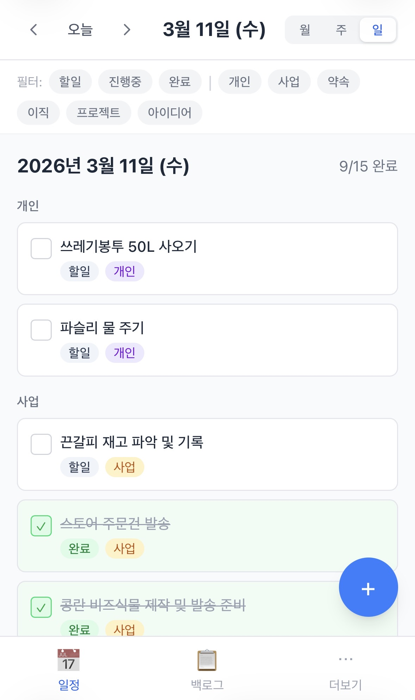

# 내 라이프를 관찰하고 잔소리하는 LLM 에이전트

> 자연어로 일정·루틴·수면·일기를 기록하면, Claude가 SQL로 DB를 관리하고 크로스 분석.
> "일찍 자야 일정 다 해내" 같은 잔소리를 먼저 건넨다. 기획·보안·운영까지 1인, 2026-03-05 시작 후 매일 사용 중.


<p align="center">
  <b>매일 사용·운영</b> · <b>A to Z 1인 제작</b> · <b>LLM Guardrails 설계</b> · <b>Public 저장소 개인정보 보안</b> · <b>설계 판단 기록(ADR)</b>
</p>

---

## 이 프로젝트의 핵심

- **프로액티브 인사이트 + 생활 맥락 잔소리** — 직접 설계한 5가지 SQL 패턴(연속 기록·수면 추세·빈 시간대 등)을 크론이 자동 감지해, 묻지 않아도 먼저 건넨다. 일기·사주·수면 상관 분석도 주간 자동 실행.
- **LLM 자율 SQL 에이전트 + LLM Guardrails** — Claude가 SQL 도구로 DB를 직접 다루는 구조에서 발생하는 할루시네이션·비용·안전 문제를 검증·프록시·승인 플로우로 제어.
- **Public 저장소 개인 데이터 다층 보안** — 코드가 전부 공개된 상태에서 개인 일정·수면·루틴·일기 데이터를 지키는 6-layer 구조적 방어.
- **A to Z 1인 제작 + AI 협업 파이프라인** — 기획·설계·구현·보안·배포·운영까지 혼자. Claude Code의 Hooks·Skills·MCP·Scheduled Tasks로 개발 프로세스 자체를 자동화.

---

## 어떻게 동작하나

<p align="center">
  
</p>

핵심은 **말만 하면 알아서 기록되고, 묻지 않아도 인사이트를 먼저 건네는 구조**다. Claude Sonnet이 SQL을 직접 작성·실행·반복하며(Agent Loop) 도구 호출 여부와 횟수를 자율 판단하고, 미리 설계한 패턴 감지는 Pure SQL이 담당한다. 테이블만 추가하면 별도 코드 없이 크로스 분석이 가능하다.

Vercel(웹)은 DB에 직접 연결하지 않고, **HTTPS API 프록시**를 경유해 데이터를 조회한다. DB 포트는 외부에 노출되지 않으며, 전 구간 TLS로 암호화된다.

---

## 차별점

### 1. 프로액티브 인사이트 + 생활 맥락 잔소리

묻지 않아도 먼저 인사이트를 건넨다. 직접 설계한 5가지 SQL 패턴을 크론이 자동 감지해 아침/밤 알림에 삽입.

- **5가지 감지 패턴** — `streak`(연속 기록), `sleepTrend`(수면 추세), `slotGap`(빈 시간대), `weekComparison`(전주 대비), `overdueAlert`(기한 초과)
- **수면·루틴·일정 영향 분석** — 수면 부족한 날 루틴 달성률·일정 소화율이 떨어지는 패턴을 추적. 잔소리의 근거가 된다.
- **개인 프로파일 기반 피드백 루프** — 반복되는 체감·테마를 `life_themes`에 누적, 2회 이상 감지된 패턴은 `saju_patterns`에서 활성 상태로 승격. 활성 패턴은 이후 응답 프롬프트에 자동 주입되어 개인화된 해석을 제공.
- **LLM 호출 없이 Pure SQL** — 패턴이 명확한 영역은 LLM 미경유 → 비용 절감 + 즉시 응답

> 예시 메시지: "어제 6시간 잤네. 오늘 일정 3개 남았고 그중 집중 필요한 거 2개야. 일찍 자자."

**향후**: 긴 기간 트렌드는 고정 패턴으로 잡기 어려운 영역이 있어, LLM 자율 탐색 기반 인사이트 도출을 검토 중 ([#354](https://github.com/hyewon3938/slack-ai-agents/issues/354)).

### 2. LLM 자율 SQL 에이전트 + LLM Guardrails

LLM이 SQL을 직접 쓰는 구조는 강력하지만 할루시네이션·비용·안전 문제가 따라온다. 운영하며 하나씩 해결했다.

- **DB Proxy + SQL 화이트리스트** — DDL(`DROP`, `ALTER` 등) 차단, 위험 함수 차단, WHERE 필수, 벌크 제한 50행
- **modify_db 승인 플로우** — 변경 쿼리는 Slack 카드로 dry-run 결과 보여주고 사용자 승인 받은 뒤 실행
- **프롬프트 캐싱** — Anthropic `cache_control: ephemeral`로 시스템 프롬프트·도구 정의 캐시 → 토큰 비용 최대 90% 절감. [llm.ts:108](src/shared/llm.ts:108)
- **3-tier 비용·품질 구조 + 비동기 분석 전략** — 실시간 응답이 필요한 대화는 Sonnet, 실시간 불필요한 깊은 분석(주간 사주 패턴·매일 개발 리포트)은 scheduled task로 분리해 Opus로 돌리고 결과를 DB에 저장. 실시간 응답 시엔 DB 조회만으로 풍부한 맥락을 프롬프트에 주입 → 비용·품질·속도를 동시에 확보. 패턴이 명확한 영역은 Pure SQL로 LLM 우회.
- **fast path 바이패스** — 정규식 매칭 가능한 단순 조회는 LLM 우회 → `\~1초` 응답 (LLM 경유 시 7\~11초)
- **할루시네이션 감지** — LLM 반복 실수를 관찰·분류해 검증 로직·프롬프트 규칙으로 차단

### 3. Public 저장소 개인 데이터 다층 보안

코드가 전부 공개된 상태에서 개인 데이터를 지키려면 "코드가 보여도 안전한" 구조가 필요하다.

| 계층 | 방어 |
|------|------|
| 네트워크 | DB·API 포트 루프백 바인딩, 외부 트래픽은 Caddy TLS 종료 강제, HTTPS API 프록시 경유 |
| 인증 | Bearer API Key(타이밍 세이프 비교), iron-session, 요청 크기 1MB 제한 |
| SQL 실행 | 테넌트 격리 검증, DDL/위험 함수 차단, WHERE 필수 + 벌크 50행 제한, `statement_timeout` 파라미터화 |
| LLM | 프롬프트 인젝션 패턴 감지, SQL 감사 로그 |
| 요청 제어 | 슬라이딩 윈도우 Rate Limiter(5req/min), 10KB 메시지 제한, 봇 루프 필터 |
| 개발 프로세스 | 커밋 전 시크릿 스캔 Hook, PR 리뷰 스킬에 보안 감사 체크리스트 내장 |

### 4. A to Z 1인 제작 + AI 협업 파이프라인

기획·설계·구현·보안·배포·운영까지 혼자. Claude Code의 기능을 조합해 개발 프로세스 자체를 자동화.

```
/design  →  .claude/plans/  →  /compact  →  /build
  설계·인터뷰    계획서 핸드오프    컨텍스트 정리    구현·리뷰·PR
```

- **Hooks (3)**: prettier/eslint 자동 실행, tsc+lint pre-commit, 시크릿 스캔
- **Custom Skills**: `/init-project`, `/design`, `/build` — 계획서 파일로 세션 간 핸드오프
- **MCP**: PostgreSQL(운영 DB 조회), Slack(에이전트 응답 품질 점검)
- **Scheduled Tasks (비동기 깊은 분석 전용)**:
  - `nightly-dev-report` (매일 22:00): Opus가 당일 git 활동·대화 이력을 분석 → 로컬 문서에 관찰 메모 자동 축적 → 다음 날 09:25/09:30 Slack으로 예약 전송, 매일 피드백 수신
  - `weekly-saju-review` (일요일 21:31): 최근 4주 일기·일운·수면 상관 분석 → 사주 패턴 감지/업데이트
  - `weekly-fortune` (일요일 22:37): 7일 일운 + 월운/세운/대운 자동 갱신
  - `nightly-achievements` (매일 23:30): 오늘 해낸 일 3가지 + 일운 코멘트 응원 메시지 — 바쁘게 보낸 날에도 "아무것도 안 한 것 같은" 불안감 극복용
- **ADR (Architecture Decision Records)**: 되돌리기 어려운 설계 판단을 표준 포맷(Status/Context/Decision/Consequences)으로 기록 → `/design`·`/build` 스킬에 ADR 판단 로직 내장
- **자체 업타임 모니터링**: GitHub Actions cron으로 봇·웹 5분 간격 폴링 + Slack DOWN/RECOVERY 알림 (2회 재시도로 일시 장애 흡수)

AI를 "코딩 보조"가 아니라 **협업 개발자**로 취급하고, 작업 단위는 GitHub Issues·PR로 리뷰·검증한다.

---

## 주요 기능

### Slack 에이전트 — 자연어로 라이프 데이터 관리

일정·루틴·수면·일기를 자연어 대화만으로 기록·조회·수정. 하루 2회 크론 알림 + 프로액티브 인사이트 + 생활 맥락 기반 잔소리. 스마트 메모리로 사용자 선호를 자동 학습.

**수면 기록 워크플로우** — 아침에 봇이 기록 알림 → 슬랙에 자연어로 입력(취침시간·기상시간·중간기상·메모) → 자동 파싱·저장 → 웹 대시보드에서 시각화 + 규칙성 점수 → 수면 부족한 날 루틴 달성률·일정 소화율 하락 상관 분석 → 잔소리 근거로 재활용

### 일기 기반 개인 프로파일 맥락 자동 연결

사용자 메시지가 일기·감정·이벤트 성격이면 조용히 `diary_entries`에 누적. 일기 응답 시 **개인 프로파일 + 당일 맥락 데이터**를 자동 연결해 공감 + 해석을 함께 건넨다.

- **피드백 루프 구조** — 일기에서 반복 감지되는 테마/체감이 `life_themes` · `saju_patterns`에 누적되고, 2회 이상 감지된 패턴은 활성 상태로 승격(`detection_count` 기반). 활성 패턴은 이후 응답 프롬프트에 실시간 주입되어 개인화된 해석 제공.
- **주간 비동기 분석** — 매주 일요일 Opus가 최근 4주 일기·생활·체감 데이터를 상관 분석해 패턴 업데이트 (scheduled task). 실시간 대화는 이 결과를 DB에서 가져다 쓰는 구조.
- **만세력 계산 유틸** — 사주 도메인 구현 시 LLM 할루시네이션 방지 위해 직접 코드로 구현 ([docs/domains/insight.md](docs/domains/insight.md))
- **운세 fast path** — `일운`/`월운`/`세운`/`대운` 등은 정규식 매칭 → DB 직접 조회로 LLM 우회

### 예산·지출 관리 — 개인 예산 엔진

목표 기간을 설정하면 월·일 단위 예산이 자동 분배되고, 일일 소비 패턴을 추적해 초과·절약 여부를 기록. 결제수단·할부·고정비까지 포함한 다층 지출 구조 지원.

- **자동 예산 분배** — 기간 설정 시 월 예산 + 일 예산 자동 산정
- **일일 집계** — 매일 소비액과 예산 대비 차이 기록
- **할부 분산** — 결제 시점이 아닌 실제 지출 시점 기준으로 월별 배분
- **고정비/결제수단 관리** — 반복 지출과 카드별 청구 주기 추적
- **웹 대시보드 전용 입력** — 복잡한 분류·금액 입력은 웹에서 (자연어 기록 X)

### 웹 대시보드 — LLM 비용 절감 + UX 편의성

단순 조작(이동·체크·수정)은 LLM을 거치지 않고 직접 처리. 캘린더·백로그·카테고리·루틴 히트맵·수면 규칙성 시각화를 제공하고, 드래그 앤 드롭(@dnd-kit)으로 일정 이동·리사이즈, 반응형 UI + PWA.

- **생활 탭 (수면 분석)** — 취침/기상 시간 분포, 규칙성 점수, 수면 시간 추세, 루틴·일정 상관 분석
- **캘린더·백로그** — 일정 드래그 앤 드롭, 카테고리별 색상 구분
- **루틴 히트맵** — 일간/주간 달성률 시각화
- **예산 대시보드** — 예산 대비 소비 패턴, 고정비·할부·결제수단 관리

<p>
  
  
  
</p>

### App Home — Slack 내 대시보드

오늘의 일정·루틴·수면 요약을 Slack App Home 탭에 영구 표시.


---

## 기술 스택

| 영역 | 선택 |
|------|------|
| AI/LLM | Claude (Opus: 비동기 깊은 분석 / Sonnet: 실시간 대화·크론·주간 리포트) + Tool Use |
| AI 개발 | Claude Code — Hooks · Custom Skills · MCP · Scheduled Tasks |
| Backend | Node.js + TypeScript (strict) |
| Frontend | Next.js 16 (App Router) + Tailwind v4 + @dnd-kit |
| Messaging | Slack Bolt (Socket Mode) |
| Database | PostgreSQL 17 (Docker, TLS on) |
| Auth | iron-session (암호화 쿠키 세션) |
| Infra | Docker Compose + 클라우드 VM · Vercel · Caddy(호스트 서비스, 자동 TLS) |
| CI/CD | GitHub Actions → GHCR 이미지 빌드·자동 정리 → VM pull + 재기동 |
| Test | vitest — 단위·통합·SQL 안전·프롬프트 검증 |

---

## 개발 히스토리

> **2026-03-05 시작. 매일 사용·운영 중.**

| 주차 | 핵심 변화 |
|------|-----------|
| W1 (03-05\~11) | Slack Bolt · LLM 추상화 · 일정/루틴 에이전트 · 속도 최적화(7\~11초→\~1초) · **v2 전환**(Notion→PostgreSQL) · App Home · 스마트 메모리 · Hooks/Skills · HTTPS 배포 |
| W2 (03-12\~15) | **v3 전환**(Vercel+VM 분리) · CI/CD Slack 알림 · 웹 대시보드 UX(DnD·PWA·반응형) · 카테고리 유형 시스템 · **명리학/일기 도메인** · 만세력 계산 유틸리티 |
| W3 (03-22) | 하위 카테고리(subcategory) + 일정 폼 UX |
| W4 (04-03\~07) | 루틴 관리 대시보드(히트맵) · **Neon→VM PostgreSQL 마이그레이션** · 디자인 시스템(공통 컴포넌트 7개) · 결제수단/할부 입력 |
| W5 (04-09\~10) | **보안 아키텍처 전면 강화** — DB Proxy API · Rate Limiting · SQL 감사 로그 · 전 구간 TLS · 포트 루프백 바인딩 <br> **배포 파이프라인 최적화** — GHCR 이미지 빌드(warm cache \~81초 고정, 편차 13배→2배) · 이미지 자동 정리 |

[상세 기록](docs/project-history.md)

---

## 프로젝트 구조

```
src/                       # Slack 에이전트 (VM + Docker)
├── app.ts                 # 서버 진입점
├── router.ts              # 채널별 라우팅 + Rate Limiting
├── db-proxy.ts            # DB Proxy API (Vercel → HTTPS → DB)
├── agents/life/           # 통합 라이프 에이전트 (일정·루틴·수면·지출)
├── agents/insight/        # 사주·일기 에이전트
├── cron/                  # 크론 알림 + 주간 리포트
└── shared/                # LLM, agent-loop, sql-tools, insights, ...

web/                       # 웹 대시보드 (Vercel 자동 배포)
└── src/app/               # schedules · backlog · categories · routines · budget · ...
```

---

## 실행 방법

```bash
# Slack 봇 (백엔드)
yarn install
cp .env.example .env        # Slack, Anthropic, DB 등 API 키 설정
yarn dev                    # 개발 모드
yarn build && yarn start    # 빌드 & 실행

# 운영 배포는 GitHub Actions가 담당:
#   - main 브랜치 push → 자동 배포
#   - 수동 재배포: GitHub Actions에서 Deploy 워크플로우 "Run workflow"
#     또는 CLI: `gh workflow run deploy.yml`

# 웹 대시보드
cd web && yarn install
cp .env.example .env.local  # DB Proxy URL, 세션 시크릿 등
yarn dev                    # localhost:3000
# 프로덕션은 Vercel 자동 배포 (GitHub push → 빌드 → 배포)
```

### 운영 환경 구성 (Docker Compose)

봇과 DB는 Docker Compose로 함께 관리된다.

```bash
docker compose up -d            # 전체 기동 (app + db)
docker compose logs -f app      # 로그 확인
docker compose restart app      # app만 재시작 (DB 영향 없음)
docker compose down             # 전체 정지 (볼륨은 유지 → 데이터 보존)
```

- **app 컨테이너**: Slack 봇 + DB Proxy API. 내부 포트는 루프백 바인딩.
- **db 컨테이너**: PostgreSQL 17, TLS on, Docker 내부 네트워크 전용.
- **볼륨 `pgdata`**: DB 데이터 영속화. 컨테이너 재생성·재배포에도 유지.

---

## 관련 문서

| 문서 | 내용 |
|------|------|
| [docs/adr/](docs/adr/) | Architecture Decision Records — 되돌리기 어려운 설계 판단의 배경·대안·트레이드오프 기록 |
| [docs/project-history.md](docs/project-history.md) | 설계 변화와 의사결정 과정 상세 기록 |
| [docs/conventions.md](docs/conventions.md) | 코드 컨벤션 & 보안 체크리스트 |
| [docs/optimization/](docs/optimization/) | 최적화 기록 — LLM 비용, 응답 속도, 배포 파이프라인, 의도 분류 제거 회고 |
| [docs/ops/db-backup.md](docs/ops/db-backup.md) | DB 백업/복원 운영 가이드 |
| [docs/ops/health-monitoring.md](docs/ops/health-monitoring.md) | 업타임 모니터링 운영 가이드 (GitHub Actions 기반) |
