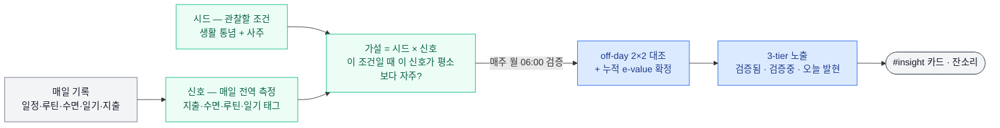

# 내가 모르던 생활 패턴을 찾아 통계로 검증하는 개인 라이프 에이전트

> "월말마다 컨디션이 떨어지는 것 같아"가 진짜 내 패턴인지, 그냥 그렇게 기억하는 건지. 그 답은 내 감이 아니라 매일 쌓인 기록에서 통계로 나온다.
>
> 일정·루틴·수면·일기 등 생활 데이터를 자연어로 편하게 입력하면 에이전트가 그날그날 일상을 챙겨주고, 기록이 쌓일수록 생활 패턴이 통계 검증을 거쳐 덤으로 나온다.
>
> 사용자는 생활을 기록하기만 하면 되고, 시스템 내부에서는 매주 도는 발굴·검증 엔진이 쌓인 데이터를 훑어 진짜 패턴을 찾아낸다. 2026-03-05 시작, 매일 사용 중.

<p align="center">
  
</p>

<p align="center">
  
  
  
  
</p>

---

## 왜 만들었나

청년 1인 가구가 빠르게 느는 요즘, 혼자 지내는 시간이 길어지면 나를 객관적으로 볼 기회가 줄어든다. 가족과 살 땐 "요즘 너무 늦게 자더라" 한마디로 방향이라도 잡는데, 그게 없으면 내 상태를 내 기준으로만 보게 된다. 그 기준마저 편향돼 있다는 게 문제다. 잘 기억나는 것만 떠오르고, 믿고 싶은 대로 해석한다.

그래서 그 객관적 시선을 데이터로 대신하기로 했다. 매일의 기록을 통계로 따져서, 막연히 "이런 것 같다"고 여기던 걸 진짜인지 기분 탓인지 가려낸다. 그동안 몰랐던 패턴이 잡히면 비로소 고쳐볼 거리가 생긴다.

이 프로젝트는 두 가지 역할을 한다.

- **사용자에게는** — 매일의 기록을 편하게 하고 그날그날 생활 관리를 도와주는 도구.
- **시스템으로는** — 사용자가 쌓아온 기록을 활용해 생활 패턴을 찾아내고 검증하는 통계 엔진.

사용자는 통계 분석을 위해서가 아니라 매일 생활을 편하게 기록하고 관리하기 위해서 쓰고, 패턴 발견과 잔소리, 검증은 그렇게 쌓인 기록을 활용해 자연스레 얻는 결과가 되도록 흐름을 구성했다.

---

## 1. 핵심 — 통계로 검증한 내 패턴

내가 가진 가설을 그럴듯하게 말로 푸는 건 쉽다. 어려운 건 **그게 내 실제 데이터에 맞는지**다. 이 시스템은 패턴을 많이 찾는 게 아니라 **믿을 만한 패턴을 찾아가는 것**을 목표로, 발견·검증·노출을 전부 자동화한다.

세 가지 원칙으로 굴러간다.

- **off-day 대조** — 시드(관찰할 조건)가 활성화된 날의 데이터만 보면, 사실은 평소에도 자주 일어나는 일을 마치 그 시드 때문인 것처럼 착각하기 쉽다. 그래서 시드가 켜진 날과 안 켜진 날을 같은 조건에서 비교한다. 안 켜진 날이 기준선 역할을 해줘야 **기분 탓**과 **진짜 패턴**을 가를 수 있다.
- **e-value 확정 게이트** — e-value는 어떤 패턴이 진짜라는 증거가 얼마나 모였는지 보여주는 점수다. 매주 결과를 보다 보면 어쩌다 한 주가 우연히 강한 신호처럼 보일 수 있는데(peeking), 그 한 주만 보고 확정하면 우연을 진짜 패턴으로 잘못 잡는다. 그래서 누적 e-value가 **20**을 넘은 것만 검증됨으로 치고, 이러면 매주 반복해서 확인해도 거짓양성 확률이 5%(유의수준 0.05) 아래로 유지된다.
- **생성·판정·선택의 분리** — 패턴 후보는 사람이 직접 등록하거나 통계 발굴·LLM 제안으로 모인다. 그게 진짜인지 **가려내는 건 통계 검증**이고, 어떤 걸 추적할지 **고르는 건 사람**이다. 출처가 무엇이든 통계 검증을 거치니, LLM이 내놓은 것도 사람이 일일이 확인할 필요가 없다.


```mermaid
flowchart LR
  REC[매일 기록<br/>일정·루틴·수면·일기·지출]
  SEED[시드 — 관찰할 조건<br/>생활 통념 + 사주]
  REC --> SIG[신호 — 매일 전역 측정<br/>지출·수면·루틴·일기 태그]
  SEED --> HYP[가설 = 시드 × 신호<br/>이 조건일 때 이 신호가 평소보다 자주?]
  SIG --> HYP
  HYP -->|매주 월 06:00 검증| VER[off-day 2×2 대조<br/>+ 누적 e-value 확정]
  VER --> TIER[3-tier 노출<br/>검증됨 · 검증중 · 오늘 발현]
  TIER --> OUT([#insight 카드 · 잔소리])

  classDef io fill:#f3f4f6,stroke:#6b7280,color:#111827
  classDef stat fill:#dbeafe,stroke:#2563eb,color:#1e3a8a
  classDef store fill:#ecfdf5,stroke:#10b981,color:#065f46
  class REC,OUT io
  class VER,TIER stat
  class SEED,SIG,HYP store
```

### n=1을 다루는 통계 — 착각 하나씩 막기

한 사람의 데이터(n=1)는 양이 적어서, 희미한 연관도 진짜 패턴이라고 쉽게 믿게 된다. 통계 장치로 이런 착각을 하나씩 막으려 했다.

| 통계 장치 | 막는 착각 |
|---|---|
| off-day 대조 | 시드가 켜진 날만 보면, 평소에도 자주 있는 일을 그 시드 탓이라 착각한다 |
| 누적 e-value | 매주 결과를 보다가 우연히 좋아 보인 한 주를 진짜라고 착각한다 (peeking) |
| block permutation | 내 컨디션이 며칠 이어진 것뿐인데, 그 연속을 시드와 신호의 관계로 착각한다 (자기상관) |
| empirical-Bayes 수축 | 몇 개 안 되는 데이터로 섣불리 확신한다 (소표본 과신) |
| BH-FDR | 여러 신호를 한꺼번에 검사하면 그중 하나쯤은 관련이 없어도 우연히 강해 보인다 (다중 검정) |
| Mann-Whitney | 수면 시간 같은 연속된 숫자를 충분/부족 둘로만 나누면, 정도 차이가 사라져 구분할 수 없게 된다 |

### 느려도 아는 만큼은 알려준다

기록을 시작하고 3개월차까지는 대부분 아직 증거가 충분히 모이지 않아 패턴으로 확정되지 않는다. 통계로 잡힐 만큼 강한 연관이 별로 없으면, 억지로 단언하는 대신 아직 모른다고 정직하게 말한다. 그렇다고 아무것도 안 보여주는 건 아니다. 확정 전이라도 가능성이 보이면 **검증중**(emerging)으로 계속 보여주고, 확정까지 얼마나 왔는지 e-value 진행바(`e=4.2/20`)로 표시한다.

매일 아침, 그날 켜진 시드를 **얼마나 증거가 쌓였는지**에 따라 세 단계로 나눠 보여준다. 확정된 패턴이면 단언하고, 쌓는 중이면 조심스럽게 말하고, 아직 근거가 없으면 주장 없이 켜졌다고만 알린다. 검증 안 된 걸 확정처럼 말하지 않으려고 말투를 달리했다.

| tier | 어떤 경우 | 말투 |
|---|---|---|
| **검증됨** (verified) | 통계로 확정된 패턴 (누적 e-value 20 돌파) | "너는 X일 때 실제로 Y하더라" (연관은 단언, 원인이라고는 안 함) |
| **검증중** (emerging) | 가능성은 보이지만 아직 증거를 쌓는 중 (발현 15일↑, 효과 보임) | "요새 X일에 Y 경향이 있네, 검증중" + e-value 진행바 |
| **오늘 발현** (recent) | 추적 중인 조건이 최근 켜졌을 뿐, 위 두 단계엔 못 듦 | "오늘 이런 조건이 켜졌어" (패턴이라는 주장은 안 함) |

> **시드는 '관찰할 조건'이다.** 빈 상태에서 패턴을 찾으면 막막하니, 무엇부터 볼지 출발점이 필요해 두 곳에서 가져왔다. 하나는 **생활 통념**으로, 요일·주말·월말·계절·수면 부족처럼 흔히 영향을 준다고들 하는 환경 변수다. 다른 하나는 **사주**로, 태어난 사주에서 정해지는 글자가 그날 운에 들어오는 날이다. 둘 다 결론이 아니라 출발점일 뿐이고, 어느 쪽이든 똑같은 off-day 통계로 채점되니 사주라고 특별할 건 없다.

**→ 더 깊이: [프로액티브 인사이트 v2 explainer](docs/explainers/insight-v2.md)**. 패턴을 발굴하고 검증하는 엔진의 전체 흐름을 담은 문서로, 시드·신호·가설·검증 네 개념부터 통계 스택, 발굴·교란 통제까지 단계별로 설명한다.

---

## 2. 매일 쓰는 제품 — 기록이 편해야 패턴이 쌓인다

패턴은 꾸준히 기록해야 쌓인다. 그래서 통계를 앞세워 기록을 귀찮게 강요하기보다, 기록이 편하고 그 기능만으로도 매일 생활에 도움이 되는 걸 먼저 챙겼다. 사용자 입장에서 이건 패턴 분석 도구라기보다 **생활을 관리하고 기록하는 도구**고, 패턴은 그렇게 쌓인 기록 위에서 통계로 얻는 덤이다.

**기록은 슬랙이든 대시보드든 편한 대로.** 일정·루틴·수면·일기는 슬랙에 대화하듯 적으면 에이전트가 알아서 정리해 저장한다. 급할 땐 "내일 3시 약속 추가해줘"처럼 던지면 되고, 일정을 펼쳐 보거나 조정하는 건 대시보드에서 한다. 모든 걸 자연어로 받는 건 아니라서, 입력이 까다로운 건 대시보드 화면에서 직접 넣는 게 편하다.

**빠른 확인은 fast path, 복잡한 요청은 Sonnet.** 슬랙에서 `오늘 일정`·`일운`처럼 약속된 명령으로 빠르게 볼 땐 LLM을 거치지 않고 정규식이 바로 DB를 조회해 \~1초에 답한다. 자연어를 이해해야 하는 복잡한 요청만 Claude Sonnet이 SQL 도구를 반복 호출해 처리한다(\~7\~11초).

**그날그날 한마디 해준다 (하루 2회 잔소리).** 혼자서는 갖기 어려운 객관적 시선을 아침저녁으로 짧게 건네는 역할이다. 아침엔 어제 루틴이 얼마나 됐는지와 오늘 일정을, 밤엔 그날 쌓인 데이터를 엮어 한마디 한다. 검증된 패턴이 쌓일수록 그 한마디에 반영돼서, 쓰면 쓸수록 점점 나한테 맞춰진다.

<p align="center">
  
</p>
<p align="center">
  
</p>

**LLM이 데이터를 바꿀 땐 승인을 받는다.** 에이전트한테 여러 건을 한꺼번에 고쳐달라고 하면, LLM이 잘못 알아듣거나 엉뚱한 데이터를 건드릴 수 있다. 그래서 `modify_db`는 바로 실행하지 않고, 무엇을 어떻게 바꿀지 미리 돌려본 결과(dry-run)를 Slack 카드로 보여준 뒤 내가 승인해야 반영한다. 할루시네이션이나 실수로 데이터가 망가지는 걸 막는 안전장치다.

<p align="center">
  
  &nbsp;&nbsp;
  
</p>

**리마인더는 말만 해두면 알아서 챙긴다.** "매일 11시에 약 먹기 알려줘"라고 슬랙에 말하면, 봇이 이걸 cron 일정으로 바꿔 저장해두고 그 시간이 되면 직접 알림을 보낸다. "그거 화요일로 바꿔줘"처럼 고치거나 지우는 것도 대화로 끝난다.

<p align="center">
  
</p>

**입력이 번거로운 건 웹 대시보드 + App Home으로.** 분류·금액이 복잡한 지출, 또는 단순 조작(이동·체크)은 LLM을 거치지 않고 직접 처리해 비용·지연을 아낀다. 캘린더는 드래그 앤 드롭, 루틴은 히트맵, 수면은 규칙성 차트로 시각화해 흐름을 눈으로도 본다. 반응형 + PWA라 모바일에서도 동일하게.

<p align="center">
  
  &nbsp;&nbsp;
  
</p>
<p align="center">
  
  &nbsp;
  
  &nbsp;
  
</p>

**지출·예산은 개인 예산 엔진으로.** 예산을 등록하고 쓸 기간을 정하면 월·일 예산이 자동으로 분배된다. 할부는 결제 시점이 아니라 실제 지출 시점 기준으로 월별로 나눠 잡고, 카테고리마다 월 목표 횟수를 정해 얼마나 지켰는지 관리할 수도 있다. 카드 결제주기를 기준으로 월 예산을 산정하고, 주기가 끝나면 카드 자산을 자동 정산한다.

<p align="center">
  
  &nbsp;
  
</p>

> 도메인별 기능 전체 카탈로그는 [docs/features.md](docs/features.md), 스키마·로직 상세는 [docs/domains/](docs/domains/).

---

## 3. 시스템 · 보안

자연어 메시지가 들어오면 **채널 라우터 → Rate Limiter → Fast path 또는 Agent Loop → 응답** 순으로 흐른다. Rate Limiter는 한 사용자가 짧은 시간에 너무 많이 요청하면 잠깐 막아 과부하를 예방한다. 실시간으로 답할 필요가 없는 분석은 미리 비동기로 돌려 결과를 DB에 저장해두고, 실시간 응답 때는 그걸 조회만 해서 빠르게 낸다. 기준은 작업의 무게가 아니라 즉답이 필요한지다. 무겁더라도 즉답이 필요하면 실시간으로 처리한다.

<p align="center">
  
</p>

- **봇·DB** — Oracle Cloud VM, Docker Compose로 app + PostgreSQL 17 운영
- **DB Proxy** — 루프백 바인딩, 외부에선 Caddy HTTPS 경유로만 접근(DB 포트 미노출). 웹(Vercel)은 DB 직결 없이 이 프록시 API를 호출
- **비동기 분석** — 주간 통계 검증·발굴은 node-cron(Asia/Seoul), LLM이 무거운 일일 종합 인사이트는 Claude 앱 routine으로 실시간 경로와 분리
- **CI/CD** — main push → GitHub Actions → GHCR 이미지 빌드 → VM 재기동, 5분 간격 자체 업타임 모니터링

### Public 저장소 다층 보안

코드가 전부 공개된 상태에서 개인 데이터를 지키려면 **코드가 보여도 안전한** 구조가 필요하다.

| 계층 | 방어 |
|---|---|
| 네트워크 | DB·API 포트 루프백 바인딩, 외부 트래픽은 Caddy TLS 종료, HTTPS 프록시 경유 |
| 인증 | Bearer API Key(타이밍 세이프 비교), iron-session, 요청 크기 제한 |
| SQL 실행 | 테넌트 격리 검증, DDL/위험 함수 차단, WHERE 필수 + 행 수 제한, `statement_timeout` |
| LLM | 프롬프트 인젝션 패턴 감지, SQL 감사 로그, LLM-생성 SQL 2단 방어(정적 검증 + read-only 트랜잭션 격리) |
| 요청 제어 | 슬라이딩 윈도우 Rate Limiter, 메시지 크기 제한, 봇 루프 필터 |
| 개발 프로세스 | 커밋 전 시크릿 스캔 Hook, PR 리뷰 스킬에 보안 감사 체크리스트 내장 |

---

## 4. A to Z 1인 제작 + AI 협업

기획·설계·구현·보안·배포·운영까지 혼자. Claude Code를 코딩 보조가 아니라 **협업 개발자**로 다루는 흐름을 세웠다.

```
/design  →  .claude/plans/  →  /compact  →  /build
  설계·인터뷰    계획서 핸드오프    컨텍스트 정리    구현·리뷰·PR
```

- **Hooks** — 자동 포맷·린트·타입체크·시크릿 스캔
- **Custom Skills** — `/design`·`/build`·`/init-project`를 계획서 파일로 세션 간 핸드오프
- **Scheduled Tasks** — 일일 종합 인사이트·월간 LLM 신호 제안처럼 LLM이 무겁게 도는 비동기 분석은 봇 서버 밖 Claude 앱 routine으로 분리해, 봇 서버에 분석 부하를 얹지 않는다
- **5문서 아키텍처** — 인터뷰 분기점·포기·회고가 코드만 남고 휘발되지 않게 사고를 5문서(plans · design-notebook · ADR · features · domains)로 분산, 각 문서마다 `/design`·`/build` owner를 지정해 단계별로 자동 갱신

### 기술 스택

| 영역 | 선택 |
|---|---|
| AI/LLM | Claude (Opus: 비동기 깊은 분석 / Sonnet: 실시간 대화·크론·잔소리 합성) + Tool Use |
| AI 개발 | Claude Code — Hooks · Custom Skills · MCP · Scheduled Tasks |
| Backend | Node.js + TypeScript (strict) |
| Frontend | Next.js 16 (App Router) + Tailwind v4 + @dnd-kit |
| Messaging | Slack Bolt (Socket Mode) |
| Database | PostgreSQL 17 (Docker, TLS on) |
| Stats | Fisher's exact + block permutation + BH-FDR + Beta-Binomial posterior + 누적 e-value |
| Infra | Docker Compose + 클라우드 VM · Vercel · Caddy(자동 TLS) |
| CI/CD | GitHub Actions → GHCR 이미지 빌드 → VM pull + 재기동 |
| Test | vitest — 단위·통합·SQL 안전·프롬프트 검증 |

---

## 빠른 실행

```bash
# Slack 봇
yarn install
cp .env.example .env
yarn dev

# 웹 대시보드
cd web && yarn install
cp .env.example .env.local
yarn dev
```

운영 배포는 GitHub Actions가 담당 (main push → 자동 배포).

---

## 더 읽을거리

| 문서 | 내용 |
|---|---|
| [docs/explainers/insight-v2.md](docs/explainers/insight-v2.md) | **프로액티브 인사이트 v2** — 패턴 발견·검증 시스템 전체 (시드·신호·가설·검증 + 통계 스택) |
| [docs/explainers/insight-v2-saju.md](docs/explainers/insight-v2-saju.md) | 사주 시드가 어떻게 정의되는지 (사주 모르는 사람용 미니 101 포함) |
| [docs/features.md](docs/features.md) | 현재 기능 카탈로그 — 도메인별로 작동 중인 기능 한눈에 |
| [docs/domains/](docs/domains/) | 도메인별 스키마·API·로직 상세 (일정·루틴·사주·예산) |
| [docs/adr/](docs/adr/) | Architecture Decision Records — 되돌리기 어려운 판단의 배경·대안·트레이드오프 |
| [docs/design-notebook/](docs/design-notebook/) | 마스터 단위 설계 서사 — Phase 별 분기점·포기·회고 |
| [docs/project-history.md](docs/project-history.md) | 마일스톤 timeline (2026-03-05\~) |
| [docs/conventions.md](docs/conventions.md) | 코드 컨벤션 & 보안 체크리스트 |
