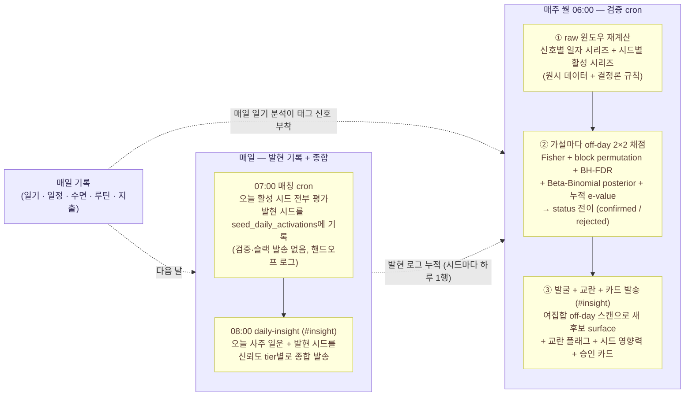
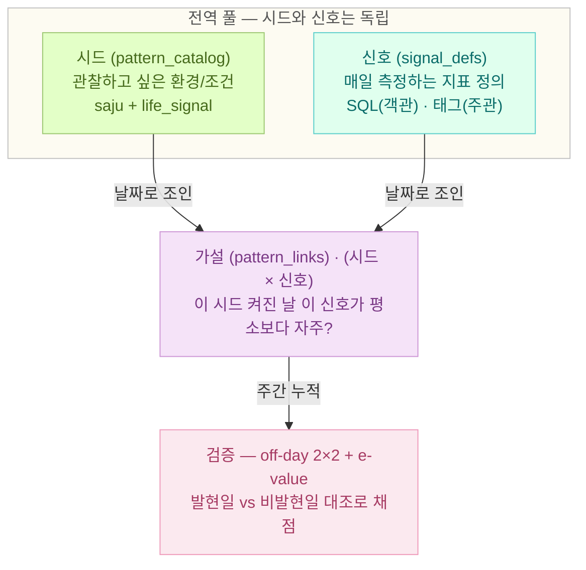
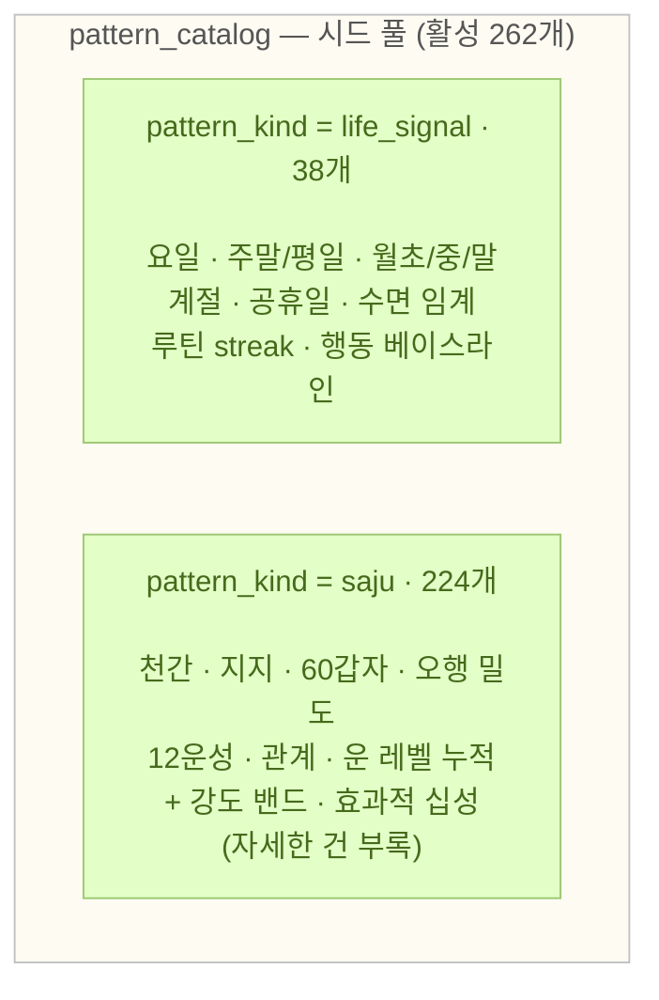
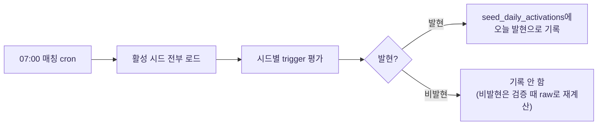
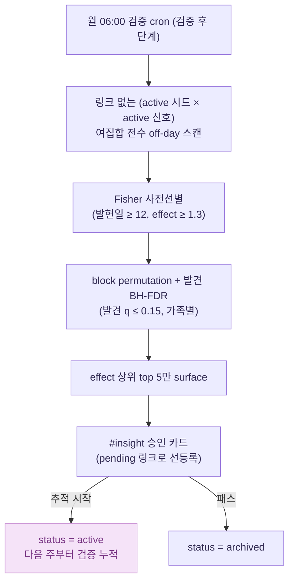
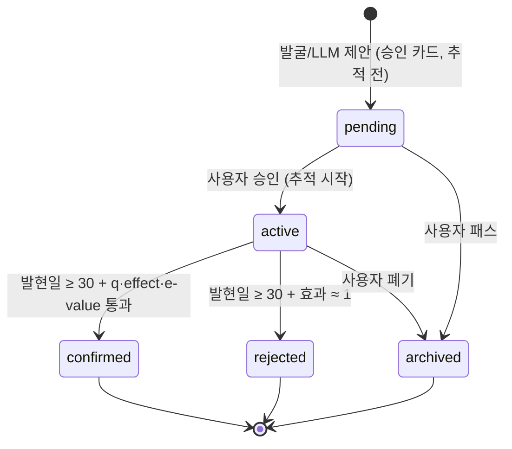
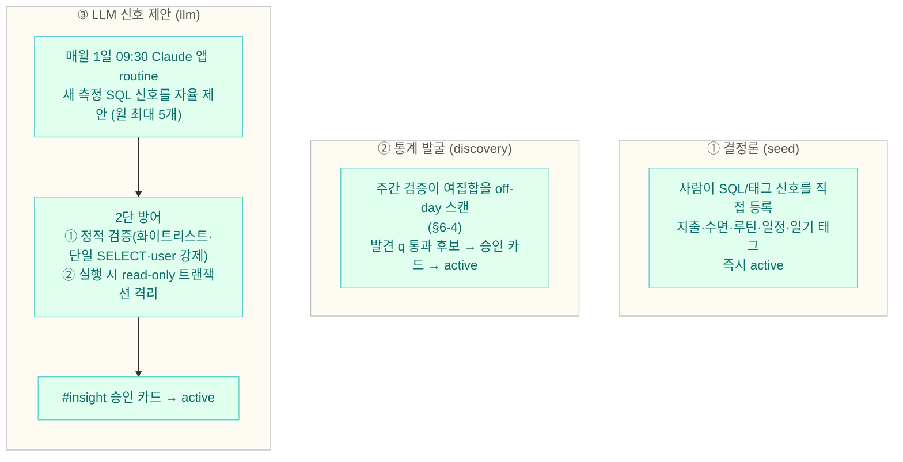
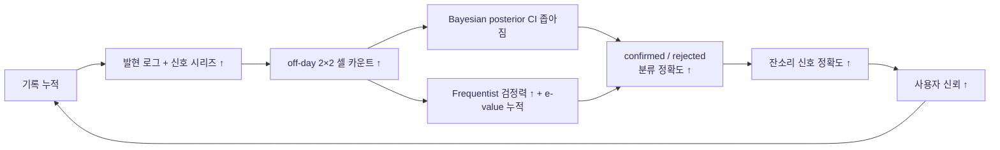

# 프로액티브 인사이트 v2 — 개인 라이프 패턴 발견 시스템

> 매일 기록한 라이프 데이터에서 내 생활 패턴을 찾아간다. 시드가 켜진 날을 **안 켜진 날과 대조**해 채점하고, 검증된 패턴은 검증됐다고, 떠오르는 패턴은 가능성으로 알려준다.

---

## 1. 이 문서를 읽으면 알 수 있는 것

- 이 기능이 어떤 용어로 구성되는지 (**시드·신호·가설·검증**)
- 기록된 데이터에서 어떻게 패턴을 발굴·채점·확정하는지
- 그렇게 찾은 패턴이 무엇으로 이어지는지 (잔소리·카드·점진적 개인화)

**누가 읽으면 좋은가**

- 이 프로젝트를 처음 접하는 사람
- 6개월 뒤의 본인 (구조를 잊지 않기 위해)
- 외부 리뷰어 / 협업자 (시스템 책임 경계를 이해해야 할 때)

---

## 2. 만든 이유

본인이 자주 같은 패턴을 겪는다는 의심이 들 때, 그게 진짜인지 아니면 인지·확증 편향인지 구분하기 어렵다.

- "월말마다 컨디션이 안 좋다" — 진짜 통계적으로 그런가, 아니면 잘 기억나는 것만 떠올리고 있는가?
- "수면 시간이 짧은 날에 지출이 늘어난다" — 우연인가, 본인 패턴인가?
- "이 환경 변수가 들어오는 날이 유난히 ○○하다" — 인과인가, 상관인가, 환영인가?

이 기능의 목표는 이렇다.

> **사람이 가설을 매번 직접 검토하지 않아도, 데이터가 쌓일수록 가설의 신뢰도가 자동으로 올라간다. 그리고 확신할 자격을 얻은 것만 노출된다.**

매일 일기·일정·수면·루틴·지출을 기록하면, 매일 시드 발현이 기록되고 매주 가설 검증이 돌아간다. 사람은 그렇게 검증을 통과한 결과에 따른 잔소리만 들으면 된다.

목표를 한 번 더 좁히면, 패턴을 많이 찾는 게 아니라 **믿을 만한 패턴을 찾아가는 것**이다. 검증된 패턴은 검증됐다고 분명히 알려주고, 아직 검증 전이어도 가능성이 보이면 가능성으로 짚어준다. 내 패턴을 데이터와 함께 찾아가는 과정 자체가 핵심이다.

### 2-1. 어디서부터 시작할까 — 두 가지 기준

처음부터 빈 상태에서 패턴을 찾으면 너무 막막하다. 무엇을 살펴봐야 할지 출발점이 있어야 한다. 그래서 시스템은 **두 가지 기준**에서 시드(패턴 후보)를 가져와 출발한다.

| 기준 | 무엇 | 예시 |
|---|---|---|
| **생활 통념** | 사회적·경험적으로 흔히 거론되는 영향 변수 | "잠을 적게 자면 다음 날 활동 효율이 떨어진다", "월말에는 평소보다 지출이 늘어난다", "주말에는 식사·수면 리듬이 흐트러진다" |
| **사주** | 본인 사주에서 이미 정의된 글자 집합이 그날의 운에 들어오는 날 | (구체 정의는 [사주 부록](insight-v2-saju.md)) |

두 기준 모두 **출발점**이지 **결론**이 아니다. 두 출처를 같은 핵심 구성 개념(시드·신호·가설·검증) 위에서 다루고, 검증이 쌓이면 통계로 가설을 채점·발굴한다. 시간이 지나면서 본인 데이터에 맞지 않는 가설은 기각되고, 효과가 검증된 가설만 잔소리로 살아남는다. **쓸수록 더 맞춰지는** 흐름이다.

---

## 3. 핵심 구성 개념

본문에 계속 나올 4가지 개념을 먼저 정의한다. 흐름 도식은 다음 섹션에서 본다.

### 3-1. 4가지 개념

| 용어 | 한 줄 정의 | 직관 예시 |
|------|-----------|----------|
| **시드** (seed) | 관찰하고 싶은 환경/조건의 단위 | "월말이라는 환경", "본인 일지에 충이 들어오는 날" |
| **신호** (signal) | 시드와 무관하게 **매일 측정**하는 지표 정의. SQL 측정(객관) 또는 일기 태그(주관) | "그날 지출이 평소보다 큼", "그날 일기에 `짜증` 태그" |
| **가설** (hypothesis) | **(시드 × 신호) 한 쌍**. "이 시드가 켜진 날 이 신호가 **평소보다** 자주 발현하는가?" | "`월말` 시드 × `지출 초과` 신호" |
| **검증** (verification) | 가설을 주 단위 **off-day 통계**로 채점해 confirmed/rejected로 판정 | "발현일 50% vs 비발현일 20%, e=22 → 검증됨" |

이 모델의 핵심은 두 가지다.

1. **신호는 시드에서 분리돼 전역으로 매일 측정된다.** "그날 지출이 평소보다 컸나"는 어떤 시드가 켜졌든 상관없이 매일 계산된다. 그래야 시드가 켜진 날과 **안 켜진 날**을 같은 잣대로 비교할 수 있다(→ off-day 대조, 검증의 핵심).
2. **가설은 별도 엔티티가 아니라 (시드 × 신호) 연결 그 자체다.** 시드 풀과 신호 풀을 날짜로 이어 붙여 "이 조합이 의미 있나"를 묻는 것이 가설이고, 검증은 그 가설을 주마다 채점한다.

> **신호는 두 종류다.**
> - **SQL 신호** (객관, **1차**): 지출·수면·루틴·일정을 SQL로 정량 측정. 예) `그날 지출 합계 > 평소 평균`.
> - **태그 신호** (주관, **보조**): 그날 일기에서 뽑은 enum 태그(`diary_meta_tags` 22종 — 짜증·불안·기력저하·평온·돈인식·실수 등) 존재 여부.
>
> 객관 SQL 신호가 1차이고 주관 태그 신호는 보조다. 일기 텍스트 자체는 검증에 쓰지 않고, 정량 enum 태그만 신호로 쓴다(기대편향 오염 방지).

### 3-2. 부속 용어

| 용어 | 한 줄 정의 |
|------|-----------|
| **트리거** (trigger) | 매일 시드가 켜졌는지(발현) 결정하는 조건 |
| **off-day 대조** | 검증의 핵심 잣대. 시드 **발현일** vs **비발현일**(off-day)의 신호 발현율을 비교 |
| **pass / fail** | 그날 신호가 기준(평균 대비 / 절댓값 / 태그 존재)을 통과했는지 |
| **hit / miss** | 가설 관점의 채점. 발현일에 신호 pass면 hit, fail이면 miss |
| **rate ratio** (effect) | 효과크기 = 발현일 pass율 ÷ 비발현일 pass율. 1.0이면 차이 없음, 클수록 강한 연관 |
| **posterior** | Bayesian Beta-Binomial 사후 확률 (지금까지 누적으로 본 실제 패턴일 확률) |
| **e-value** | 누적 증거. 매주 반복 점검에서 "우연히 유의해진 주"(peeking)에 안 속도록 확정을 거르는 게이트. **e ≥ 20**이면 통계적으로 확정 |
| **tier** | 노출 등급 — `verified`(검증됨) / `emerging`(검증중) / `recent`(오늘 발현) |
| **status** | 가설의 생애 상태 — `active`·`pending`·`weak`·`confirmed`·`rejected`·`archived` |
| **pattern_kind** | 시드의 출처가 생활 통념인지 사주인지 — `life_signal` / `saju` |
| **신호 출처** (source) | 신호가 어떻게 만들어졌나 — `seed`(사람 등록) / `discovery`(통계 발굴) / `llm`(LLM 제안) |

> 사주 용어(천간·지지·십성·12운성·합/충/형·강도·합화 등)는 이 문서에 등장하지 않는다. 사주 시드가 어떻게 정의되는지 자세히 보려면 [사주 부록](insight-v2-saju.md)으로.

---

## 4. 전체 그림 한 장

위에서 정의한 4가지 개념이 매일·매주 어떤 흐름으로 돌아가는지 도식으로 본다. **매일 사이클**과 **매주 사이클**이 따로 돌아간다.



- 매일 박스는 **발현 기록(07:00)**과 **종합 발송(08:00)** 두 단계다. 매칭 cron은 "오늘 어떤 시드가 켜졌나"만 `seed_daily_activations`에 적고, 검증이나 슬랙 발송은 하지 않는다.
- 매주 박스가 **검증의 전부**를 담당한다. 원시 데이터로 윈도우를 통째로 재계산하므로(n=1이라 저렴), 매일 따로 채점 행을 쌓아둘 필요가 없다.

같은 흐름을 **4가지 개념이 서로 어떻게 엮이는지** 관점으로 다시 본다.



**읽는 법**

- 시드와 신호는 **서로 독립된 두 풀**이다. 신호는 특정 시드에 매여 있지 않고 매일 전역으로 측정된다.
- 가설은 그 두 풀을 **날짜로 이어 붙인 (시드 × 신호) 쌍**이다. 별도의 "가설 테이블"이 따로 있는 게 아니라, 이 연결 자체가 검증 대상이다.
- 검증은 가설마다 주 단위로 누적되며, 발현일과 비발현일을 대조해 통계·확신도·e-value가 임계를 넘은 가설만 confirmed로 승급한다.

---

## 5. 시드의 두 출처

시드는 두 개의 풀(pool)에서 온다. (현재 본인 데이터 기준 **활성 시드 262개**.)



**핵심**: 두 출처 모두 **같은 핵심 구성 개념 위에서 같은 흐름**을 통과한다. 사주만의 특수 검증 처리는 없다. 사주를 결정론 규칙으로 "강도/관계/합화" feature까지 계산하지만, 그건 **시드를 만드는 단계**일 뿐이고, 만들어진 시드는 다른 시드와 똑같이 off-day 통계로 채점된다. 이게 이 시스템이 **사주 검증기**가 아닌 이유다.

### 5-1. life_signal (라이프 통념 시드) — 38개

본인 데이터 외에 누가 봐도 흔히 거론되는 환경 변수.

- 요일 7개 (월\~일)
- 주말 / 평일 2개
- 월초 / 월중 / 월말 3개
- 계절 4개
- 공휴일 / 공휴일 다음날 2개
- 수면 임계 (`전일 수면 ≤ 6시간` 등)
- 루틴 streak 임계 (`아침 루틴 3일 연속` 등)
- 행동 베이스라인 (평소 행동 대비 임계)

모두 `trigger_target_type = 'life_signal'`. 트리거는 `trigger_aux`의 kind(요일·계절·임계·행동 베이스라인 등)로 평가된다.

### 5-2. 사주 시드 (saju) — 224개

본인 사주 원국에서 파생되는 결정론적 글자 집합. `trigger_target_type` 10종 중 사주 계열이 9종이다(현재 본인 데이터 기준):

| trigger_target_type | 의미 (한 줄) | 시드 수 |
|---|---|---|
| `stem` | 일운 천간이 본인 사주의 특정 글자 | 12 |
| `branch` | 일운 지지가 본인 사주의 특정 글자 | 15 |
| `ganji` | 일운 60갑자가 특정 조합 | 60 |
| `element_density` | 본인 8자 + 일운 2자 중 특정 오행이 N개 이상/이하 | 10 |
| `sibiunsung` | 본인 일간 기준 일운 지지의 12운성 | 12 |
| `relation` | 본인 지지·천간과 일운의 관계 (합/충/형/원진·귀문 등) | 82 |
| `cumulative_pillar_count` | 원국+대운+세운+월운+일운 누적에서 특정 오행/십성 빈도 | 10 |
| `strength_band` | 결정론으로 계산한 일간·오행 **실효 강도**의 상대 분위수 밴드 (#477 P4a) | 18 |
| `hwa_sipsung` | 합화(合化) 변환 후의 **효과적 십성** (#477 P4b) | 5 |

합계 224개. (나머지 1종 `life_signal` 38개를 더하면 262개.)

> `strength_band`와 `hwa_sipsung`은 #477에서 추가됐다. 사주의 운 레벨 영향을 통계 상호작용 항으로 검증하는 대신, **결정론 규칙으로 강도·합화를 미리 계산해 시드로 만든** 것이다(일운 한 차원에 갇히지 않게). 자세한 정의는 [사주 부록](insight-v2-saju.md)으로.

핵심은 사주 시드든 라이프 시드든 검증 엔진 입장에서 차이가 없다는 점이다. 둘 다 오늘 켜졌는지만 똑같이 평가받고, off-day 대조로 채점된다.

---

## 6. 데이터 일생 — 시드부터 잔소리까지

매일·매주 어떤 일이 일어나는지 단계로 본다.

### 6-1. 시드가 트리거되는 순간 (매일 07:00)

매일 **07:00** 매칭 cron이 활성 시드 전체(262개)를 평가해, 오늘 켜진 시드를 `seed_daily_activations`에 기록한다. (08:00 일일 종합 인사이트가 그날 발현 시드를 읽을 수 있도록 그보다 앞서 돈다.)



평가 방식은 시드의 `trigger_target_type`에 따라 다르다. 라이프 시드라면 "오늘이 토요일인가" 같은 단순 조건, 사주 시드라면 "오늘 일운 천간이 본인 사주의 갑목과 일치하는가" 같은 결정론적 조건. 어느 쪽이든 그날 켜짐 여부가 결정론적으로 정해진다(난수·추측 없음).

**이 단계는 검증을 하지 않는다.** 매칭 cron은 "오늘 어떤 시드가 켜졌나"만 적는 슬림한 핸드오프 로그다(`seed_daily_activations`). 검증·채점은 전적으로 매주 검증 cron의 일이다. (#477 P2 이전에는 이 cron이 hit/miss 확정과 `#life` 한 줄 발송까지 했지만, 검증 책임을 주간 엔진으로 옮기면서 분리됐다.)

### 6-2. 신호가 측정되는 순간 (매일, 전역)

신호는 **시드와 무관하게 매일 측정 가능한 전역 정의**다. "그날 지출이 평소보다 컸나", "그날 일기에 짜증 태그가 있었나"는 어떤 시드가 켜졌든 그날의 값이 정해진다.

실제로는 매일 따로 신호 값을 저장하지 않는다. **주간 검증 cron이 원시 데이터(`expenses`·`sleep_records`·`routine_records`·`schedules`·`diary_meta_tags`)에서 윈도우를 통째로 재계산**한다. n=1이라 재계산 비용이 낮고, 매주 같은 결과가 나와 드리프트가 없다.

- **SQL 신호**: `direction`(`above_avg`/`below_avg`/`above_abs`/`below_abs`/`flag_present` 5종)이 그날 값을 직전 `window_days`일 rolling 평균 또는 절대 임계와 비교해 pass/fail을 가린다.
- **태그 신호**: 그날 일기 enum 태그에 해당 태그가 있으면 pass.

신호가 시드와 분리돼 매일 전역으로 측정된다는 점이 다음 단계(off-day 대조)를 가능하게 하는 토대다.

### 6-3. 가설이 채점되는 순간 — off-day 2×2 (매주 월 06:00)

검증의 핵심은 **off-day 대조**다. "시드 켜진 날만 본다"로는 증명이 안 된다 — 원래 자주 일어나는 일을 패턴으로 착각할 수 있다. 그래서 시드 **발현일**과 **비발현일**을 같이 본다.

가설(시드 × 신호)마다 2×2 분할표를 만든다.

```
                신호 pass   신호 fail
시드 발현일        a          b      ← 발현일 pass율 = a/(a+b)
시드 비발현일      c          d      ← 비발현일 pass율 = c/(c+d)

effect (rate ratio) = 발현일 pass율 / 비발현일 pass율
```

- `effect`가 1.0이면 시드가 켜지든 안 켜지든 신호 발현율이 같다는 뜻 — 패턴 아님("기분탓").
- `effect`가 1.3 이상이면 발현일에 신호가 더 자주 나타난다는 뜻 — 패턴 후보.

이 2×2 위에서 Fisher's exact, block permutation, BH-FDR, Beta-Binomial posterior, 누적 e-value를 한꺼번에 계산한다(통계 상세는 §8). 옛 방식은 신호를 "자기 28일 평균"하고만 비교했는데, 그러면 비발현일 baseline이 없어 "원래 자주 그럼"과 "본인 패턴"을 가를 수 없었다. off-day 대조가 그 둘을 가른다.

### 6-4. 가설이 발굴되는 순간 — 여집합 스캔 + 승인 게이트

위 채점은 이미 등록된 가설(active 링크)만 다룬다. 그런데 시드 풀(262)과 신호 풀(71)을 곱하면 아직 아무도 연결 안 한 (시드 × 신호) 조합이 수만 개 남는다. 그중 의미 있는 걸 찾아내는 게 **발굴**이다(#477 P5a).



- **2층 통제**: 발굴의 발견 q(느슨, 0.15)는 후보를 **띄우기만** 한다. 진짜 믿어도 되는지(확정)는 끝까지 엄격한 e-value 트랙의 일이다. 거짓 발견의 비용은 승인 카드 한 장이지 거짓 믿음이 아니다.
- **승인 게이트**: 후보는 `pending` 링크로 등록돼 #insight 카드(off-day 통계 + 시드/신호 의미 설명)로 노출된다. 사용자가 [추적 시작]을 누르면 `active`가 되어 다음 주부터 검증 누적에 들어가고, [패스]면 `archived`로 묻힌다.
- 사람은 **노출·큐레이션**("추적할 가치가 있나")만 판단한다. **믿음**("진짜 패턴인가")은 사람이 아니라 통계가 끝까지 결정한다.

### 6-5. 검증이 confirmed/rejected로 정해지는 순간

active 가설은 매주 검증되며 status가 전이된다. 확정 임계가 까다롭다.

| 판정 | 조건 | status |
|---|---|---|
| **confirmed** | 발현일 ≥ 30 + 확정 q ≤ 0.05 + effect ≥ 1.3 + **누적 e-value ≥ 20** | `confirmed` (이후 동결) |
| **rejected** | 발현일 ≥ 30 + effect가 0.95\~1.05 (켜지든 안 켜지든 발현율 같음) | `rejected` |
| **그 외** | 데이터 부족(발현일 < 30) 또는 판정 보류 | `active` 유지 |

여기서 **e-value(test martingale)**가 핵심이다. 매주 리포트를 본다는 건 매주 들여다본다는 뜻이고, 그러다 보면 우연히 한 주가 유의해질 수 있다("peeking"). 고정 임계로 "q ≤ 0.05인 주에 확정"하면 이 우연이 거짓 확정으로 새어든다. e-value는 매주 누적되는 증거로, **언제 멈춰서 봐도 거짓양성이 통제되는**(anytime-valid) 값이라 이 함정을 막는다. 강한 진짜 패턴만 시간을 들여 e가 20을 넘는다.

> **느린 수율 = 정직.** 데이터가 \~90일 정도면 대부분 "증거 불충분"이고 일부만 기각, 확정은 거의 0이다. 이건 실패가 아니라 *정답*이다. 검출할 만큼 강한 연관이 별로 없으면 시스템은 빈손이 아니라 "아직 모른다"는 결론을 정직하게 내놓는다.

가설 lifecycle 전체 상태도:



### 6-6. 잔소리·카드로 노출되는 순간

확정된 정보가 사용자에게 도달하는 통로:

| 시각 | 채널 | 내용 |
|---|---|---|
| 매일 07:00 | (발송 없음) | 오늘 발현 시드를 `seed_daily_activations`에 기록만 |
| 매일 08:00 | `#insight` | 오늘 일운 + 발현 시드를 tier별로 종합 (daily-insight routine, Opus) |
| 매주 월 06:00 | `#insight` | 주간 검증 리포트 — 시드 영향력 + 검증 현황 + 발굴 승인 카드 + 교란 플래그 |
| 매주 월 09:00 | `#life` | 지난주 한눈에 (수면·루틴·일정) |
| 매주 월 09:15 | `#insight` | 운 레벨 분포 (어느 운 차원이 패턴 신호를 더 많이 내는가) |
| 매월 1일 09:30 | `#insight` | LLM 신호 제안 승인 카드 (§7) |

daily-insight는 발현 시드를 신뢰도 **3-tier**로 나눠 표현 강도를 달리한다(ADR-0035).

| tier | 라벨 | 게이트 | 어조 |
|---|---|---|---|
| **verified** | 검증됨 | confirmed 가설 (e ≥ 20) | "너는 X일 때 실제로 Y하더라" (연관 단언, 인과는 아님) |
| **emerging** | 검증중 | active 가설 (effect ≥ 1.3, 발현일 ≥ 15) | "요새 X일에 Y 경향, 검증중" + e-value 진행바 (예: `e=4.2/20`) |
| **recent** | 오늘 발현 | 최근 7일 발현, 위 두 tier 아님 | "오늘 이런 기운·신호 활성" (인과 주장 금지) |

엄격한 게이트는 "검증됨"이라는 *단언*에만 걸고, 가시성은 hedged한 "검증중" tier가 따로 나른다. 그래서 시스템은 몇 달씩 침묵하지도, 미검증을 확정처럼 말하지도 않는다. emerging의 e-value 진행바는 반복 노출이 오히려 "아직 멀었다"를 상기시켜 peeking 심리를 방어한다.

---

## 7. 신호의 세 가지 작성 경로

신호(측정 정의)는 세 가지 길로 만들어진다. 어느 길로 왔든 **(시드 × 신호) 가설로 연결되고 나면 똑같이 off-day 통계로 검증**받는다.



핵심 원칙:

> **LLM은 신호를 *생성*만 하고, 그게 진짜 패턴인지 *판정*은 통계가 한다.** 사람은 그 사이에서 노출·큐레이션을 게이트한다.

- **① 결정론**: 사람이 직접 박은 객관 SQL 신호와 일기 태그 신호. 현재 신호의 대부분(sql 49 + tag 22).
- **② 통계 발굴**: 사람이 연결 안 한 (시드 × 신호) 조합을 데이터가 스스로 찾아 후보로 띄운다(§6-4).
- **③ LLM 신호 제안**: LLM이 "이런 걸 측정해보면 어떨까"라며 **새 SQL 측정 정의**를 자율 제안한다(#477 P5b). LLM이 만든 SQL은 신뢰하지 않고 untrusted로 다룬다 — 등록 시 정적 검증(테이블 화이트리스트 10개·단일 SELECT·`user_id` 강제·위험 키워드 차단), 실행 시 read-only 트랜잭션 + row cap으로 격리한다. 미승인 신호는 아예 실행되지 않는다(`status='active'`만 평가 진입).

운영 인프라는 봇 cron이 아니라 [Claude 앱 routines](https://docs.claude.com)로 통일돼 있다(ADR-0027). 봇 서버에 LLM 호출 부하를 얹지 않고, async LLM 작업은 외부 routine에서 처리하는 책임 분리.

> **폐기된 경로 — v2 LLM 자율 발견 슬롯.** 예전에는 LLM이 자유 서술로 인사이트를 발견하는 별도 슬롯이 있었지만, 생애 산출이 0건이었고 "정량 통계 1차 + LLM 텍스트 의존 최소화"라는 헌장과 충돌해 은퇴했다(ADR-0043). 발견 역할은 위 ②(통계 발굴)와 ③(LLM 신호 제안)이 이어받았다.

---

## 8. 검증 통계 — 자기기만 하나씩에 대한 방어

이 시스템의 통계 스택은 화려함이 목적이 아니라, **약한 n=1 신호를 잡으면서 속지 않기 위한** 장치다(정본 [ADR-0032](../adr/0032-metric-first-verification-statistics.md)). 각 조각은 특정 자기기만 하나씩을 막는다.

| 조각 | 막는 자기기만 |
|------|--------------|
| **off-day 대조** | "원래 자주 그럼"을 패턴으로 착각 |
| **e-value** (test martingale) | "매주 보다 우연히 유의해진 주" (peeking) — 주간 리포트 구조의 핵심 위험 |
| **block permutation** | 일별 자기상관이 만드는 가짜 유의 (블록 길이 7일) |
| **empirical-Bayes 수축** | 소표본 쌍의 과신 |
| **BH-FDR / 발견·확정 q 분리** | 다중 신호 중 우연히 유의해진 것 (발견 q=0.15, 확정 q=0.05) |
| **Mann-Whitney + 효과크기** | 연속값을 이진화하며 버린 정보 회수 (보고용) |

두 통계 관점을 같이 본다.

- **Frequentist** (Fisher's exact → block permutation → BH-FDR): "이 차이가 통계적으로 우연이 아닌가." 가설 양이 늘어날수록 BH-FDR이 자동으로 보정한다. 단 누적이 적으면 검정력이 부족하다.
- **Bayesian** (Beta-Binomial posterior + empirical-Bayes 수축): "지금까지 본 데이터로 실제 패턴일 확률은 얼마인가." 누적이 적은 단계에서도 안정적이다.

```
prior: Beta(1, 1)  (운영 누적 후 informed prior 검토)
posterior: Beta(1 + hit, 1 + miss)
  hit  = 시드 발현일 중 신호 pass
  miss = 시드 발현일 중 신호 fail
사후 평균 = α / (α + β),  CI 95% = [Beta(α,β).ppf(0.025), .ppf(0.975)]
```

그 위에 **e-value**가 "확정" 판정을 책임진다. e-value는 매주 누적되는 증거(test martingale)로, optional stopping(아무 때나 멈춰 봐도)에 면역이다. Frequentist의 q가 "이번 주 유의한가"를 본다면, e-value는 "지금까지 쌓인 증거가 확정을 정당화하나"를 본다. 확정 임계 **e ≥ 20은 임의값이 아니라 유의수준 α = 0.05의 역수(1/α)**다 — e-value 이론에서 "e가 1/α를 넘으면 거짓양성 확률이 α 이하"임이 수학적으로 보장된다(Ville 부등식). 두 관점이 함께 임계를 넘을 때 비로소 confirmed가 된다.

FDR은 **세 가족으로 분리**한다(ADR-0037·0038) — `saju_strength`(강도 밴드) / `saju_relation`(관계·효과적 십성) / `baseline`(그 외). 자주 발현하는 강도·관계 시드가 빠른 `life_signal` 트랙(주말·월말)의 확정을 늦추지 않게 격리한 것이다.

카드 한 줄에 두 관점을 모두 표시한다.

```
발현일 n=8 · trigger 50.0% vs baseline 20.0% · ratio 2.50x
p=0.040 q=0.150 · 사후 50% [21%, 79%] · e=4.2/20
```

> **읽는 법**: 윗줄은 Frequentist(효과량 + 우연 가능성), 아랫줄은 Bayesian 사후(+95% CI)와 e-value 진행도. 사후 50%=우연 수준, 70\~80%↑=강함. e가 20을 넘어야 "검증됨"이다.

---

## 9. 교란 통제 — "어부지리" 거르기

off-day 검증은 한 시드의 **단독(marginal) 연관**만 본다. 그런데 같은 날 공존하는 제3의 변수(요일·계절·월 위치 같은 달력 주기, 또는 다른 사주 시드)가 시드와 신호 둘 다를 끌어당기면 가짜 연관이 생긴다. 예를 들어 어떤 사주 시드가 "주말"과 자주 겹친다면, 실제 효과는 주말 때문인데 그 시드가 어부지리로 유의해 보일 수 있다.

이걸 두 단계로 다룬다.

- **P6 — 교란 플래그 (정직하게 알리기)**: 가설마다 공존하는 후보 교란 Z를 두 조건으로 탐지한다 — (a) 공동발현(겹침 ≥ 60%, 함께 켜진 날 ≥ 10일) **그리고** (b) Z 자체도 그 신호와 연관(effect ≥ 1.3). 둘 다 맞으면 "교란 의심: {Z} 공존"을 카드에 표시한다. **판정·status·e-value는 건드리지 않는다** — 진짜 패턴을 섣불리 죽이지 않고 정직하게 알리기만 한다(ADR-0041).
- **P7 — 다변량 분리 (데이터가 차면 조정)**: 공동발현이 충분히(함께 켜진 날 ≥ 30일) 쌓인 쌍은 **Mantel-Haenszel 층화**로 교란을 통제한 조정 효과를 계산한다. 조정 후 효과가 임계 밑으로 떨어지면(explained_away) 노출 레이어에서 "검증됨"을 강등한다. 단 e-value·status 자체는 보존한다 — 조정은 *노출*에만 작용한다(ADR-0042).

이건 "후속 과제로 미루지 않기"(자체 헌장)의 사례다. 다변량 분리는 데이터가 부족하면 자동으로 잠들어 있다가(현재는 dormant), 공동발현이 임계를 넘으면 **수동 재진입 없이 스스로 켜진다**.

---

## 10. 시간이 누적될수록 강해지는 메커니즘



핵심 문장:

> **사용자의 손은 데이터 입력에만 닿는다. 패턴 발견·검증·노출 결정은 모두 시스템이 한다.**

사용자가 일기를 쓰고, 일정을 기록하고, 수면을 찍는 동안 시스템은 매일 07:00 발현을 적고, 매주 월 06:00에 자동으로 검증을 누적한다. 사용자는 "오늘 새로 검증된 패턴이 있는가"를 카드 한 장으로 확인하면 된다.

가설 lifecycle을 시간으로 한 번 더 보면:

```
1주차 ──→ 2주차 ──→ 3주차 ──→ … ──→ 임계 도달
pending     active      active            confirmed
(승인 카드)   (검증 누적)   (e-value 누적)     (발현일 ≥ 30 + q·effect·e≥20)
                                          rejected
                                          (효과 ≈ 1)
```

---

## 11. 한계와 보완점

| 한계 | 설명 | 보완 |
|------|------|------|
| **n=1 single-case** | 본인 한 사람의 데이터만 다룬다. 다른 사람에게 그대로 적용 불가 | 의도된 제약. 개인 baseline에 충실 |
| **인과 아닌 연관** | n=1 관측 데이터라 "인과"를 주장할 수 없다 | 모든 노출을 "연관/경향"으로 표현, 인과 단언 금지 (ADR-0032) |
| **느린 확정 수율** | \~90일에선 대부분 증거 불충분, 확정 거의 0 | 의도된 정직함. emerging tier가 "검증중"을 가시화해 침묵을 막음 |
| **prior 가정 의존** | Bayesian이 Beta(1,1) uniform prior로 시작 | empirical-Bayes 수축 + 누적 충분 후 informed prior 검토 |
| **사주의 통계적 검증 불가능성** | 사주 자체가 맞다·틀리다로 검증할 대상이 아님 | 사주를 **시드 풀의 한 출처**로만 다룸. 사주 진위는 이 문서 범위 밖 |
| **결정론 사주 feature의 학파 의존** | 강도·합화 규칙은 명리학 프레임에 따라 달라짐 | 규칙을 하드코딩 않고 파라미터화. 틀린 규칙 feature는 off-day 대조에서 연관이 안 나와 걸러짐 |
| **LLM 신호의 안전성** | LLM이 생성한 SQL이 prod DB에서 무인 반복 실행 | untrusted 취급 — 2단 방어(정적 검증 화이트리스트 + read-only 격리), 미승인 inert |

---

## 12. 더 깊이 들어가려면

| 문서 | 무엇 |
|------|------|
| [docs/domains/insight.md](../domains/insight.md) | 도메인 상세 (스키마·API·로직·SQL 본문) |
| [docs/design-notebook/metric-first-verification.md](../design-notebook/metric-first-verification.md) | 마스터 #477 서사 (자체 헌장 4개 + Phase 1\~7 결정 흐름 + 회고) |
| [docs/design-notebook/personal-pattern-discovery.md](../design-notebook/personal-pattern-discovery.md) | 마스터 #434 서사 (5어휘 원형 + Phase 1\~8) |
| [사주 부록](insight-v2-saju.md) | 사주 시드가 어떻게 정의되는지 (사주 모르는 사람도 따라올 수 있는 미니 101 포함) |

### 12-1. 핵심 설계 결정 (ADR)

#477 매트릭 중심 검증 재설계의 결정들:

| ADR | 결정 |
|---|---|
| [ADR-0032](../adr/0032-metric-first-verification-statistics.md) | n=1 패턴 검증 통계 스택 (Fisher + block permutation + BH-FDR + Beta-Binomial + 누적 e-value + Mann-Whitney + EB 수축) |
| [ADR-0033](../adr/0033-metric-as-hypothesis-and-saju-feature-substrate.md) | (시드 × 신호) = 가설로 통합, 일기 태그를 신호로 흡수, 운 레벨을 결정론 feature로 환원 |
| [ADR-0034](../adr/0034-evalue-construction-replay-test-martingale.md) | e-value 구성 — 결정론 리플레이 test martingale (e ≥ 20 확정) |
| [ADR-0035](../adr/0035-graded-confidence-exposure.md) | 등급별 노출 3-tier (verified / emerging / recent) |
| [ADR-0036](../adr/0036-relative-quantile-strength-bands.md) | 사주 강도 밴드 = 상대 분위수 (절대 명리학 기준 아님) |
| [ADR-0037](../adr/0037-verification-fdr-family-split.md) | 검정 FDR 가족 분리 (빠른 트랙 보호) |
| [ADR-0038](../adr/0038-saju-relation-hwa-feature-depth.md) | 사주 관계·합화 feature 깊이 (검증=결정론 / 해석=LLM) |
| [ADR-0039](../adr/0039-pattern-discovery-surface-and-approval-gate.md) | 패턴 발굴 — surface 제안 + 사람 승인 게이트 |
| [ADR-0040](../adr/0040-llm-signal-sql-validation-and-execution-isolation.md) | LLM 신호 SQL 검증·실행 격리 (2단 방어) |
| [ADR-0041](../adr/0041-confound-cofiring-flag.md) | 교란 플래그 — marginal 공동발현 (annotate-only) |
| [ADR-0042](../adr/0042-confound-multivariate-stratification.md) | 교란 다변량 분리 — Mantel-Haenszel 층화 (데이터 게이트) |
| [ADR-0043](../adr/0043-retire-v2-llm-autonomous-discovery.md) | v2 LLM 자율 발견 슬롯 은퇴 (발견은 P5a·P5b가 계승) |

이전 단계(#393·#434)의 토대가 된 결정은 [ADR 인덱스](../adr/README.md)에서 0014\~0031을 참고.

---

## 13. 어떻게 여기까지 왔나

```
2026-05-15      마스터 #393 (프로액티브 인사이트 v2) 시작
                "사주 가설을 정량 데이터로 검증하는 시스템"
2026-05-27      #393 close
                ▼
2026-05-16      마스터 #434 (본인 1명 패턴 발견 시스템) — 정체성 진화
                "사주는 시드 출처 중 하나"
                5어휘(시드·매트릭·매칭·가설·검증) + life_signal 합류
                + Bayesian posterior + 승인 게이트
2026-05-29      #434 close
                ▼
2026-06-03      마스터 #421 A3 — 일일 종합 인사이트 (ADR-0031)
                매칭 07:00 선행 + 08:00 #insight 종합 발송
                ▼
2026-06-04      마스터 #477 (매트릭 중심 패턴 검증) — 검증축 재정의
                P1 신호 전역화 (매트릭→신호, 가설=시드×신호)
                P2 주간 off-day 검증 엔진 (매칭→핸드오프 로그)
                P3 e-value 확정 게이트 + 3-tier 노출
                P4 사주 강도·합화·관계 결정론 feature
                P5 발굴 + LLM 신호 제안
                P6/P7 교란 플래그 + 다변량 분리
2026-06-06      #477 close
2026-06-07      v2 LLM 자율 발견 슬롯 은퇴 (ADR-0043)
```

핵심 진화: **사주 검증** → **개인 라이프 패턴 발견** → **정량 매트릭 1차 검증축**.

#434에서 "매트릭(SQL)과 outcome(일기 태그)"을 별도 파이프라인으로 두었던 게 의도-역전(주관 태그만 검증축이 됨)을 낳았고, #477이 이를 바로잡았다. 측정 정의(옛 "매트릭")는 시드와 분리된 **신호**로 전역화되고, 일기 태그는 신호의 한 종류로 흡수되며, (시드 × 신호) 자체가 검증 대상 **가설**이 됐다. 검증은 off-day 대조 + e-value로 "확신할 자격"을 까다롭게 매긴다.

---

## 마무리

> **내가 가설을 만들지 않아도, 내 데이터가 가설을 만들고 통계가 채점한다. 검증된 패턴은 검증됐다고, 떠오르는 패턴은 가능성으로 — 내 패턴을 데이터와 함께 찾아간다.**

이 한 문장이 전부다. 사주가 시드 풀의 큰 부분을 차지하지만, 사주를 증명하지는 않는다. 사주든 라이프 통념이든 같은 4가지 개념 위에서 같은 흐름을 거치고, 같은 통계의 채점을 받는다.

이 문서를 다 읽었다면 다음 흐름으로 들어가 볼 수 있다.

- **구현 깊이로**: [docs/domains/insight.md](../domains/insight.md) (스키마·API·로직)
- **결정 흐름으로**: [docs/design-notebook/metric-first-verification.md](../design-notebook/metric-first-verification.md) (#477 자체 헌장 4개 + Phase 1\~7 서사)
- **사주 깊이로**: [사주 부록](insight-v2-saju.md) (사주 시드 + 미니 101)
