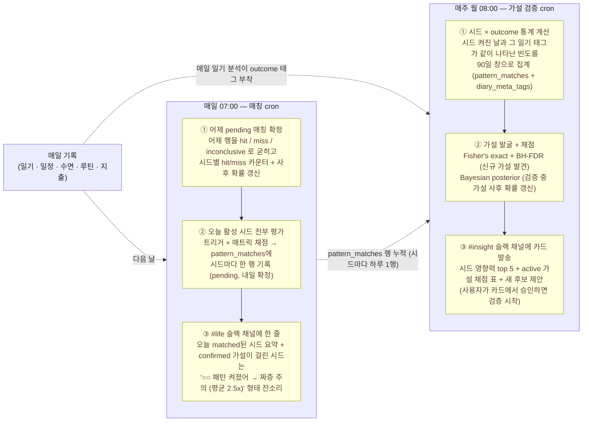
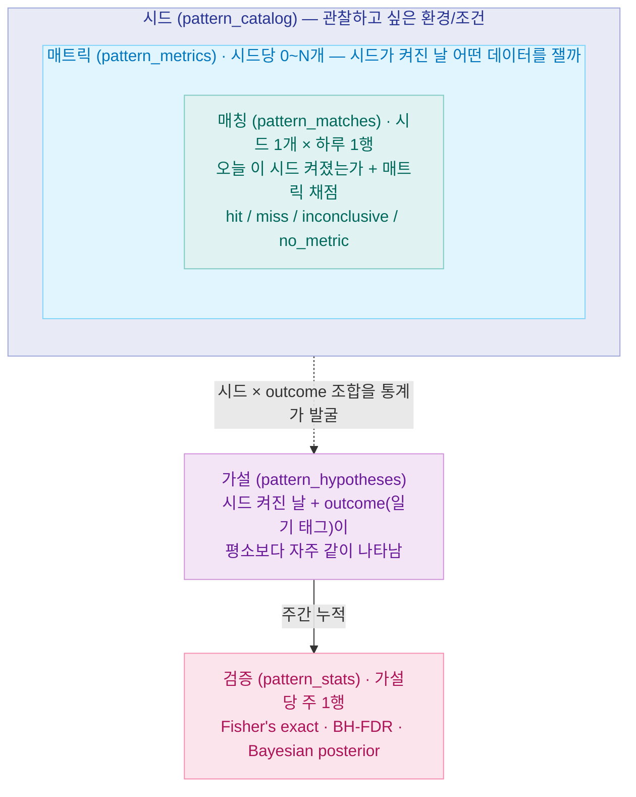
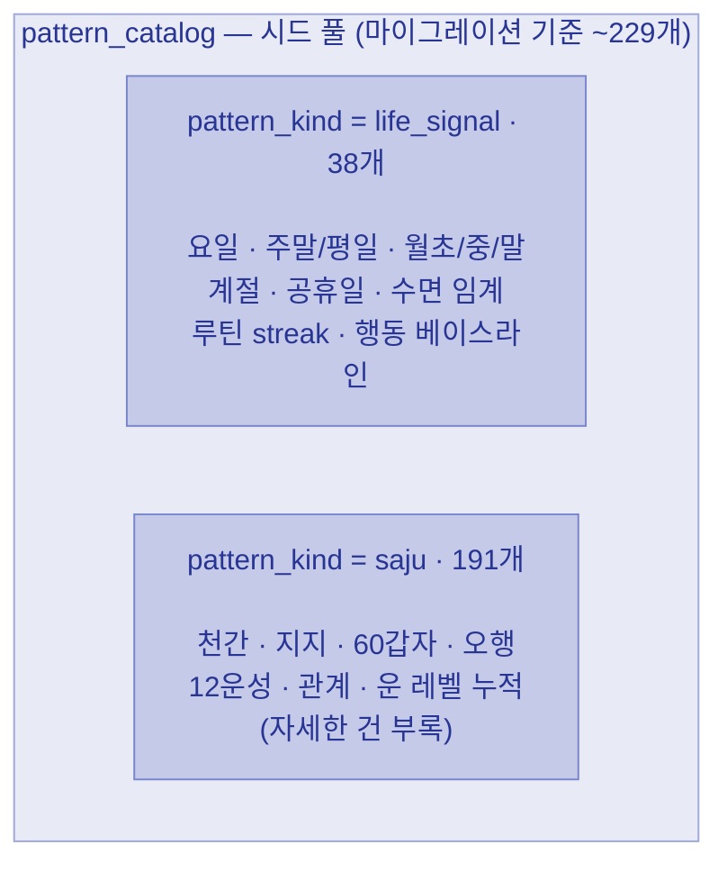
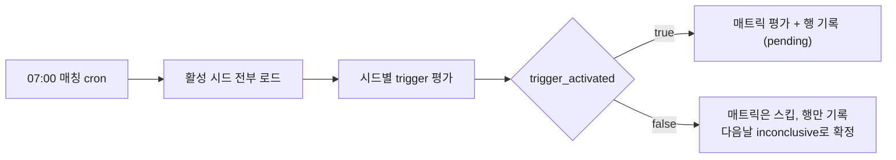
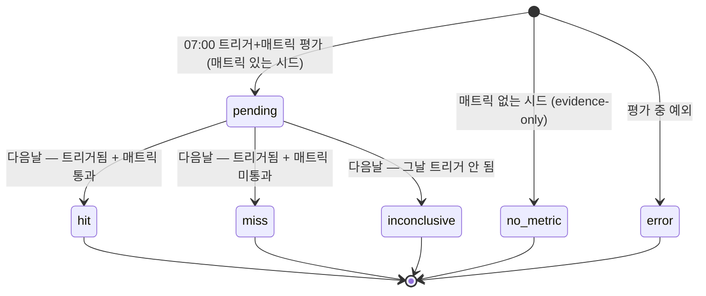
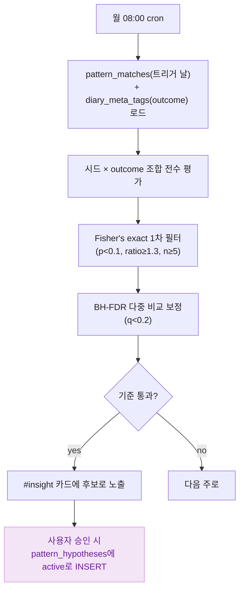
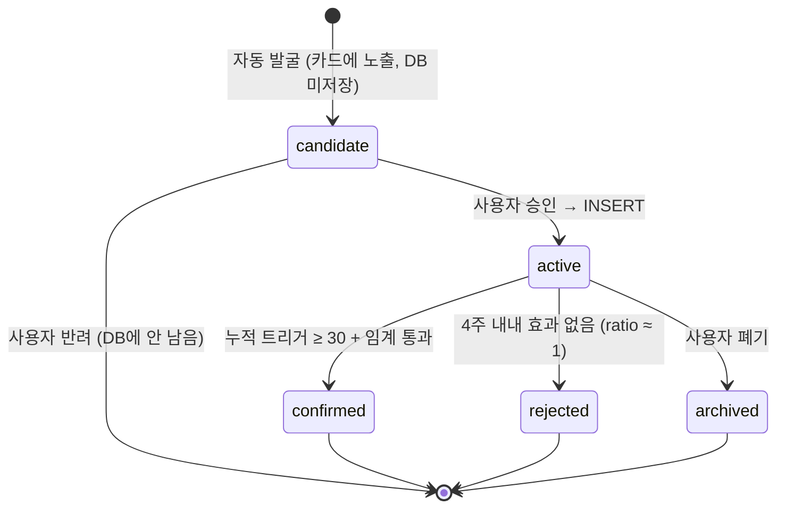
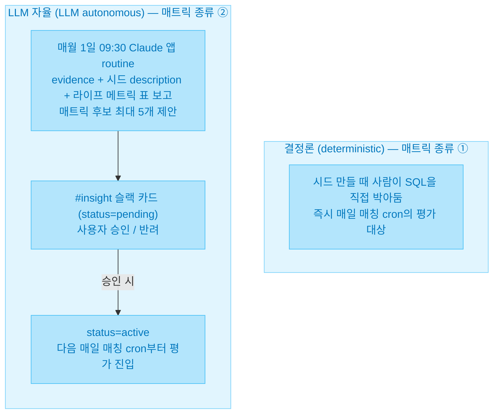
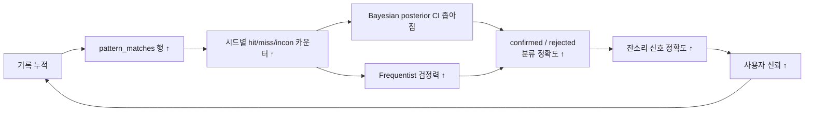

# 프로액티브 인사이트 v2 — 개인 라이프 패턴 발견 시스템

> 매일 기록한 라이프 데이터에서 생활 패턴을 자동으로 찾아내는 실험. 시드가 켜진 날만 채점하고, 통계와 사후 확신도가 충분해진 가설만 잔소리로 나온다.

---

## 1. 이 문서를 읽으면 알 수 있는 것

- 이 기능이 어떤 용어로 구성되는지 (**시드·매트릭·매칭·가설·검증**)
- 기록된 데이터에서 어떻게 패턴을 발굴·채점하는지
- 그렇게 찾은 패턴이 무엇으로 이어지는지 (잔소리·카드·점진적 개인화)

**누가 읽으면 좋은가**

- 이 프로젝트를 처음 접하는 사람
- 6개월 뒤의 본인 (구조를 잊지 않기 위해)
- 외부 리뷰어 / 협업자 (시스템 책임 경계를 이해해야 할 때)

---

## 2. 만든 이유

본인이 자주 같은 패턴을 겪는다는 의심이 들 때, 그게 진짜인지 아니면 인지·확증 편향인지 구분하기 어렵다.

- "월말마다 컨디션이 안 좋다" — 진짜 통계적으로 그런가, 아니면 잘 기억나는 것만 떠올리고 있는가?
- "수면 시간이 짧은 날에 지출이 늘어난다" — 우연인가, 본인 패턴인가?
- "이 환경 변수가 들어오는 날이 유난히 ○○하다" — 인과인가, 상관인가, 환영인가?

이 기능의 목표는 이렇다.

> **사람이 가설을 매번 직접 검토하지 않아도, 데이터가 쌓일수록 가설의 신뢰도가 자동으로 올라간다.**

매일 일기·일정·수면·루틴·지출을 기록하면, 매일 매칭이 돌아가고 매주 가설 검증이 돌아간다. 사람은 그렇게 찾아낸 결과에 따른 잔소리만 들으면 된다.

### 2-1. 어디서부터 시작할까 — 두 가지 기준

처음부터 빈 상태에서 패턴을 찾으면 너무 막막하다. 무엇을 살펴봐야 할지 출발점이 있어야 한다. 그래서 시스템은 **두 가지 기준**에서 시드(패턴 후보)를 가져와 출발한다.

| 기준 | 무엇 | 예시 |
|---|---|---|
| **생활 통념** | 사회적·경험적으로 흔히 거론되는 영향 변수 | "잠을 적게 자면 다음 날 활동 효율이 떨어진다", "월말에는 평소보다 지출이 늘어난다", "주말에는 식사·수면 리듬이 흐트러진다", "운동을 한 날 수면이 더 깊다" |
| **사주** | 본인 사주에서 이미 정의된 글자 집합이 그날의 운에 들어오는 날 | (구체 정의는 [사주 부록](insight-v2-saju.md)) |

두 기준 모두 **출발점**이지 **결론**이 아니다. 두 출처를 같은 핵심 구성 개념(시드·매트릭·매칭·가설·검증) 위에서 다루고, 매칭이 쌓이면 통계로 가설을 발굴·채점한다. 시간이 지나면서 본인 데이터에 맞지 않는 시드는 가라앉고, 자주 등장하는 시드만 활성으로 살아남는다. **쓸수록 더 맞춰지는** 흐름이다.

---

## 3. 핵심 구성 개념

본문에 계속 나올 다섯 개념을 먼저 정의한다. 흐름 도식은 다음 섹션에서 본다.

### 3-1. 다섯 개념

| 용어 | 한 줄 정의 | 직관 예시 |
|------|-----------|----------|
| **시드** (seed) | 관찰하고 싶은 환경/조건의 단위 | "월말이라는 환경", "본인 일지에 충이 들어오는 날" |
| **매트릭** (metric) | 그 시드가 켜진 날 어떤 데이터를 잴지 정의한 SQL 단위 | "그날 지출 합계", "그날 수면 시간" |
| **매칭** (match) | 활성 시드마다 하루 한 행 — 오늘 그 시드가 켜졌는지(trigger)와 매트릭 채점 결과를 묶어 남긴 기록 | "2026-06-01 시드 #42 켜짐, hit" |
| **가설** (hypothesis) | "이 시드가 켜진 날 이 **outcome**(아래 정의)이 평소보다 자주 나타나는가"를 묻는 시드 × outcome 한 쌍 | "시드 #42가 켜진 날 `짜증` 태그가 더 자주" |
| **검증** (verification) | 가설을 주 단위 통계로 채점해 쌓은 주별 기록 | "주차 22, p=0.04, q=0.15, 사후=0.62" |

시드 안에 매트릭이 들어가고(시드당 0\~N개), 매일 매칭이 시드마다 한 행씩 쌓인다(그날 평가한 매트릭 결과는 그 한 행 안에 묶인다). 가설은 이 위에 따로 떠오르는 별개의 자료다 — 시드(켜진 날)와 outcome(일기 태그)의 조합을 통계가 찾아내고, 가설은 주마다 검증으로 채점받는다.

> **헷갈리기 쉬운 갈래 — 트랙이 둘이다.** 같은 "시드가 켜진 날"에서 출발하지만 오른쪽에 두는 변수가 다르다.
> - **채점 트랙** (시드 × **매트릭** → hit/miss): 시드에 붙은 SQL을 그날 평가해 통과/미통과를 가린다. → 시드별 적중률·사후 확률.
> - **가설 트랙** (시드 × **outcome 일기 태그** → 통계): 시드 켜진 날과 그 일기 태그가 같이 나타나는지 비교한다. → confirmed 가설·잔소리.
>
> 매트릭(SQL 채점)과 outcome(일기 태그)은 출처도 테이블도 다르다. 가설 트랙은 둘을 **날짜로 이어 붙일 뿐**, 매트릭 hit/miss를 입력으로 쓰지 않는다.

### 3-2. 부속 용어

| 용어 | 한 줄 정의 |
|------|-----------|
| **트리거** (trigger) | 매일 시드가 켜졌는지 결정하는 조건 |
| **outcome** | 그날 일기에서 뽑아낸 상태·행동 태그. `diary_meta_tags`의 22종 enum 중 하나(짜증·불안·기력저하·평온·돈인식·실수 등). 시드와 무관하게 매일 일기 분석이 붙인다. 매칭의 hit/miss와는 **다른 축이자 다른 테이블** — hit/miss는 시드 매트릭 채점 결과, outcome은 그날 일기 상태 |
| **hit** | 트리거됨 + 그 시드 매트릭 중 하나 이상 통과 |
| **miss** | 트리거됨 + 매트릭 모두 미통과 |
| **inconclusive** | hit/miss로 확정하지 못한 매칭 행 — 매트릭이 붙은 시드인데 그날 트리거가 안 켜진 경우. 시드는 대부분의 날 안 켜지므로 매칭 행 중 가장 흔하다 |
| **no_metric** | 매트릭이 **아직 안 붙은** 시드(evidence-only). 켜졌다는 사실만 기록하고 채점은 건너뛴다 |
| **verify_status** | 매칭 한 행의 상태. `hit` / `miss` / `inconclusive` / `no_metric` + `pending`(확정 대기) + `error`(평가 중 예외) |
| **pattern_kind** | 시드의 출처가 생활 통념인지 사주인지 — `life_signal` / `saju` |
| **posterior** | Bayesian Beta-Binomial 사후 확률 (지금까지 누적으로 본 실제 패턴일 확률) |
| **CI lower bound** | 사후 확률 95% 신뢰 구간의 하한값. 사후 평균만 보면 운 좋게 높게 나온 경우를 거를 수 없으니, "최소 이만큼은 확실하다"는 보수적 기준으로 함께 본다 |
| **결정론** (deterministic) | 매트릭 종류 ① — 시드를 만들 때 사람이 SQL을 직접 박아둔 매트릭. 즉시 매일 매칭 cron의 평가 대상이 된다 |
| **LLM 자율** (LLM autonomous) | 매트릭 종류 ② — LLM이 시드 description을 보고 제안한 매트릭. 사용자가 Slack 카드에서 승인해야 활성화 |
| **승인 게이트** | LLM이 만든 모든 매트릭 후보는 Slack 카드에서 사용자가 통과시켜야만 활성 |

> 사주 용어(천간·지지·십성·12운성·합/충/형 등)는 이 문서에 등장하지 않는다. 사주 시드가 어떻게 정의되는지 자세히 보려면 [사주 부록](insight-v2-saju.md)으로.

---

## 4. 전체 그림 한 장

위에서 정의한 다섯 개념이 매일·매주 어떤 흐름으로 돌아가는지 도식으로 본다. **매일 사이클**과 **매주 사이클**이 따로 돌아간다.



- 매일 박스는 cron 한 번에 **어제 확정 + 오늘 평가 + 잔소리**를 같이 한다. (봇이 며칠 죽어 있었으면 맨 앞에 누락일 자동 백필이 한 단계 더 붙는다.)
- 매일 박스와 매주 박스는 **다른 시간대에 따로 돈다**. 매일이 pattern_matches에 행을 쌓고, 매주가 그 누적(+ 일기 태그)을 통계로 채점한다.

같은 흐름을 **다섯 개념이 서로 어떻게 포개지는지** 관점으로 다시 본다.



**읽는 법**

- 시드 박스가 가장 크고, 그 안에 매트릭이, 매트릭 안에 매칭이 들어간다(**포함 관계**).
- 매트릭은 시드 1개에 0\~N개 붙는다(없으면 evidence-only). 매칭은 시드 1개가 하루 한 행 — 그날 평가한 매트릭 결과는 그 행 안에 묶인다.
- 가설은 시드와 매칭 위에 **새로 떠오르는 별개의 자료**다. 시드가 가설을 직접 만들어내는 게 아니라, 시드(켜진 날)와 outcome(일기 태그)의 조합을 통계가 발견해서 가설이 떠오른다. 그래서 점선 화살표다.
- 검증은 가설 1개당 주 1행씩 시간 순서대로 쌓이며, 누적이 충분해진 가설만 confirmed 상태로 승급한다.

---

## 5. 시드의 두 출처

시드는 두 개의 풀(pool)에서 온다.



> 위 개수는 마이그레이션에 시드(seed)로 박힌 수다. 실제 활성 개수는 운영 중 승급/비활성에 따라 달라질 수 있다.

**핵심**: 두 출처 모두 **같은 핵심 구성 개념 위에서 같은 흐름**을 통과한다. 사주만의 특수 처리 없음. 이게 이 시스템이 **사주 검증기**가 아닌 이유다.

### 5-1. life_signal (라이프 통념 시드)

본인 데이터 외에 누가 봐도 흔히 거론되는 환경 변수. 38개 구성:

- 요일 7개 (월\~일)
- 주말 / 평일 2개
- 월초 / 월중 / 월말 3개
- 계절 4개
- 공휴일 / 공휴일 다음날 2개
- 수면 임계 4개 (`전일 수면 ≤ 6시간` 등)
- 루틴 streak 임계 5개 (`아침 루틴 3일 연속` 등)
- 행동 베이스라인 11개 (결정론 패턴에서 승격)

모두 `trigger_target_type = 'life_signal'`. 트리거는 `trigger_aux`의 kind(요일·계절·임계·행동 베이스라인 등)로 평가된다. 대부분 매트릭 없이 evidence-only로 출발한다.

### 5-2. 사주 시드 (saju)

본인 사주 원국에서 파생되는 결정론적 글자 집합. `trigger_target_type` 8종 중 사주 계열이 7종이다:

| trigger_target_type | 의미 (한 줄) | 시드 수 |
|---|---|---|
| `stem` | 일운 천간이 본인 사주의 특정 글자 | 12 |
| `branch` | 일운 지지가 본인 사주의 특정 글자 | 15 |
| `ganji` | 일운 60갑자가 특정 조합 | 60 |
| `element_density` | 본인 8자 + 일운 2자 중 특정 오행이 N개 이상/이하 | 10 |
| `sibiunsung` | 본인 일간 기준 일운 지지의 12운성 | 12 |
| `relation` | 본인 지지·천간과 일운의 관계 (합/충/형/원진 등) | 72 |
| `cumulative_pillar_count` | 원국+대운+세운+월운+일운 누적에서 특정 오행/십성 빈도 | 10 |

합계 191개. (나머지 1종 `life_signal` 38개를 더하면 \~229개.)

> 위 표의 용어가 낯설다면 그게 정상이다. 이 문서는 사주 용어 사전이 아니라서 자세한 설명을 의도적으로 피했다. 깊이 들어가고 싶다면 [사주 부록](insight-v2-saju.md)으로.

핵심은 사주 시드든 라이프 시드든 매칭 cron 입장에서 차이가 없다는 점이다. 둘 다 오늘 켜졌는지만 똑같이 평가받고, 매트릭으로 채점된다.

---

## 6. 데이터 일생 — 시드부터 잔소리까지

매일·매주 어떤 일이 일어나는지 6단계로 본다.

### 6-1. 시드가 트리거되는 순간

매일 **07:00** 매칭 cron이 활성 시드 전체(\~229개)를 평가한다. (08:00 일일 종합 인사이트가 그날 발현 시드를 읽을 수 있도록 그보다 앞서 돈다.)



평가 방식은 시드의 `trigger_target_type`에 따라 다르다. 라이프 시드라면 "오늘이 토요일인가" 같은 단순 조건, 사주 시드라면 "오늘 일운 천간이 본인 사주의 갑목과 일치하는가" 같은 결정론적 조건. 어느 쪽이든 그날 켜짐 여부가 결정론적으로 정해진다(난수·추측 없음).

활성 시드는 트리거되든 안 되든 그날 한 행씩 기록된다. 트리거 안 된 행은 다음날 inconclusive로 확정될 뿐이다.

**시드 description**에는 사람이 읽을 수 있는 문장 하나가 들어 있다. 이게 나중에 LLM 매트릭 자율 제안 단계에서 "이 시드가 켜진 날 무엇을 측정해야 하는지" 힌트로 쓰인다.

### 6-2. 매트릭이 평가되는 순간

시드 트리거가 켜진 날에만 그 시드에 붙은 매트릭(0\~N개)을 평가한다. 매트릭이 없으면(evidence-only) 평가 없이 켜졌다는 사실만 남는다.

```
시드 #42 (오늘 트리거 켜짐)
  │
  ├─ 매트릭 a (지출): SUM(amount) = 86,000  vs  임계 50,000  →  통과
  ├─ 매트릭 b (수면): sleep = 5.2h          vs  평균 6.8h    →  미통과
  └─ 매트릭 c: status=pending (사용자 승인 대기)            →  평가 스킵
        │
        └─ 하나라도 통과 → 이 시드의 오늘 매칭 = hit (내일 확정)
```

- 매트릭이 **하나도 없는 시드**는 `verify_status='no_metric'`만 박고 카운터 SKIP. `evidence-only`라고 부른다. 켜졌다는 기록만 남는다.
- 매트릭의 `expected_direction`(`above_avg`/`below_avg`/`above_abs`/`below_abs`/`flag_present` 5종)이 그날 값을 평균 또는 임계값과 비교해 통과/미통과를 가른다.
- 매트릭 SQL이 데이터를 못 찾으면 값 0으로 보고 미통과 처리된다(별도 inconclusive 아님). 시드의 매트릭 중 하나라도 통과하면 그날 매칭은 hit, 모두 미통과면 miss다.

### 6-3. 매칭이 채점되는 순간

매칭은 시드마다 하루 한 행으로 `pattern_matches`에 쌓인다. 다음날 cron이 어제 행을 hit/miss로 확정하면서 매트릭 카운터를 갱신한다.



| verify_status | 의미 | 카운터 영향 |
|---|---|---|
| `hit` | 트리거됨 + 매트릭 통과 | `hit_count++` + 사후 α++ |
| `miss` | 트리거됨 + 매트릭 미통과 | `miss_count++` + 사후 β++ |
| `inconclusive` | 그날 트리거 안 켜짐 (매트릭은 붙어 있음) | `inconclusive_count++` |
| `no_metric` | 매트릭 자체가 없음 (evidence-only) | 카운터 SKIP |
| `error` | 평가 중 예외 (per-seed try/catch) | 카운터 SKIP |
| `pending` | 확정 대기 (다음날 cron이 위 상태로) | — |

**카운터를 한곳에 모으는 이유**: hit/miss/inconclusive 카운터와 Bayesian α/β를 모두 `pattern_metrics` 한 위치에서 갱신한다(ADR-0023). counter source가 한 곳이면 정합성이 보장되고, 동일 cron·동일 함수에서 처리해 흩어지지 않는다.

### 6-4. 가설이 발견되는 순간

가설은 **매주 월요일 08:00** 가설 검증 cron이 발굴한다.



- 시드가 켜진 날 outcome이 나타난 빈도와, 시드가 안 켜진 날 outcome이 나타난 빈도를 Fisher's exact로 비교한다(90일 창).
- 통과한 후보는 **다중 비교 보정**(BH-FDR)을 한 번 더 거친다. 후보가 늘어날수록 우연히 통과할 확률이 늘어나므로, 후보 수에 따라 q값이 자동으로 더 엄격해진다.
- 살아남은 후보만 #insight 카드에 노출된다. 사용자가 승인하면 `pattern_hypotheses`에 active로 등록되어 매주 검증 누적 대상에 들어간다. 반려하면 DB에 남지 않는다.

### 6-5. 검증이 confirmed/rejected로 정해지는 순간

active 가설은 매주 월요일 08:00 cron에서 한 행씩 `pattern_stats`에 시간 순서대로 쌓인다.

```
pattern_stats (가설 #88) — 주마다 한 행
  week_start | n_trigger | rate_trigger | rate_baseline | rate_ratio | raw_p | fdr_q | 사후
  2026-04-06 |    21     |    0.48      |     0.20      |   2.40     | 0.09  | 0.18  | 0.62
  2026-04-13 |    26     |    0.52      |     0.20      |   2.60     | 0.04  | 0.10  | 0.66
  2026-04-20 |    31     |    0.55      |     0.19      |   2.90     | 0.02  | 0.05  | 0.70
  2026-04-27 |    34     |    0.58      |     0.19      |   3.05     | 0.01  | 0.03  | 0.73
                                                                       ▲
              누적 트리거 ≥ 30 · 최근 4주 평균 q < 0.05 · 평균 rate_ratio ≥ 1.3  →  confirmed
```

- **confirmed**: 누적 트리거 ≥ 30 + 최근 4주 평균 `fdr_q` < 0.05 + 최근 4주 평균 `rate_ratio` ≥ 1.3
- **rejected**: 누적 트리거 ≥ 30 + 최근 4주 `rate_ratio`가 내내 0.95\~1.05 (시드가 켜지든 안 켜지든 outcome 빈도가 같음)
- **archived**: 사용자가 카드에서 명시적으로 끄거나, 데이터 폐기 정책으로 묻힌 경우

가설 lifecycle 전체 상태도:



### 6-6. 잔소리·카드로 노출되는 순간

확정된 정보가 사용자에게 도달하는 통로:

| 시각 | 채널 | 내용 |
|---|---|---|
| 매일 07:00 | `#life` | 오늘 matched된 시드 1\~3줄 + confirmed 가설 잔소리 |
| 매일 08:00 | `#insight` | 오늘 일운 + 검증된/최근 발현 시드 종합 (Opus routine) |
| 매주 월 08:00 | `#insight` | 가설 주간 리포트 — 시드 영향력 top 5 + active 가설 표 + 신규 후보 카드 |
| 매주 월 09:00 | `#life` | 지난주 한눈에 (수면·루틴·일정) + 사주 시드 hit/miss 누적 |
| 매주 월 09:15 | `#insight` | 시드 운 레벨 분포 (어느 운 차원이 패턴 신호를 더 많이 내는가) |

`#life` 07:00 잔소리 예시 (confirmed 가설이 걸린 시드):

```
*○○ 패턴* 켜졌어 → `짜증` 주의 (평균 2.5x).
```

`#insight` 월요일 가설 카드의 후보 한 줄 예시:

```
발현일 n=8 · trigger 50.0% vs baseline 20.0% · ratio 2.50x
p=0.040 q=0.150 · 사후 50% [21%, 79%]
```

> **읽는 법**: 사후 50%=우연 수준, 70\~80%↑=강함. `[ , ]`는 95% 신뢰 구간. p값은 Frequentist(우연 가능성), 사후는 Bayesian(실제 패턴일 확률).

---

## 7. 결정론과 LLM 자율 — 매트릭의 두 작성 경로

매트릭은 두 가지 길로 만들어진다.



핵심 원칙:

> **자율 영역은 모두 사용자 승인 게이트를 통과해야 한다.** LLM이 매트릭을 만들고, 사람이 그것을 통과시킨다.

이 게이트가 LLM의 false discovery를 마지막으로 거른다. 시드 description이 LLM의 가설 공간을 좁히고, cap(월 최대 5개)이 한 번에 들어오는 양을 제한하고, 사용자 승인이 최종 거름망 역할을 한다.

운영 인프라는 봇 cron이 아니라 [Claude 앱 routines](https://docs.claude.com)로 통일되어 있다 (ADR-0027). 봇 서버에 LLM 호출 부하를 얹지 않고, async LLM 작업은 외부 routine에서 처리하는 책임 분리.

---

## 8. 검증 통계 두 측 — Frequentist + Bayesian

이 시스템은 **두 가지 통계 도구를 동시에** 가설에 적용한다.

| 측 | 도구 | 묻는 질문 | 강점 / 약점 |
|---|---|---|---|
| Frequentist | Fisher's exact + BH-FDR | "이 차이가 통계적으로 우연이 아닌가" | 가설 양 늘어날수록 자동 보정 / 누적 적으면 검정력 부족 |
| Bayesian | Beta-Binomial posterior | "시드 켜진 날 outcome 빈도로 본 실제 패턴일 확률은 얼마" | 누적 적은 단계에서도 안정 / prior 가정 의존 |

### 8-1. Frequentist (Fisher's exact + BH-FDR)

각 가설에 대해 2x2 분할표(트리거 × outcome)를 만들고 Fisher's exact test를 돌린다. p값이 1차 필터(<0.1).

가설 후보가 늘어날수록 우연히 p<0.1을 통과하는 가설이 늘어난다. 이걸 보정하기 위해 **Benjamini-Hochberg FDR** (False Discovery Rate)을 적용:

```
q_i = p_i × N / rank_i
```

(N=전체 가설 수, rank=p값 오름차순 순위). q<0.2가 1차 통과 기준.

**자동 보정 효과**: target-type에 life_signal을 추가해 가설 후보 총량이 크게 늘었을 때도, BH-FDR이 후보 수에 비례해 같은 p값을 더 엄격한 q로 매기므로 임계치를 손볼 필요가 없었다.

### 8-2. Bayesian (Beta-Binomial posterior)

hit/miss 누적이 적은 단계에서는 Frequentist 검정력이 부족하다. 이 단계에서도 "지금까지 본 데이터로 실제 패턴일 확률은 얼마인가"를 답할 수 있게 Bayesian 사후를 동시 갱신한다.

```
prior: Beta(1, 1)  — uniform (운영 누적 후 informed prior 검토)
가설 사후에서
  hit  = 시드 켜진 날 중 outcome이 나타난 날
  miss = 시드 켜진 날 중 outcome이 안 나타난 날
posterior: Beta(1 + hit, 1 + miss)
posterior_p = α / (α + β)
CI 95%: [Beta(α, β).ppf(0.025), Beta(α, β).ppf(0.975)]
```

카드 한 줄의 "사후 50% [21%, 79%]"가 바로 이 값(사후 평균 + 95% 신뢰 구간). 같은 Beta-Binomial은 채점 트랙에서도 한 벌 더 돌아간다 — 거기선 hit/miss가 매트릭 통과/미통과이고, 그 사후가 **시드 영향력** 순위를 만든다.

### 8-3. 두 측이 같이 있는 이유

n=1(본인 한 사람) 환경에서 누적이 적은 단계는 Frequentist가 약하고 Bayesian이 안정적이다. 누적이 충분해지면 Frequentist의 효과량(rate_ratio)이 의미를 가지기 시작한다. 두 측이 같은 가설에 동의할 때 신뢰가 최대가 된다.

카드에는 한 줄에 두 측을 모두 표시한다.

```
발현일 n=8 · trigger 50.0% vs baseline 20.0% · ratio 2.50x
p=0.040 q=0.150 · 사후 50% [21%, 79%]
```

- 윗줄: Frequentist 관점 (효과량 + 우연 가능성)
- 아랫줄: Bayesian 관점 (사후 확신도 + 95% CI)

---

## 9. 시간이 누적될수록 강해지는 메커니즘



핵심 문장:

> **사용자의 손은 데이터 입력에만 닿는다. 패턴 발견·검증·노출 결정은 모두 시스템이 한다.**

사용자가 일기를 쓰고, 일정을 기록하고, 수면을 찍는 동안 시스템은 매일 07:00, 매주 월 08:00에 자동으로 매칭과 검증을 누적한다. 사용자는 "오늘 새로 발견된 패턴이 있는가"를 카드 한 장으로 확인하면 된다.

가설 lifecycle을 시간으로 한 번 더 보면:

```
1주차 ──→ 2주차 ──→ 3주차 ──→ 4주차 ──→ 임계 도달
candidate    active      active       active       confirmed
(카드)       (승인)       (검증 누적)   (검증 누적)   (누적 트리거 ≥ 30 + q·ratio)
                                                    rejected
                                                    (4주 내내 효과 ≈ 1)
```

---

## 10. 한계와 보완점

| 한계 | 설명 | 보완 |
|------|------|------|
| **n=1 single-case** | 본인 한 사람의 데이터만 다룬다. 다른 사람에게는 그대로 적용 불가 | 의도된 제약. 개인 baseline에 충실 |
| **BH-FDR 정확도 한계** | 가설 풀이 너무 작으면 다중 비교 보정이 부정확해진다 | 풀 충분히 커진 후 임계치 재조정 검토 (운영 1\~3개월 후) |
| **LLM 자율 매트릭의 false discovery** | LLM이 우연 패턴을 매트릭으로 제안할 수 있음 | 사용자 승인 게이트 + 시드 description 힌트 + cap=5로 완화 |
| **일기 텍스트 LLM 분석 제외** | v2 헌장 ①에 따라 텍스트 의존 LLM 분석은 컨텍스트에서 배제 | outcome은 일기에서 추출한 정량 enum 태그만 쓰고, 검증은 정량 메트릭에 한정 |
| **사주의 통계적 검증 불가능성** | 사주 자체가 맞다·틀리다 식으로 검증 가능한 대상이 아님 | 이 시스템은 사주를 **시드 풀의 한 출처**로만 다룸. 사주 자체 진위는 이 문서 범위 밖 |
| **prior 가정 의존** | Bayesian이 Beta(1,1) uniform prior로 시작 — 누적 적은 단계의 사후가 prior에 흔들림 | 누적 충분해진 후 informed prior 검토 (운영 1\~3개월 후) |
| **카드 노출 cap** | 한 카드에 가설 표·후보·시드 영향력을 다 띄우면 가독성 ↓ — cap으로 잘라냄 | cap이 발견을 가리는 가능성 있음, follow-up 이슈로 추적 |

---

## 11. 더 깊이 들어가려면

| 문서 | 무엇 |
|------|------|
| [docs/domains/insight.md](../domains/insight.md) | 도메인 상세 (스키마·API·로직·SQL 본문) |
| [docs/design-notebook/personal-pattern-discovery.md](../design-notebook/personal-pattern-discovery.md) | 마스터 #434 서사 (자체 헌장 5개 + Phase 1\~8 결정 흐름 + 회고) |
| [사주 부록](insight-v2-saju.md) | 사주 시드 7종이 어떻게 정의되는지 (사주 모르는 사람도 따라올 수 있는 미니 101 포함) |

### 11-1. 핵심 설계 결정 (ADR)

| ADR | 결정 |
|---|---|
| [ADR-0014](../adr/0014-insight-engine-unification.md) | 인사이트 엔진 통합 (v2 Phase 1) |
| [ADR-0016](../adr/0016-llm-autonomous-slot-outcome-verification.md) | LLM 자율 슬롯 + outcome 검증 |
| [ADR-0017](../adr/0017-saju-ganji-master-normalization.md) | 60갑자 마스터 정규화 |
| [ADR-0019](../adr/0019-saju-hypothesis-verification-pipeline.md) | 가설-검증 정량 파이프라인 (Fisher + BH-FDR) |
| [ADR-0022](../adr/0022-target-type-generalization.md) | target-type 일반화 (사주 + life_signal) |
| [ADR-0023](../adr/0023-metric-unit-counter-and-summary-view.md) | 매트릭 단위 카운터 + summary view |
| [ADR-0024](../adr/0024-bayesian-posterior-update.md) | Bayesian Beta-Binomial posterior 도입 |
| [ADR-0025](../adr/0025-llm-metric-approval-gate.md) | LLM 매트릭 승인 게이트 |
| [ADR-0026](../adr/0026-pattern-prefix-rename.md) | `pattern_*` prefix rename |
| [ADR-0027](../adr/0027-llm-async-routine-unification.md) | LLM async 작업을 Claude 앱 routines로 통일 |
| [ADR-0028](../adr/0028-pillar-level-and-threshold-pool.md) | 운 레벨 + 임계치 풀 도입 |
| [ADR-0029](../adr/0029-life-signal-trigger-aux-standard.md) | life_signal trigger / aux 표준 |
| [ADR-0030](../adr/0030-llm-metric-suggest-input-and-cadence.md) | LLM 매트릭 제안 input + 월간 cadence |
| [ADR-0031](../adr/0031-daily-insight-synthesis.md) | 일일 종합 인사이트 — 개인화 주입 지점을 생성에서 발송으로 |

---

## 12. 어떻게 여기까지 왔나

```
2026-05-15      마스터 #393 시작
                "사주 가설을 정량 데이터로 검증하는 시스템"
                Phase 1: 인사이트 엔진 통합 (ADR-0014)
                Phase 2: LLM 자율 슬롯 + outcome 검증 (ADR-0016)
                Phase 3: 60갑자 매칭 + 시드 카탈로그 (ADR-0017)
                Phase 4: Fisher / BH-FDR 검증 파이프라인 (ADR-0019)
2026-05-27      마스터 #393 close
                ▼
2026-05-16      마스터 #434 시작 — 정체성 진화
                "개인 라이프 패턴 발견 시스템 (사주는 시드 출처 중 하나)"
                Phase 1: 스키마 일반화 — `pattern_*` rename (ADR-0026)
                Phase 2/2.5: 사주 시드 풀세트 + 운 레벨 차원 (ADR-0028)
                Phase 3: life_signal 시드 + 매칭 cron 일반화 (ADR-0029)
                Phase 4: 카운터 source 전환 + Bayesian posterior (ADR-0024)
                Phase 5: 가설 발견 target-type 확장 대응
                Phase 6: LLM 매트릭 + 승인 게이트 (ADR-0025·0030)
                Phase 7: Bayesian 카드 병기 + 시드 영향력 top 5
                Phase 8: 마스터 close + follow-up 이슈 일괄 등록
2026-05-29      마스터 #434 close
                ▼
2026-06-03      마스터 #421 A3 — 일일 종합 인사이트 (ADR-0031)
                매칭 07:00 선행 + 08:00 #insight 종합 발송 routine
```

핵심 진화: **사주 검증** → **개인 라이프 패턴 발견 (사주는 시드 출처 중 하나)**

같은 흐름이 사주 한정에서 라이프 통념 합류까지 일반화됐고, 그 과정에서 다섯 개념이 직접 표현되는 `pattern_*` 스키마로 rename됐다. v2의 검증 헌장 4개는 그대로 남고, 그 위에 본인 1명 통계·다섯 개념 분리·target-type 일반화·승인 게이트·신뢰 비용 분리 5개 자체 헌장이 더해졌다.

---

## 마무리

> **내가 가설을 만들지 않아도, 내 데이터가 가설을 만들고 통계가 채점한다. 잔소리는 통과한 것만 나온다.**

이 한 문장이 전부다. 사주가 시드 풀의 큰 부분을 차지하지만, 사주를 증명하지는 않는다. 사주든 라이프 통념이든 같은 다섯 개념 위에서 같은 흐름을 거치고, 같은 통계 두 측의 채점을 받는다.

이 문서를 다 읽었다면 다음 흐름으로 들어가 볼 수 있다.

- **구현 깊이로**: [docs/domains/insight.md](../domains/insight.md) (스키마·API·로직)
- **결정 흐름으로**: [docs/design-notebook/personal-pattern-discovery.md](../design-notebook/personal-pattern-discovery.md) (자체 헌장 5개 + Phase 1\~8 서사)
- **사주 깊이로**: [사주 부록](insight-v2-saju.md) (사주 시드 7종 + 미니 101)
