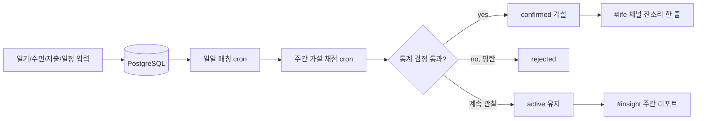
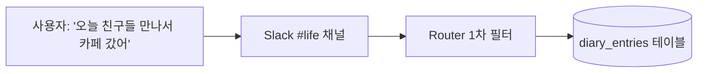
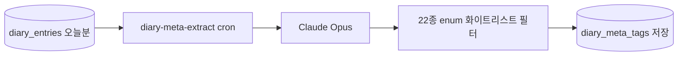
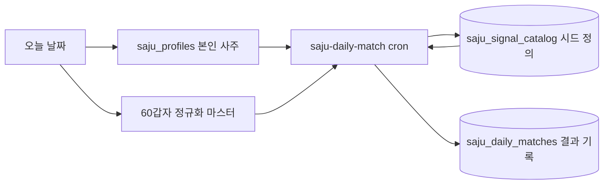
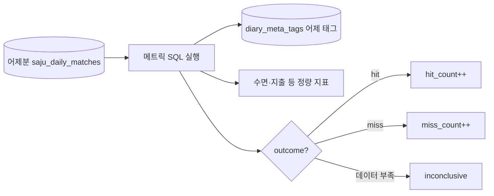
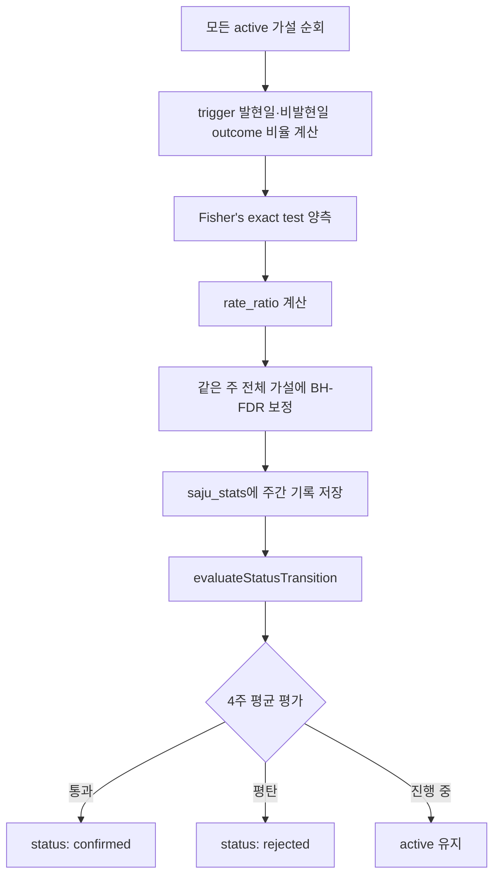
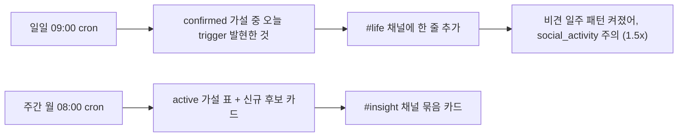
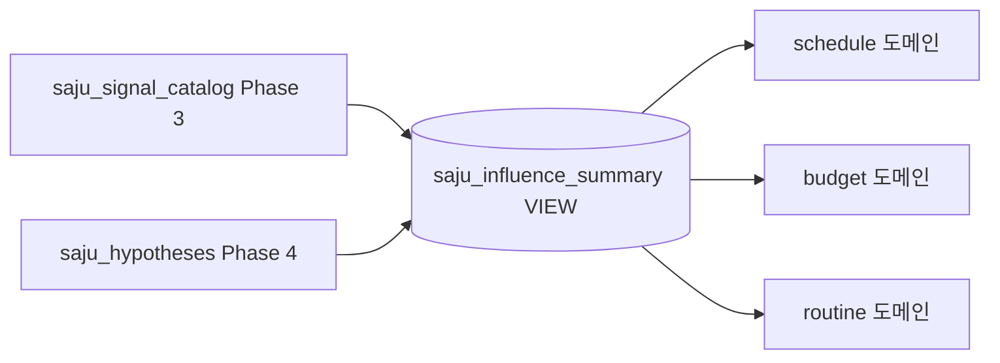
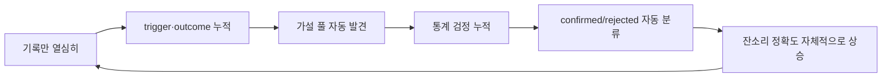

# 프로액티브 인사이트 검증 시스템 — 처음 보는 사람을 위한 설명서

> 이 시스템을 한 번도 본 적 없는 사람을 대상으로, **데이터가 들어와서 검증된 잔소리로 나가기까지의 전 과정**을 그림과 함께 설명한다.
> 코드를 안 봐도 읽을 수 있게 썼다. 더 깊은 설계 디테일은 [docs/domains/insight.md](./domains/insight.md), [docs/adr/](./adr/), [docs/design-notebook/insight-engine-v2.md](./design-notebook/insight-engine-v2.md) 참고.

## 0. 한 줄 요약 (Elevator pitch)

> LLM이 만든 가설을, 통계 검정이 자동으로 채점한다.
> 사람이 매번 "이거 진짜 맞아?"를 확인하지 않아도, 데이터가 쌓일수록 가설은 스스로 `active → confirmed → rejected` 상태를 옮겨간다.

## 1. 이 문서를 읽고 나면 알 수 있는 것

- LLM 잔소리의 신뢰도 문제를 **데이터로 자동 검증**하는 구조가 어떻게 생겼는지
- 일기 한 줄이 들어왔을 때 그게 어떤 단계를 거쳐 "검증된 가설"이 되는지
- "가설", "트리거", "아웃컴", "hit", "p-value", "rate_ratio" 같은 용어가 이 시스템에서 정확히 무슨 의미인지
- 왜 굳이 이렇게 복잡하게 만들었는지 (대안과 비교했을 때 트레이드오프)

대상 독자:
- 이 프로젝트 README는 읽었는데 검증 시스템 부분이 막연한 사람
- LLM 출력을 신뢰할 수 있게 만드는 방법에 관심 있는 개발자
- 통계 검정·실험 설계에 관심 있는 비개발자

## 2. 왜 이 시스템이 필요했나

### 출발점의 문제

LLM에게 "내 일기 3개월치 보고 어떤 패턴이 보여?"라고 물으면 그럴듯한 답이 나온다. 문제는:

1. **그게 정말 맞는지 확인할 방법이 없다.** LLM은 같은 질문에 매번 다른 답을 줄 수 있고, 본인은 그 답을 검증할 시간/방법이 없다.
2. **사람은 매번 확인 못 한다.** 매일 일기 쓸 때마다 "이번 주 가설들 다시 점검"을 사람이 직접 할 수 없다.
3. **'직관적으로 그럴듯한' 가설은 실제로 틀린 경우가 많다.** 인지편향(확증편향, 회상편향) 때문에 본인이 느끼는 패턴은 실제 데이터와 어긋난다.

### 해결 방향

> **LLM은 적극적으로 쓰되, 그 출력은 통계·DB·도구 권한으로 자동 검증한다.**

- LLM이 "가설을 만드는 일"을 한다 (창의성 활용)
- DB와 통계 검정이 "그 가설이 맞는지 채점하는 일"을 한다 (결정론적 검증)
- 사람은 "최종 통과한 가설만 잔소리로 받아본다" (인지 부하 최소화)

## 3. 전체 그림 한 장

큰 흐름은 이렇다:
- **입력** — 일기·수면·지출·일정이 Slack/웹으로 들어와 DB에 쌓임
- **매일** — cron이 트리거 발현 여부와 일별 매칭 결과를 기록
- **매주** — cron이 누적 데이터를 통계 검정으로 채점, 가설 상태 자동 전이
- **출력** — confirmed 가설만 일일 잔소리에 합류, active는 주간 리포트로 추적

## 4. 용어 사전

| 용어 | 의미 | 예시 |
|------|------|------|
| **시드 (seed)** | 명리학 카탈로그에 사전 정의된 후보 패턴 | "비견(比肩)이 일주에 들어오는 날" |
| **trigger** | 시드가 "오늘 발현했는가"를 SQL로 판정하는 결정론적 조건 | 60갑자 일주가 특정 천간/지지인 날 = 발현 |
| **outcome (아웃컴)** | 트리거 발현일에 관찰된 사용자 데이터의 정량 지표 | "그날 일기에 `social_activity` 태그가 붙었는가" |
| **enum 화이트리스트** | LLM이 일기에서 뽑을 수 있는 태그 22종 (그 외는 무시) | `social_activity`, `clumsy_overflow`, `task_completion` 등 |
| **hit / miss** | trigger 발현일 + outcome도 발현 → hit. trigger 발현했는데 outcome은 없음 → miss | trigger 발현 + 일기에 해당 태그 있음 = hit |
| **가설 (hypothesis)** | "trigger 발현일에 outcome이 평소보다 자주 일어난다"는 명제 | "비견 일주에는 `social_activity`가 평소보다 자주 일어난다" |
| **status** | 가설의 현재 상태 | `active`(검증 중) / `confirmed`(통계로 입증) / `rejected`(평탄 확인) / `archived`(수동 종료) |
| **rate_ratio** | trigger 발현일의 outcome 비율 ÷ 비발현일의 outcome 비율. 효과 크기 지표 | 1.5 = 트리거 날에는 1.5배 자주 발생 |
| **raw p-value** | Fisher 정확검정으로 계산한 이 차이가 우연일 확률 | 0.03 = 3% 확률로 우연 |
| **q-value (FDR-corrected)** | 여러 가설을 동시 검정할 때 false positive 비율을 통제한 보정값 | 0.04 = 보정 후에도 유의 |
| **view (saju_influence_summary)** | Phase 3 시드 카탈로그 + Phase 4 confirmed 가설을 단일 SQL view로 합친 것 | 다른 도메인은 "어떤 패턴이 active인지"만 보면 됨 |
| **confidence tier** | confirmed 가설의 신뢰도 등급 (서로 배타 아님, 동시 표시 가능) | `verified` / `accumulating` / `recent` |

> trigger와 outcome의 차이가 헷갈리는 사람을 위한 단순화:
> - **trigger = "오늘이 그런 날인가?" (사주·달력 같은 외부 결정론)**
> - **outcome = "그날 나에게 그게 실제로 일어났나?" (내 일기·수면 같은 관찰 데이터)**
> - 둘 다 yes면 hit, trigger만 yes면 miss.

## 5. 데이터의 일생 — 단계별로

한 번의 흐름을 처음부터 끝까지 따라가본다.

### 단계 1. 사용자가 일기 한 줄을 쓴다

- Slack `#life` 채널로 한 줄 입력
- Router가 채널 매핑, 봇 메시지 필터, Rate Limit (1분 5회), 10KB 길이 제한 통과시킴
- `diary_entries` 테이블에 append (날짜당 1행, 줄바꿈으로 누적)

### 단계 2. LLM이 일기에서 enum 태그를 뽑는다

- 매일 새벽 cron이 어제 일기를 Claude Opus에 보냄
- LLM이 자유롭게 태그를 생성해도, 코드가 **22종 화이트리스트와 교집합만 통과시킨다** (이중 필터: CHECK 제약 + 코드 레벨 `TAG_SET`)
- 위 일기 → `social_activity` 태그 저장

> 왜 22종으로 제한? — LLM이 매번 다른 단어("friend_meeting", "cafe_visit", "social_event")를 생성하면 통계로 묶을 수가 없다. 화이트리스트가 곧 **검증 가능한 outcome의 정의역**이다.

### 단계 3. 동시에 trigger도 평가된다 (사주 일일 매칭)

- 시드 카탈로그에는 6가지 trigger 종류가 정의되어 있음 (stem / branch / relation / sipsin / element_density / sibiunsung)
- cron이 본인 사주 + 오늘 일주를 보고 각 시드가 "오늘 발현했는지" 결정론적으로 판정
- `saju_daily_matches` 테이블에 `trigger_activated: true/false` UPSERT (멱등 — 같은 날짜로 다시 돌려도 중복 없음)

### 단계 4. 일별 hit/miss 채점

- 어제 trigger가 발현했던 시드들에 대해, 시드의 메트릭 SQL을 실행해 outcome 채점
- 메트릭 종류 4가지 (`direction`): `higher` / `lower` / `presence` / `absence`
- 예: "비견 일주 + 일기에 `social_activity` 태그 있음" → hit
- 결과는 `signal_catalog`에 누적

### 단계 5. 매주 월요일 — 통계 검정 + 상태 전이

여기가 시스템의 심장.

자동 전이 조건은 정확히 이렇다:

| 전이 | 조건 (전부 만족) |
|------|----------------|
| `active → confirmed` | 최근 4주 평균 q-value < 0.05 AND 최근 4주 평균 rate_ratio >= 1.3 AND 누적 trigger 발현일 >= 30일 |
| `active → rejected` | 최근 4주 모두 rate_ratio가 0.95 \~ 1.05 사이 (평탄) |
| 그 외 | active 유지 |

> **왜 4주를 한 단위로?** — 1주만 보면 우연한 spike에 휘둘림. 너무 길게(예: 12주) 잡으면 패턴이 바뀌어도 반영이 느림. 4주는 "최근 트렌드"와 "노이즈 평탄화"의 절충.

> **왜 q-value 0.05 + rate_ratio 1.3을 둘 다?** — 통계적 유의성(우연 아님)과 실질적 의미(효과가 충분히 큼)는 다르다. n이 매우 크면 효과가 미미해도 p가 작아진다 → 효과 크기 임계를 따로 둠.

### 단계 6. 사용자에게 노출

- **일일 #life** — confirmed 가설 중 오늘 trigger가 켜진 것만 짧게 합류 (Phase 3 매칭 라인 뒤)
- **주간 #insight** — active 가설들의 전주 대비 rate_ratio 변화(▲▼─), 신규 후보 등록/폐기 카드

### 단계 7. 외부 도메인은 view로만 본다

다른 도메인(예: 일정·지출 잔소리)은 Phase 3 시드 카탈로그와 Phase 4 confirmed 가설을 일일이 JOIN하지 않는다. 둘을 합친 **단일 view (`saju_influence_summary`)** 만 본다.

> **왜 view?** — Phase 3와 Phase 4가 서로 다른 테이블 구조를 가졌지만, 외부에서 보면 "지금 active한 사주 영향이 뭐냐"는 같은 질문. View 한 층이 막아주면 외부 도메인은 두 시스템의 차이를 몰라도 됨. 미래에 Phase 5(월운/세운)가 추가돼도 view만 갱신하면 끝.

## 6. 결정론과 자율의 분리 — 두 종류의 인사이트가 같이 산다

같은 봇이 인사이트를 만들 때 **두 가지 방식이 공존**한다:

| 방식 | 작성자 | 예시 | 보장 |
|------|--------|------|------|
| **결정론적 11종 SQL 패턴** | 사람이 미리 코딩 | "수면 7일 연속 6시간 미만" | 정확함, 변동 없음 |
| **LLM 자율 슬롯 (주간/월간)** | LLM이 데이터 보고 가설 + 검증 SQL을 즉석 작성 | "최근 외식이 늘었는데 잠도 줄었는지 확인" | N일 뒤 채점 자동 |

LLM 자율 슬롯의 안전장치 4중:
1. **SELECT-only** — LLM이 생성한 SQL은 SELECT만 통과
2. **get_schema precall** — 스키마 모를 때 추측 못 하도록 강제 호출
3. **result_type 화이트리스트** — outcome 채점 가능한 형태로만 답 받음
4. **verify_after_days 1\~28 clamp** — 너무 멀거나 가까운 검증 일정 차단

> 자세한 설계 비교는 [ADR-0016 Section 3](./adr/0016-llm-autonomous-slot-outcome-verification.md) 참조.

## 7. 각 설계 결정의 이유

### 왜 Fisher's exact test? (카이제곱이 더 흔한데)

- 사용자 1명의 데이터는 표본이 작다 (4주 28일, trigger 발현일은 그중 일부)
- 카이제곱은 기대빈도가 셀당 5 이상이어야 하는 정규근사. 표본이 작으면 부정확
- Fisher는 hypergeometric 분포 기반 정확검정. **표본 크기 무관하게 정확**

### 왜 BH-FDR? (Bonferroni가 더 보수적인데)

- 매주 평가하는 가설이 수십\~수백 개로 늘 수 있음
- Bonferroni는 너무 보수적이라 진짜 패턴도 놓침 (Type II error)
- BH는 false discovery rate(거짓 양성 비율)를 통제하면서 검출력 유지. 다중 비교의 표준

### 왜 view 한 층을 두었나? (직접 JOIN하면 안 되나)

- 직접 JOIN하면 외부 도메인 코드가 Phase 3와 Phase 4 테이블 구조를 다 알아야 함
- view를 두면 외부는 "active한 사주 영향" 하나만 보면 됨 → 결합도 낮아짐
- Phase 5(월운/세운) 추가 시 view만 ALTER → 외부 코드 무수정
- 결정 배경: [ADR-0020](./adr/0020-fortune-system-responsibility-split-via-view.md)

### 왜 멱등성(idempotency)을 DB 레벨에서 강제?

- cron이 재실행되거나 네트워크 retry로 같은 일이 두 번 일어날 수 있음
- 코드에서 "이미 있나?" 체크하는 건 race condition 여지 (체크와 insert 사이에 다른 트랜잭션이 끼어들 수 있음)
- `UNIQUE 제약 + ON CONFLICT DO NOTHING RETURNING` 패턴은 **DB가 원자적으로 보장**
- 이 패턴은 Stripe API의 Idempotency-Key, Kafka idempotent producer, K8s declarative manifest와 같은 계열의 표준 처리

### 왜 enum 22종으로 outcome을 제한?

- LLM이 매번 다른 자유 텍스트("친구_만남", "social_event", "외출")를 생성하면 통계로 묶을 수 없음
- 화이트리스트가 **검증 가능한 outcome의 도메인**을 정의함
- 추가하려면 마이그레이션 + LLM 프롬프트 + 코드 `TAG_SET` 세 곳 동시 변경 → 의도적인 friction (무분별 확장 차단)

### 왜 자동 전이를 두 번 거치게 했나? (`evaluate` + `apply` 분리)

- `evaluateStatusTransition`은 pure function (입력 → 다음 상태 계산만)
- `applyStatusTransition`이 DB 적용을 따로 수행
- 분리하면 **테스트 가능** (DB 없이 evaluate만 단위 테스트), **드라이런 가능** (apply만 빼고 시뮬레이션)

### 왜 confidence tier가 status와 별개?

- status는 `active/confirmed/rejected/archived` 4종 — lifecycle 축
- tier는 `verified/accumulating/recent` 3종 — 신뢰도 등급 축
- 같은 confirmed 가설이라도 누적 데이터량에 따라 "오래 검증됨" vs "방금 통과" 구분 → 사용자가 가설 신뢰도를 빠르게 파악
- OR 조건 아님. **동시 표시 가능한 라벨**.

## 8. 시간이 지날수록 강해지는 메커니즘

이 시스템의 핵심 가치는 **사람이 더 일하지 않아도 알아서 정밀해진다**는 점.

- 일기·수면·지출만 꾸준히 기록 → 시스템이 그 안에서 패턴 후보를 자동 발견
- 발견된 후보는 등록·폐기 카드로 사용자에게 제시 (수동 게이트)
- 등록된 가설은 active로 들어가 매주 자동 채점
- 누적될수록 confirmed/rejected 분류가 더 정밀해짐
- **잔소리는 confirmed만 합류 → 시간이 지날수록 신호:노이즈 비율이 자동으로 좋아짐**

## 9. 한계와 앞으로 보완할 점

| 한계 | 영향 | 대응 방향 |
|------|------|----------|
| 사용자 1명 데이터로 통계 검정 → 표본이 늘 작음 | n<5면 raw_p=NaN skip, 가설 수가 적을 때는 BH-FDR 효과 약함 | Fisher 정확검정 채택으로 일부 완화. 본질적으로 long-tail 문제 |
| 월운/세운/대운 검증 사이클이 길다 (월 \~2년, 세 \~28년 데이터 필요) | Phase 5 확장 시 검증 누적 속도 차이 극심 | 시기별 가설을 별도 처리, 단기/장기 신뢰도 임계를 다르게 적용하는 메커니즘 별도 설계 ([#408](https://github.com/hyewon3938/slack-ai-agents/issues/408)) |
| 일기 enum 추출이 LLM 의존 → 같은 사건도 날마다 다른 태그가 붙을 수 있음 | outcome 노이즈 | Opus 이관 + 화이트리스트 이중 필터로 일부 완화. 본질 해소는 더 안정적인 태깅 모델 필요 |
| confirmed 가설 자체가 시간이 지나면 패턴이 바뀔 수 있음 | 한 번 confirmed가 영구 통과되면 위험 | rejected 전이가 4주 평탄으로 작동. 추가로 confirmed→rejected 재평가 사이클 검토 중 |
| 사용자 한 명에 맞춰진 시스템 | 다른 사람에게 그대로 못 씀 | 의도적. 라이프 데이터는 본인 데이터로만 학습/검증해야 의미 있음 |

## 10. 더 깊이 들어가려면

| 궁금한 것 | 읽을 문서 |
|----------|----------|
| Phase 별 결정 배경 + 회고 | [docs/design-notebook/insight-engine-v2.md](./design-notebook/insight-engine-v2.md) |
| 도메인 스키마·SQL·코드 위치 | [docs/domains/insight.md](./domains/insight.md) |
| LLM 자율 슬롯 4중 안전장치 | [ADR-0016](./adr/0016-llm-autonomous-slot-outcome-verification.md) |
| Fisher + BH-FDR 채택 이유 | [ADR-0019](./adr/0019-saju-hypothesis-verification-pipeline.md) |
| view-mediated master integration | [ADR-0020](./adr/0020-fortune-system-responsibility-split-via-view.md) |
| 기능 카탈로그 전체 | [docs/features.md](./features.md) |

## 마무리

이 시스템이 푸는 본질적 문제는 단순하다.

> "LLM이 그럴듯한 말을 하는데, 그게 진짜 맞는지 사람이 매번 확인할 수 없다."

해결책도 단순한 원칙으로 설명된다.

> "LLM에게는 가설을 만들게 하고, 데이터와 통계에게는 그 가설을 채점하게 한다. 사람은 통과한 것만 본다."

이 원칙을 운영 가능한 코드로 옮기는 과정에서 — view-mediated 합본, 멱등성 DB 제약, BH-FDR, 자동 상태 전이, LLM 자율 슬롯 안전장치 — 여러 결정이 쌓였다. 각 결정에는 대안과 트레이드오프가 있었고, 그 기록은 ADR과 design-notebook에 남아 있다.
